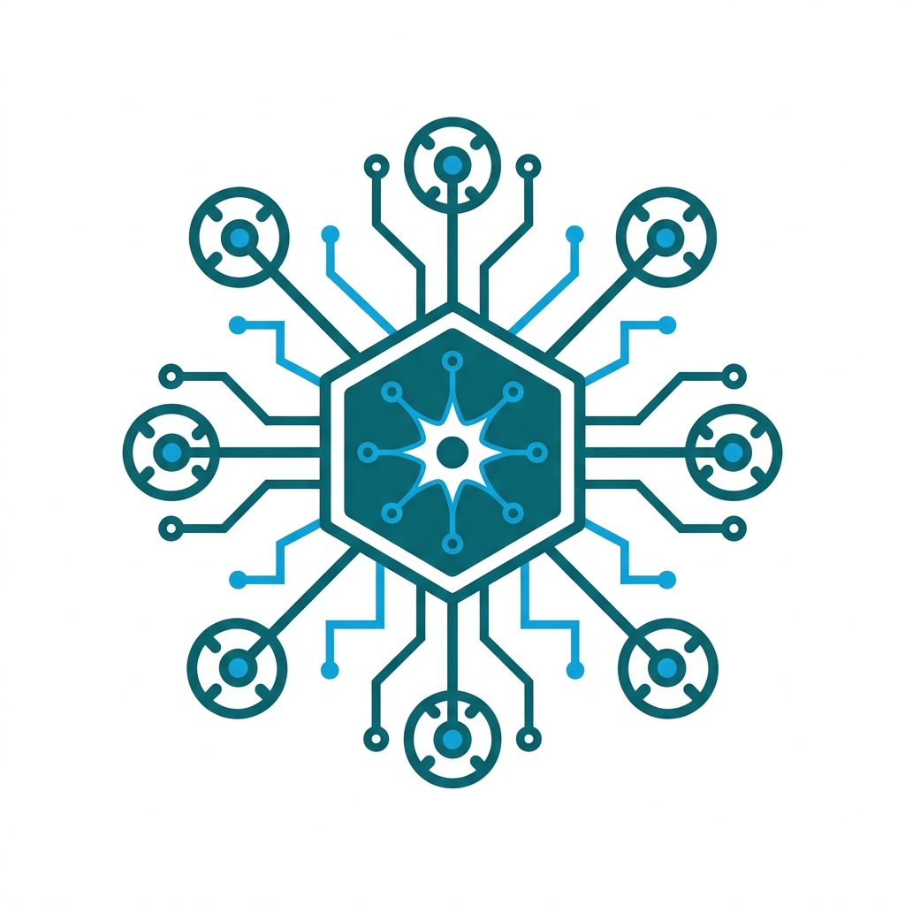
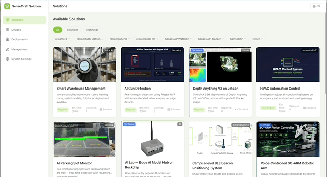

[English](README_en.md) | **中文**

<p align="center">
  
</p>

# SenseCraft Solutions

[](https://github.com/suharvest/sensecraft-solutions/actions/workflows/guard.yml)
[](LICENSE)

**面向 NVIDIA Jetson、RK3576/RK3588 与 Raspberry Pi 的 18+ 个开箱即用边缘 AI 方案** —— 还附带用来创作和校验你自己方案的开源工具链。

<p align="center">
  
</p>

离线语音 AI、计算机视觉、智慧零售、机器人等方案，均可直接从 [SenseCraft 桌面应用](https://www.seeed.cc/category/reference-designs) 或通过 `solutionctl` 命令行部署，无需依赖云端。

---

## 方案列表

| Solution | Hardware | 分类 |
|----------|----------|------|
| [Local Voice Service](solutions/jetson_voice_assistant/) | Jetson Orin · RK3576 · RK3588 · RPi | 语音 AI（ASR + TTS，≤180ms，离线） |
| [Smart Retail Voice AI](solutions/smart_retail_voice_ai/) | Jetson | 零售 / 语音 |
| [Smart Space Assistant](solutions/smart_space_assistant/) | Jetson | 语音 AI |
| [GPT OSS 20B](solutions/gpt_oss_20b/) | Jetson | 本地大模型 |
| [AI Lab](solutions/ai_lab/) | Jetson | AI 开发环境 |
| [Depth Anything v3](solutions/depth_anything_v3/) | Jetson | 深度估计 |
| [Industrial Security](solutions/industrial_security_jetson/) | Jetson | 安防 / 视觉 |
| [Gun Detection (Frigate)](solutions/gun_detection_frigate/) | Jetson | 安防 / 视觉 |
| [NVBlox + Orbbec](solutions/nvblox_orbbec/) | Jetson | 三维重建 |
| [reCamera Heatmap (Grafana)](solutions/recamera_heatmap_grafana/) | reCamera | 分析 / 看板 |
| [reCamera Parking Monitor](solutions/recamera_parking_monitor/) | reCamera | 智慧停车 |
| [reCamera Ecosystem](solutions/recamera_ecosystem/) | reCamera | 平台工具 |
| [Reachy Claw Voice Robot](solutions/reachy_claw_voice_robot/) | Reachy Mini + Jetson | 机器人 + 语音 |
| [ReSpeaker Flex + SO-ARM100](solutions/respeaker_flex_soarm/) | ReSpeaker + ARM | 机器人 + 音频 |
| [OpenClaw Deploy](solutions/openclaw_deploy/) | Jetson | 机器人 |
| [Smart Warehouse](solutions/smart_warehouse/) | Jetson | 物流 / 视觉 |
| [Smart HVAC Control](solutions/smart_hvac_control/) | Jetson | 楼宇自动化 |
| [Indoor Positioning (BLE + LoRaWAN)](solutions/indoor_positioning_ble_lorawan/) | Edge | 定位 / IoT |

---

## 工作原理

```
┌─────────────────────────────────────────────────────┐
│  This repo (open, Apache-2.0)                       │
│  ┌──────────────┐  ┌────────┐  ┌─────────────────┐ │
│  │ solutions/   │  │ spec/  │  │ packages/       │ │
│  │ YAML + guides│  │ schema │  │ solutionctl     │ │
│  │ (bilingual)  │  │ + rules│  │ solution-spec   │ │
│  └──────────────┘  └────────┘  └─────────────────┘ │
└──────────────────────────┬──────────────────────────┘
                           │ validated against
                           ▼
┌─────────────────────────────────────────────────────┐
│  SenseCraft Engine (closed-source, signed binary)   │
│  Distributed with the SenseCraft desktop app        │
│  Handles: device SSH, Docker deploy, app UI         │
└─────────────────────────────────────────────────────┘
```

每个方案都是一个自包含的目录：一份 `solution.yaml`（硬件目录、部署预设、双语元数据）、双语的 `guide.md` + `description.md`、Docker Compose 配置以及资源文件。引擎在部署前会根据 `spec/` 中发布的 JSON Schema 契约对方案进行校验。

`solutionctl` 是引擎面向无界面（headless）使用的命令行入口 —— 它定位已安装的二进制文件，并通过子进程 / 本地 REST 驱动它。

---

## 快速开始

```bash
# 安装依赖
uv sync

# 离线校验方案（无需引擎 / App）：
uv run --package sensecraft-solutionctl solutionctl validate solutions/jetson_voice_assistant

# 打包方案为可导入的 zip（用于在桌面应用中预览）：
uv run --package sensecraft-solutionctl solutionctl export jetson_voice_assistant

# 通过已安装的 SenseCraft 桌面应用部署（无界面）：
uv run --package sensecraft-solutionctl solutionctl deploy jetson_voice_assistant --connection '{...}'
```

`solutionctl` 会自动定位引擎二进制：先看 `$SENSECRAFT_ENGINE_BIN` 环境变量 → 再走 `~/.sensecraft/engine.json` 握手 → 最后按平台原生方式发现（macOS `mdfind`、Windows 注册表、Linux `dpkg`）。

---

## 仓库结构

| Path | 说明 |
|------|------|
| `solutions/` | 方案包 —— `solution.yaml`、双语 `guide.md`/`description.md`、设备配置、资源文件 |
| `spec/` | 生成的契约：JSON Schema + `CONTRACT.md`（字段规则、`docker_deploy` 派生、guide 语法） |
| `packages/sensecraft-solution-spec/` | `guide.md` 解析原语 —— 从 clone 中通过 `uv run` 运行 |
| `packages/solutionctl/` | 离线校验器 + 引擎二进制的轻量客户端 —— 从 clone 中通过 `uv run` 运行 |
| `skills/` | 创作手册（文案、docker/固件准备） |
| `scripts/` | CI 边界守卫（`public-repo-guard.sh`） |

---

## 编写方案

最快的方式是让 AI agent 来驱动：在 agent 中打开本仓库（Claude Code 会自动加载这些 skills），让它使用 **`author-solution`** skill —— 它会复现项目、搭建方案骨架、完成校验，并协助你预览与提交。非开发者 / AE 有一份手把手的配套指南：**[AE 提交指南](docs/AE-提交指南.md)**。内置的验证 / 部署类型不满足时，可用通用兜底（`http_debug` 调任意接口 / `web_dashboard` 打开任意页面）或在设备配置里用 `actions` 自定义检查，详见 `skills/author-solution`。需要一个**全新的交互形态**？可用插件原型化，或向维护者提需求 —— 见 [插件开发指南](docs/plugin-development.md)。

参考文档：[`spec/CONTRACT.md`](spec/CONTRACT.md) 讲字段/语法规则、`docker_deploy` 视图派生以及 `guide.md` 的 Step/Target 语法；[`CONTRIBUTING.md`](CONTRIBUTING.md) 讲创作与 PR 流程；AI agent 请看 [`AGENTS.md`](AGENTS.md)（**Part F** 是创作并提交的完整流程）。

## 须知

- 方案的 `docker-compose` 文件使用 **演示用默认凭据**（例如本地 InfluxDB token）。这些并非机密，生产环境请自行更换。
- 容器镜像均从公共 registry 拉取。
- 分发引擎（部署器、设备通信、桌面应用）是闭源的。本仓库中只有内容 + 契约 + 工具链这一层是 Apache-2.0。

## 许可证

[Apache-2.0](LICENSE)。
