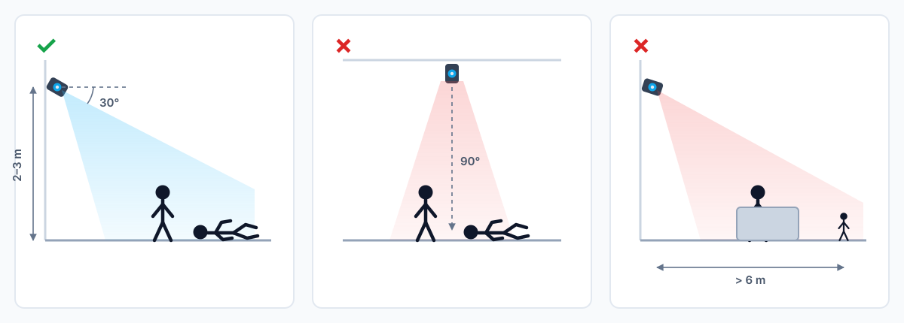

## What it does

Turn a camera into a sensor that reports "someone has fallen." The camera watches
a fixed indoor area, decides on the device whether a person went down, and pushes
an event to whatever you already use for alerting — Home Assistant, a nursing-call
system, an NVR, or your own service.

No video leaves the device unless you ask for it. Pose estimation, the fall
decision and the event history all run locally; what goes out on the network is a
small JSON message.

## What you get

**A fall event stream.** Each person is followed separately, with an ID that stays
with them as they move around the room, and a state that goes from normal, through
suspected, to fallen and then recovering. One "this is a new fall" flag fires on
the transition only, so an automation can trigger on it once instead of firing for
as long as someone is on the floor. Field names are in the interface table below.

**Ready-made Home Assistant entities.** Both presets publish MQTT discovery
configs, so a fall sensor, the current state, the event ID and a person-present
sensor appear in Home Assistant without any manual YAML.

**A live view for commissioning.** The deployment ends with a preview inside this
app: the video with the skeleton, the per-person state and the evidence count
drawn on top, so you can confirm the camera sees what it needs to before you wire
up any notifications.

## Where it fits

- **Assisted-living and home care** — an unattended bathroom, hallway or bedroom
  where a fall would otherwise go unnoticed until the next check.
- **Existing camera estates** — the reComputer preset consumes ordinary RTSP, so
  cameras you already own gain fall detection without being replaced.
- **Home Assistant automations** — a fall entity that turns on a light, sends a
  push notification, or starts a call.

## How well it works

These are engineering benchmarks on public datasets, **not a medical or
life-safety certification**. Subjects 1–2 trained the temporal model, Subject 3
froze the configuration, and Subject 4 was read once as an untouched test set.

**How it was tested**

- GMDCSA-24 v2.1, split by person: Subjects 1–2 train the temporal model,
  Subject 3 selects thresholds and freezes the configuration, and Subject 4 is a
  held-out test set **read exactly once**.
- Subject 4 drops the 10 clips previously used for pipeline smoke tests, leaving
  27 (12 falls / 15 everyday activities).
- Video is resampled to 15 FPS; tracking and temporal state reset before each clip.
- An alert more than 0.5 s before the annotated start of the fall counts as a false
  alarm, not a hit.
- Every platform re-extracts traces from its own real pose output and retrains and
  freezes its own temporal weights. Nothing is borrowed across platforms.

**Result**

Averaged over the six frozen configurations: **85.8% accuracy, 95.8% fall recall,
77.8% specificity, 85.7% F1, 1.4 s mean alert latency.** Individual configurations
fall between 77.8% and 88.9%.

**Why there is no per-platform comparison table**

27 clips resolve to 3.7 percentage points — one clip is one step — so every
configuration that reaches "all 12 falls caught, 3 of 15 everyday clips
false-alarmed" lands on the same 88.9%. All platforms false-alarm on the same two
clips, ADL/06 and ADL/07, which puts the limit in the fall-decision layer rather
than the pose model; the temporal state machine is one shared design. Model size
does not track the result either — the YOLO11s configuration scores below YOLO11n
ones. Separating the platforms would need a larger, harder test set.

### Performance

One model across every device: **YOLO11n-Pose at 640²**; per-frame is accelerator
inference only (excluding RTSP decode and postprocessing), aggregate is the highest total frame
rate measured across 1–6 concurrent contexts. Different precisions are not mixed into one
table.

**FP16**

| Runtime | Pose model | Per-frame | Aggregate | Inference-bound streams | Suggested streams |
|---|---|---:|---:|---:|---:|
| reComputer RK3576 | YOLO11n | 56.1 ms | 29.2 FPS | 1 | 1 |
| reComputer RK3588 | YOLO11n | 51.4 ms | 51.4 FPS | 3 | 1 |
| reComputer J (Orin Nano) | YOLO11n | 3.7 ms | 270.7 FPS | 18 | 7 |
| reComputer J (Orin NX) | YOLO11n | 3.3 ms | 306.2 FPS | 20 | 8 |

**INT8**

| Runtime | Pose model | Per-frame | Aggregate | Inference-bound streams | Suggested streams |
|---|---|---:|---:|---:|---:|
| reCamera 2002 | YOLO11n | 53.0 ms | 10.0 FPS | 1 | 1 |
| reCamera Pro | YOLO11n | 35.9 ms | 18.1 FPS | 1 | 1 |
| reComputer RK3576 | YOLO11n | 36.2 ms | 42.1 FPS | 2 | 1 |
| reComputer RK3588 | YOLO11n | 29.8 ms | 90.4 FPS | 6 | 2 |
| reComputer R (Hailo-8) | YOLOv8s ▲ | 6.9 ms | 59.5 FPS | 3 | 2 |
| reComputer J (Orin Nano) | YOLO11n ＊ | 2.7 ms | 363.9 FPS | 24 | 9 |
| reComputer J (Orin NX) | YOLO11n ＊ | 2.5 ms | 408.0 FPS | 27 | 10 |

▲ **No n-size model exists for Hailo.** The official Model Zoo v2.15 hailo8 directory
ships pose only as `yolov8s_pose` and `yolov8m_pose` — `yolov8n_pose`, `yolo11n_pose`
and `yolo11s_pose` are all absent (each returns 403). This solution downloads the
official pre-compiled HEF rather than compiling its own, so s is the smallest available.
Running 11n on Hailo would mean compiling it with the Hailo Dataflow Compiler (a
licensed x86 SDK) plus a calibration set, then re-freezing the temporal weights on the
resulting pose output.
Read the other way: that row runs a **larger** model than every other row and still
lands at 6.9 ms per frame.

＊ **Jetson INT8 is not deployable today and is listed for speed reference only.** The
engine is built with `trtexec --int8` and no calibrator or calibration set, so its
dynamic ranges are arbitrary: the kernel timing is real, the detections are not.
Upstream's `build_engine.sh` passes only `--fp16`; a real INT8 path needs a calibrator
and calibration set implemented in the project, then the temporal weights re-frozen on
INT8 pose output. RK INT8 is the opposite — calibrated on 240 GMDCSA frames and
identical to FP16 detection-for-detection on frames held out of that set, hence
deployable.

**Both tables use a synthetic blank 640 frame** (the same basis as the existing FP16
baselines) and time the accelerator only. Real footage is slower, because anything
detected has to go through raw-head decode, DFL, keypoints and NMS:

| Platform | Blank-frame inference | Real-footage inference | Real-footage pipeline | Postprocess delta |
|---|---:|---:|---:|---:|
| reComputer RK3576 | 56.1 ms | 69.6 ms | 70.8 ms | 1.2 ms |
| reComputer RK3588 | 51.4 ms | 54.4 ms | 54.8 ms | 0.4 ms |
| reComputer R (Hailo-8) | — | — | 7.8 ms ▲ | — |

"pipeline" is inference plus raw-head decode / DFL / keypoints / NMS; it still excludes
RTSP decode, tracking, the temporal MLP and MQTT. Postprocess cost grows with the number
of people in frame: on RK3576 it is 2.7 ms on a 4-person test image against 0.4 ms on a
blank one. The blank-to-real gap (13.4 ms on RK3576, 3.0 ms on RK3588) also contains
contention from workloads running at the time, so it cannot all be attributed to frame
content.

▲ Hailo's 7.8 ms is a probe from the buffer before `hailonet` to its source pad, covering
Hailo scheduling and output transfer but not RTSP decode, resize, the C++ postprocess,
tracking or MQTT. That runtime reports `inference_time_ms` as 0
(`inference_time_metric=unavailable`), so the two must not be conflated. Jetson needs a separate note: the `inference_time_ms` it publishes is actually a
**pipeline-scope** figure — the timer spans CUDA preprocess, TensorRT inference, YOLO
decode and NMS (see the `started`/`finished` span in `main/c_api.cpp`), rather than the
inference call alone as on RK. So the `trtexec` per-frame number in the table (pure GPU
compute, no host copies) and its application-level number measure different things; a
like-for-like figure is being measured.

**How to read the stream counts.** "Inference-bound" is aggregate ÷ 15 FPS — the
accelerator's theoretical ceiling. "Suggested" discounts it: measured end-to-end
throughput on RK reached only 28–44% of the inference bound, because RTSP decode,
tracking, the state machine and MQTT also consume CPU and memory bandwidth. Start
from the suggested figure and load-test with your own cameras, codec and scene
density.

The two RK boards appear in both tables, which gives the exchange rate between the
precisions: INT8 is 1.5–1.7× faster and matches FP16 detection-for-detection on
held-out frames.

**Measurement conditions**: both Jetson rows were taken with co-resident workloads
stopped. That step is necessary — when a co-resident workload uses the accelerator the
ranking inverts: Orin NX measured 264.9 FPS while running its own inference workload,
*below* Orin Nano and the opposite of their relative capability; stopped, it is
306.2 FPS. Orin Nano measured identically either way (270.5 vs 270.7), because its
co-resident services never touch the GPU.

reCamera 2002 and Pro are INT8 only. reComputer R (Hailo) runs the official Model Zoo YOLOv8s-Pose INT8
(6.9 ms / 59.5 FPS); different model, so it is in neither table.

**What the presets deploy today:** Jetson FP16, RK FP16, reCamera 2002 and Pro INT8.
The RK INT8 weights were converted for this comparison and are not shipped yet —
the temporal weights need re-checking before that switch.

Both Jetson boards hold essentially flat aggregate throughput from 1 to 6 concurrent
contexts, so concurrency shares one GPU budget rather than multiplying it.

On an independent external set (RealBiomFall, 34 fall-only clips) recall drops on
both configurations measured there — 58.8% on reCamera and 52.9% for the deployed
YOLO11m on reComputer J. YOLO11s was not measured on that set. The limiting factor
is pose coverage: in long shots and heavy occlusion the person is barely detected
at all. The table above covers a framed indoor view at close-to-medium range; the
external figures cover long shots and occlusion.

## Output Interfaces

| Output | Where | Content |
|---|---|---|
| Fall results | MQTT port 1883, topic `recamera/fall-detection/results` | Per-frame JSON: aggregate state plus one entry per tracked person |
| Availability | MQTT port 1883, topic `recamera/fall-detection/status` | `online` / `offline`, retained |
| Home Assistant | MQTT discovery under `homeassistant/` | Fall sensor, state, event ID, person count |
| Video | RTSP port 8554 `/live0` on reCamera, or your own IP camera | The scene the detector is watching |

The reComputer preset takes more than one camera from a single box and appends the
stream id to the topic (`recamera/fall-detection/results/cam-01`), so each camera
stays separable downstream. This solution was verified end to end on one stream;
the upstream project suggests starting at 4 streams with YOLO11s on Orin Nano, or
3 with YOLO11m on Orin NX, at 15 FPS, then measuring your own cameras, codec and
scene density before committing to a count.

## Deployment Comparison

**reCamera 2002** is the whole thing in one device — camera, inference and MQTT in
a unit you mount and power. Pick it for a single room and the shortest path to a
working alert.

**IP camera + reComputer J** keeps the cameras you already have and puts the
detector on a Jetson Orin, taking more than one stream at once with a larger pose
model and higher measured accuracy. Pick it when the cameras exist, when you need
more than one view, or when the accuracy difference in the table above matters.

**reComputer RK** puts the detector on a Rockchip NPU board, now with a
board-native temporal profile and a hardware-accelerated video path. Measured
throughput with other workloads still running was about 8.6 FPS on RK3588 and
4.9 FPS on RK3576 end to end.

**reComputer R (Hailo)** runs a native C++ hot path on a Hailo-8, holding a steady
15 FPS per stream with low host CPU. Pick either when you already run that
hardware; both now have a frozen temporal-gate result, though neither has had its
deployed state machine measured separately.

## Usage Notes

- **Framing decides accuracy.** The figures above come from a fixed indoor view at
  close-to-medium range with shoulders and hips visible. A ceiling-down view, a
  long corridor shot or heavy furniture occlusion will perform worse.

  
- **The fall has to happen on camera.** Starting the detector on someone already
  lying down reports the posture but raises no event.
- **An MQTT broker must be reachable on port 1883.** reCamera uses its own local
  broker; the reComputer preset brings one up alongside the detector.
- **One vision app at a time on reCamera.** Installing takes the camera away from
  Node-RED and any other vision application.
- **Latency in the table is detection latency** — from the annotated start of the
  fall to the alert being published — measured in the offline evaluation harness.
  The separate FPS figures quoted for the pose engines are inference-core only.

## Licensing note

Upstream ships the runtime code under Apache-2.0, but that covers the code and
documentation only — the pose models keep their own terms, and the projects
require explicit licence acceptance before a model is downloaded.

The reference pose weights are distributed by Ultralytics under AGPL-3.0. Confirm
that licence suits your product, obtain a commercial licence, or substitute a
compatibly-licensed pose model before shipping a closed commercial deployment. The
runtime itself is model-agnostic within the documented output contract.
