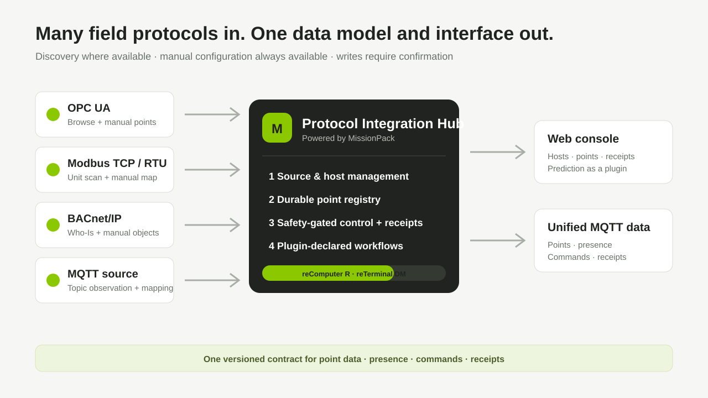

## 套餐: 多协议数据中枢 {#standard}

部署一套轻量协议融合服务，把不同控制器统一成一套可读写的点位数据。

| 设备 | 用途 |
|------|------|
| reComputer R1000 / R1100 系列 | 将多种现场协议统一为点位模型和 MQTT 接口 |
| reTerminal DM 系列 | 运行相同服务，并通过本机触控屏操作 |
| 工业控制器 | 提供 OPC UA、Modbus、BACnet/IP 或 MQTT 数据 |

**部署完成后你可以：**
- 从一个入口配置 OPC UA、Modbus、BACnet/IP 和 MQTT 控制器
- 使用自动发现加快接入，发现不完整时手动填写点位兜底
- 在一个总表中读取、筛选和受控写入所有现场点位
- 让上层应用只对接一套带版本的 MQTT 数据、命令和回执主题

**前提条件：** Docker Engine 20.10 及以上 · 至少 4 GB 可用空间 · 能够访问目标控制器网络

## 步骤 1: 部署多协议数据中枢 {#gateway type=docker_deploy required=true config=devices/gateway.yaml}

启动协议融合与数据服务，并让点位配置、审计记录和模型在重启后继续保留。

### 部署目标 {#gateway_local type=local config=devices/gateway.yaml default=true}

部署到当前运行 SenseCraft Solution 的设备。

### 接线

1. 将当前设备接入与以太网控制器相同的可达网络。
2. 标准本机 Docker 配置不会挂载串口。如需 Modbus RTU，请使用串口设备部署配置；真实硬件验证完成前不要开启生产写控制。
3. 保留默认管理界面和 MQTT 端口，或在部署前选择未占用的主机端口。

BACnet/IP 广播发现可能无法穿过 Docker Desktop 的桥接网络。本机部署时可手动填写 BACnet 地址，或选择远程 Linux 目标进行网段发现。

### 故障排查

| 问题 | 解决方法 |
|------|----------|
| Docker 不可用 | 启动 Docker Desktop 或 Docker Engine 后重试 |
| 8280 或 1883 端口被占用 | 在部署表单中选择其他管理界面或 MQTT 主机端口 |
| 镜像下载失败 | 确认设备能够访问 `sensecraft-missionpack.seeed.cn`，并至少有 4 GB 可用空间 |
| 健康检查一直等待 | 查看 `docker logs missionpack-industrial-gateway`，并确认 `/readyz` 返回 HTTP 200 |

### 部署目标 {#gateway_edge type=remote device_name="reComputer R / reTerminal DM" config=devices/gateway.yaml}

通过 SSH 部署到控制器网络中的 reComputer R1000/R1100 系列或 reTerminal DM 设备。

### 接线

1. 将所选 reComputer R 或 reTerminal DM 网口连接到控制器网络，并记录设备 IP 地址。
2. 如需 Modbus RTU，请使用串口设备安装方式挂载 USB 转 RS-485 适配器；真实硬件验证完成前不要开启生产写控制。
3. 输入设备的 SSH 地址和凭据，然后开始部署。

### 故障排查

| 问题 | 解决方法 |
|------|----------|
| SSH 连接失败 | 检查设备 IP、用户名、凭据和 SSH 服务 |
| 无法访问镜像仓库 | 检查 DNS 与防火墙是否允许访问 `sensecraft-missionpack.seeed.cn` |
| 管理界面打不开 | 放行所选管理端口，并确认容器健康 |
| BACnet 发现不到设备 | 选择 BACnet 所在网段的网卡，并确认广播没有被阻断 |

## 步骤 2: 配置统一接入与数据服务 {#dashboard type=web_dashboard required=true config=devices/dashboard.yaml}

打开管理界面，创建首个管理员，把第一个现场控制器接入统一点位模型。

### 前置条件

步骤 1 的服务容器必须处于健康状态。首次创建管理员不需要注册码或 Token。

### 故障排查

| 问题 | 解决方法 |
|------|----------|
| 页面无法加载 | 等待步骤 1 显示健康，再核对所选管理界面端口 |
| 自动发现缺少点位 | 使用手动配置兜底，并核对协议点位地址 |
| 控制命令被拒绝 | 检查点位写权限、当前数据质量、安全规则和命令回执 |
| MQTT 控制不可用 | 启用 TLS 并配置控制身份；明文模式只允许遥测数据 |

### 部署完成

1. 创建首个管理员账号，不需要 Token。
2. 打开**接入**，点击**添加**，选择 OPC UA、Modbus、BACnet/IP 或 MQTT，并配置控制器。
3. 在协议支持时执行自动发现，审核候选项，只确认需要的点位；发现不可用或不完整时使用手动配置。
4. 打开**点位总表**，先确认实时值和数据质量，再授予写权限。
5. 打开**数据服务**，配置内置 MQTT Broker，并查看点位、在线状态、命令和回执主题。
6. 如有需要，再打开预测插件，导入 CSV 并配置输入与输出点位。

#### 协议发布状态

| 协议 | 当前边界 |
|------|----------|
| OPC UA | 数据源配置、浏览或手动点位、实时读取和受控写入 |
| Modbus TCP | 手动点位、站号扫描、实时读取和受控写入 |
| BACnet/IP | Who-Is 发现、手动点位、优先级写入和释放 |
| MQTT 数据源 | 明确主题映射和有界主题观察 |
| Modbus RTU/RS-485 | 已包含配置与通讯能力；需使用串口设备部署配置并通过 USB 真实硬件验证 |
| 北向 MQTT | 使用 MissionPack v1 原生主题；当前版本未实现 Sparkplug B |
