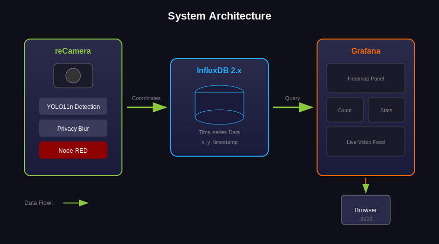

## Preset: Upgrade Existing Cameras {#jetson}

Already have IP cameras? Add an AI box (NVIDIA Jetson) to turn them into smart heatmap sensors — no need to replace your existing equipment.

| Device | Purpose |
|--------|---------|
| NVIDIA Jetson (Orin series) | Runs YOLO11 detection + Grafana + InfluxDB |
| IP Camera (RTSP) | Any camera with RTSP stream output |

**What you'll get:**
- GPU-accelerated YOLO11 detection at ~18 FPS
- Support for multiple RTSP cameras
- Same Grafana dashboard and heatmap visualization

**Requirements:** NVIDIA Jetson with JetPack 6.x · Docker with NVIDIA runtime · RTSP IP camera on same network

## Step 1: Deploy on Jetson {#jetson_deploy type=docker_deploy required=true config=devices/jetson_deploy.yaml}

Deploy the full stack (YOLO detector + InfluxDB + Grafana + MQTT) on Jetson via SSH.

### Target {#local type=local config=devices/jetson_deploy.yaml default=true}

Deploy directly on this Jetson (the machine running SenseCraft Solution). First-time TensorRT engine compilation takes 2-5 minutes.

### Target {#jetson_remote type=remote config=devices/jetson_deploy.yaml}

Deploy to another Jetson via SSH. First-time TensorRT engine compilation takes 2-5 minutes.

### Troubleshooting

| Issue | Solution |
|-------|----------|
| Connection timeout | Check network, verify Jetson IP with `ping` |
| NVIDIA runtime error | Run `nvidia-smi` on Jetson to confirm GPU access |
| No video feed | Verify RTSP URL with `ffprobe rtsp://...` |
| Slow first startup | TensorRT engine compilation (one-time, 2-5 min) |

---

## Step 2: Open Dashboard {#dashboard type=web_dashboard required=true config=devices/dashboard.yaml}

The Grafana dashboard is now live (login `admin` / `admin`). Click below to open it in your browser. A raw MJPEG video feed with detection boxes is also available at `http://<jetson-ip>:5001` if you need to embed the camera elsewhere.

### Troubleshooting
| Issue | Solution |
|-------|----------|
| Page not loading | Make sure the previous deployment step finished successfully and the service is healthy. |
| Dashboard shows no data | Wait 1-2 minutes for first data points to arrive. |
| Wrong host/port | Update the URL with your device's IP if you deployed to a remote machine. |

### Deployment Complete

Your Jetson heatmap system is running!

**Access your services:**
- **Data Dashboard**: http://\<jetson-ip\>:3000 — Grafana charts and trends
- **Live Detection**: http://\<jetson-ip\>:5001 — YOLO detection with heatmap overlay

---

## Preset: AI Camera Direct {#recamera}

Plug in a reCamera and start tracking — the camera handles AI detection on its own, just add a computer for the dashboard.

| Device | Purpose |
|--------|---------|
| reCamera | AI camera that detects people and sends location data |
| Computer or reComputer R1100 | Runs Grafana dashboard + InfluxDB |

**What you'll get:**
- View daily/weekly traffic trends with charts
- Customize dashboard layout
- Export data for analysis

**Requirements:** Docker installed · Same network for all devices

## Step 1: Start Data Dashboard {#backend type=docker_deploy required=true config=devices/backend_deploy.yaml}

Start the data storage and chart display services on your computer (or a dedicated server).

### Target {#backend_local type=local config=devices/backend_deploy.yaml default=true}

### Wiring

Make sure Docker Desktop is installed and running, with at least 2GB free disk space.

### Troubleshooting

| Issue | Solution |
|-------|----------|
| Port conflict error | Close the program using port 8086 or 3000 |
| Docker not starting | Open Docker Desktop application |
| Stops after starting | Make sure you have at least 4GB RAM |

### Target {#backend_remote type=remote config=devices/backend_deploy.yaml}

### Wiring

| Field | Example |
|-------|---------|
| Device IP | 192.168.1.100 or reComputer-R110x.local |
| Username | recomputer |
| Password | 12345678 |

### Troubleshooting

| Issue | Solution |
|-------|----------|
| Connection timeout | Check network cable, test with ping |
| SSH authentication failed | Verify username and password |

---

## Step 2: Connect Camera to Dashboard {#recamera type=recamera_nodered required=true config=devices/recamera.yaml}

Tell reCamera where to send the traffic data.

### Wiring

1. USB connection: IP address `192.168.42.1`, plug and play
2. Network/WiFi: Find reCamera's IP in your router admin page
3. Enter reCamera IP and Dashboard Server IP (from Step 1)

### Troubleshooting

| Issue | Solution |
|-------|----------|
| Cannot connect | USB: use `192.168.42.1`; Network: check router for IP |
| No data showing | Make sure Step 1 completed; camera and server on same network |

---

## Step 3: Map Heatmap to Floor Plan (Optional) {#heatmap type=manual required=false}

By default, the heatmap shows the camera's perspective. To display it on your store's actual floor plan, use the built-in calibration tool.

### How to Do It

1. Open **http://\<server-ip\>:8080** in your browser
2. Click the **gear icon** (top-right corner) to open calibration settings
3. Upload a **camera screenshot** (left side) and your **floor plan image** (right side)
4. Click **4 matching reference points** on the camera view, then the same 4 spots on the floor plan
5. Click **Save** — calibration is applied immediately

**Tips:** Choose widely-spaced landmarks like corners, pillars, or doorways as reference points.

### Troubleshooting

| Issue | Solution |
|-------|----------|
| Heatmap doesn't align well | Re-open settings, click Reset, and recalibrate with better reference points |
| Calibration lost after clearing browser data | Open settings and recalibrate — settings are stored in your browser |

### Skip This If

You only want to see the camera-view heatmap without mapping to a floor plan.

## Step 4: Open Dashboard {#dashboard type=web_dashboard required=true config=devices/dashboard.yaml}

The Grafana dashboard is now live. Click below to open it in your browser.

### Troubleshooting
| Issue | Solution |
|-------|----------|
| Page not loading | Make sure the previous deployment step finished successfully and the service is healthy. |
| Wrong host/port | Update the URL with your device's IP if you deployed to a remote machine. |

### Deployment Complete

Your heatmap dashboard is ready!

**Access your services:**
- **Data Dashboard**: http://\<server-ip\>:3000 — login `admin` / `admin`, view traffic charts and trends
- **Live Heatmap**: http://\<server-ip\>:8080 — real-time heatmap overlay (calibrate via gear icon)

Both services start automatically with Step 1.

**Having issues?**
- No data? Check that reCamera is connected (Step 2)
- Can't open pages? Run `docker ps` to check services are running
