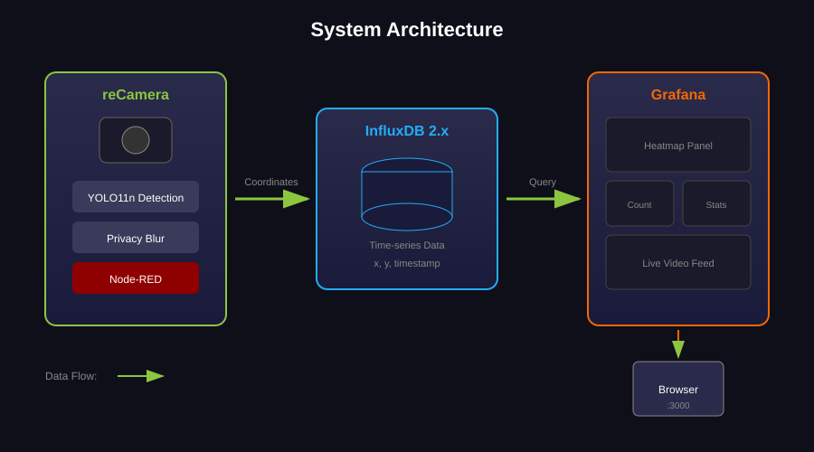

## Preset: AI Camera Direct {#recamera}

Plug in a reCamera and start tracking — the camera handles AI detection on its own, just add a computer for the dashboard.

| Device | Purpose |
|--------|---------|
| reCamera | AI camera that detects people and publishes results over MQTT |
| Computer or reComputer R1100 | Runs the MQTT broker + InfluxDB + Grafana dashboard + video gateway |

The camera only publishes MQTT; it never writes to the database. Several devices — reCamera, Jetson, RK, Raspberry Pi — can share one broker and land on one dashboard.

**What you'll get:**
- View daily/weekly traffic trends with charts
- Customize dashboard layout
- Export data for analysis

**Requirements:** Docker installed · Same network for all devices

## Step 1: Start Data Dashboard {#backend type=docker_deploy required=true config=devices/backend_deploy.yaml}

Deployment runs an ONVIF probe and wires whatever answers into the video gateway — that is where the picture in the dashboard's bottom-right panel comes from. **Discovery is multicast and stops at the subnet boundary**: a backend on another network (in the cloud, say) will find nothing, and those cameras go in the manual field on the deploy form instead.

Start the MQTT broker, data storage and chart display services on your computer (or a dedicated server). Every camera publishes here.

### Target {#backend_local type=local config=devices/backend_deploy.yaml default=true}

### Wiring

Make sure Docker Desktop is installed and running, with at least 2GB free disk space.

### Troubleshooting

| Issue | Solution |
|-------|----------|
| Port conflict error | Free up 8086, 3000, 8080 or 1883 — the stack binds all four |
| Docker not available | Local target: start Docker Desktop. Remote target: make sure the Docker service is running on the device |
| Not enough disk | The deploy step checks for at least 2 GB free |

### Target {#backend_remote type=remote config=devices/backend_deploy.yaml}

### Wiring

| Field | Example |
|-------|---------|
| Device IP | 192.168.1.100 or reComputer-R110x.local |
| Username | recomputer |
| Password | 12345678 |

### Troubleshooting

| Issue | Solution |
|-------|----------|
| Connection timeout | Check network cable, test with ping |
| SSH authentication failed | Verify username and password |

---

## Step 2: Connect Camera to Dashboard {#recamera type=recamera_cpp required=true config=devices/recamera_cpp.yaml}

Install the retail analytics app on the reCamera and tell it which broker to publish to.

The app runs on the camera itself: YOLO11n INT8 at roughly 10 FPS, tracking each shopper across frames and reporting dwell state (browsing / engaged / needs assistance) plus entry and exit counts.

### Wiring

1. USB connection: IP address `192.168.42.1`, plug and play
2. Network/WiFi: Find reCamera's IP in your router admin page
3. Enter the reCamera IP, the MQTT server IP (from Step 1), plus an installation name and camera ID

The installation name and camera ID form the MQTT topic `<installation-name>/retail-vision/results/<camera-id>`, and are how the dashboard tells devices apart. Several cameras in one store share an installation name and differ by camera ID.

This step disables Node-RED autostart — the detector and Node-RED compete for the same camera and cannot both run.

### Troubleshooting

| Issue | Solution |
|-------|----------|
| Cannot connect | USB: use `192.168.42.1`; Network: check router for IP |
| No data showing | Make sure Step 1 completed; camera and server on same network |
| Fails to start with a `device_init` assertion | The previous app holding the camera did not release TPU memory — reboot the device |

---

## Step 3: Map Heatmap to Floor Plan (Optional) {#heatmap type=manual required=false}

By default, the heatmap shows the camera's perspective. To display it on your store's actual floor plan, use the built-in calibration tool.

### How to Do It

1. Open **http://\<server-ip\>:8080** in your browser
2. Click the **gear icon** (top-right corner) to open calibration settings
3. Pick the camera to calibrate ("All cameras" sets the default for any camera without its own calibration)
4. Upload a **camera screenshot** (left side) and your **floor plan image** (right side)
5. Click **4 matching reference points** on the camera view, then the same 4 spots on the floor plan
6. Click **Save** — calibration is applied immediately

The floor plan is shared: calibrate each camera once and their footfall lands on the same plan. The dropdown at the top-left of the page narrows the view to a single camera.

**Tips:** Choose widely-spaced landmarks like corners, pillars, or doorways as reference points.

### Troubleshooting

| Issue | Solution |
|-------|----------|
| Heatmap doesn't align well | Re-open settings, click Reset, and recalibrate with better reference points |
| Calibration survives a browser change | Expected — it is stored on the server, in the `heatmap-config` volume, not in the browser |

### Skip This If

You only want to see the camera-view heatmap without mapping to a floor plan.

## Step 4: Open Dashboard {#dashboard_recamera type=web_dashboard required=true config=devices/dashboard.yaml}

The Grafana dashboard is now live. Click below to open it in your browser.

### Troubleshooting
| Issue | Solution |
|-------|----------|
| Page not loading | Make sure the previous deployment step finished successfully and the service is healthy. |
| Wrong host/port | Update the URL with your device's IP if you deployed to a remote machine. |

### Deployment Complete

Your heatmap dashboard is ready!

**Access your services:**
- **Data Dashboard**: http://\<server-ip\>:3000 — login `admin` / `admin`, view traffic charts and trends
- **Live Heatmap**: http://\<server-ip\>:8080
- **Video gateway**: http://\<server-ip\>:1984 — camera discovery and preview — real-time heatmap overlay (calibrate via gear icon)

---

## Preset: reCamera Pro {#recamera_pro}

Newer hardware, same one-camera setup. The analytics app ships in the device's App Center; this preset configures it and points it at your dashboard.

| Device | Purpose |
|--------|---------|
| reCamera Pro | AI camera — detection, tracking, dwell states and entry/exit counting, all on device |
| Computer or reComputer R1100 | Runs the MQTT broker + InfluxDB + Grafana dashboard + video gateway |

**Requirements:** the `retail-vision` app installed from the device's App Center · Docker installed · all devices on the same network

> The app is not distributed with this solution — installing one requires a release-signed archive and the signing chain is not public. If the target's App Center does not carry it, this step says so and names what is installed instead.

## Step 1: Start the Dashboard {#backend_pro type=docker_deploy required=true config=devices/backend_deploy.yaml}

Deployment runs an ONVIF probe and wires whatever answers into the video gateway — that is where the picture in the dashboard's bottom-right panel comes from. **Discovery is multicast and stops at the subnet boundary**: a backend on another network (in the cloud, say) will find nothing, and those cameras go in the manual field on the deploy form instead.

Same backend as the AI Camera Direct preset. Skip if you already deployed it.

### Target {#backend_pro_local type=local config=devices/backend_deploy.yaml default=true}

### Target {#backend_pro_remote type=remote config=devices/backend_deploy.yaml}

### Troubleshooting

| Issue | Solution |
|-------|----------|
| Port conflict error | Free up 8086, 3000, 8080 or 1883 — the stack binds all four |
| Docker not available | Local target: start Docker Desktop. Remote target: make sure the Docker service is running on the device |
| Not enough disk | The deploy step checks for at least 2 GB free |

## Step 2: Configure the Camera {#recamera_pro_app type=recamera_pro_app required=true config=devices/recamera_pro.yaml}

Enter the device's web console credentials (not SSH), an installation name, and the MQTT address of the backend from step 1.

Leaving the MQTT address empty is fine — results then stay on the camera's own page instead of reaching the dashboard.

### Troubleshooting

| Issue | Solution |
|-------|----------|
| Says retail-vision is not in the App Center | Install it from the device's App Center first, then re-run this step |
| No data on the dashboard | Check the MQTT address points at the machine from step 1 and both are on the same network |
| Avg Dwell tile stays empty | Expected — the Pro app does not report per-person dwell time. Every other tile works |

## Step 3: Open the Dashboard {#dashboard_pro type=web_dashboard required=true config=devices/dashboard.yaml}

The Grafana dashboard is now live (login `admin` / `admin`).

### Deployment Complete

**Access:**
- **Dashboard**: http://\<server-ip\>:3000
- **Live Heatmap**: http://\<server-ip\>:8080
- **Video gateway**: http://\<server-ip\>:1984 — camera discovery and preview

Both services start automatically with Step 1.

**Having issues?**
- No data? Check that reCamera is connected (Step 2)
- Can't open pages? Run `docker ps` to check services are running

### Troubleshooting

| Issue | Solution |
|-------|----------|
| Page not loading | Make sure the previous deployment step finished successfully and the service is healthy. |
| Wrong host/port | Update the URL with your device's IP if you deployed to a remote machine. |

---

## Preset: IP Camera + Rockchip NPU {#rk}

Keep your existing IP cameras — a Rockchip board runs the detector locally.

| Device | Purpose |
|--------|---------|
| reComputer RK3588 or RK3576 | Runs people-flow detection on the NPU, publishes to MQTT |
| IP camera (RTSP) | Any camera with an RTSP output |
| Computer, or the same board | Runs the MQTT broker + InfluxDB + Grafana dashboard + video gateway |

**Measured:** 13.2 fps on RK3588, 13.3 fps on RK3576, MQTT pinned at 1 msg/s. Video decode runs on the MPP hardware decoder, not the CPU.

**Requirements:** Docker installed · NPU driver present on the board (`/usr/lib/librknnrt.so`) · camera and board on the same network

## Step 1: Start the Dashboard {#backend_rk type=docker_deploy required=true config=devices/backend_deploy.yaml}

Deployment runs an ONVIF probe and wires whatever answers into the video gateway — that is where the picture in the dashboard's bottom-right panel comes from. **Discovery is multicast and stops at the subnet boundary**: a backend on another network (in the cloud, say) will find nothing, and those cameras go in the manual field on the deploy form instead.

Same backend as the other presets. It can run on this board or on another machine. Skip if you already deployed it.

### Target {#backend_rk_local type=local config=devices/backend_deploy.yaml default=true}

### Target {#backend_rk_remote type=remote config=devices/backend_deploy.yaml}

### Troubleshooting

| Issue | Solution |
|-------|----------|
| Port conflict error | Free up 8086, 3000, 8080 or 1883 — the stack binds all four |
| Docker not available | Local target: start Docker Desktop. Remote target: make sure the Docker service is running on the device |
| Not enough disk | The deploy step checks for at least 2 GB free |

## Step 2: Deploy the Detector {#rk_detector type=docker_deploy required=true config=devices/rk_deploy.yaml}

Deploys the detector to the board over SSH. Pick the right board — the model is compiled per NPU and the wrong one will not load.

If the backend runs on this same board, leave the MQTT address at `127.0.0.1`.

### Target {#rk_remote type=remote config=devices/rk_deploy.yaml default=true}

### Troubleshooting

| Issue | Solution |
|-------|----------|
| Container fails with a librknnrt error | The board is missing the NPU user-space library — check `/usr/lib/librknnrt.so` exists |
| No data on the dashboard | Verify the camera URL with `ffprobe rtsp://...`, and check the MQTT address |
| Low frame rate with a pinned CPU | Hardware decode did not engage. `/root/.cache` is a tmpfs precisely to avoid a stale plugin cache — check the MPP libraries are mounted |

## Step 3: Open the Dashboard {#dashboard_rk type=web_dashboard required=true config=devices/dashboard.yaml}

### Deployment Complete

**Access:**
- **Dashboard**: http://\<server-ip\>:3000
- **Live Heatmap**: http://\<server-ip\>:8080
- **Video gateway**: http://\<server-ip\>:1984 — camera discovery and preview

### Troubleshooting

| Issue | Solution |
|-------|----------|
| Page not loading | Make sure the previous deployment step finished successfully and the service is healthy. |
| Wrong host/port | Update the URL with your device's IP if you deployed to a remote machine. |

---

## Preset: IP Camera + Raspberry Pi 5 (Hailo) {#hailo}

Keep your existing IP cameras — a Hailo-8 accelerator runs the detector locally. The hot path is native C++: no Torch, Ultralytics, ONNX Runtime or Python in the container.

| Device | Purpose |
|--------|---------|
| Raspberry Pi 5 + Hailo-8 (or reComputer R series) | Runs people-flow detection on the accelerator, publishes to MQTT |
| IP camera (RTSP) | Any camera with an RTSP output |
| Computer, or the same board | Runs the MQTT broker + InfluxDB + Grafana dashboard + video gateway |

**Measured:** 14.3 fps tracking a 15 fps RTSP source, MQTT at 0.94 msg/s. Unpaced, the same pipeline reached 234 fps at 2.5–2.9 ms per inference — roughly 15x the source rate in reserve.

**Requirements:** Docker installed · HailoRT **4.21** present (driver, user library and GStreamer plugin must all be the same version) · camera and board on the same network

> **One Hailo-8 runs one application at a time.** HailoRT hands the physical device to a single process. If another Hailo app is already running on the board (face recognition, for instance), this detector will not start and reports `HAILO_OUT_OF_PHYSICAL_DEVICES`. Running several at once requires moving *every* Hailo consumer on the board onto the `hailort.service` multi-process scheduler, which is off by default.

## Step 1: Start the Dashboard {#backend_hailo type=docker_deploy required=true config=devices/backend_deploy.yaml}

Deployment runs an ONVIF probe and wires whatever answers into the video gateway — that is where the picture in the dashboard's bottom-right panel comes from. **Discovery is multicast and stops at the subnet boundary**: a backend on another network (in the cloud, say) will find nothing, and those cameras go in the manual field on the deploy form instead.

Same backend as the other presets. It can run on this board or on another machine. Skip if you already deployed it.

### Target {#backend_hailo_local type=local config=devices/backend_deploy.yaml default=true}

### Target {#backend_hailo_remote type=remote config=devices/backend_deploy.yaml}

### Troubleshooting

| Issue | Solution |
|-------|----------|
| Port conflict error | Free up 8086, 3000, 8080 or 1883 — the stack binds all four |
| Docker not available | Local target: start Docker Desktop. Remote target: make sure the Docker service is running on the device |
| Not enough disk | The deploy step checks for at least 2 GB free |

## Step 2: Deploy the Detector {#hailo_detector type=docker_deploy required=true config=devices/hailo_deploy.yaml}

Deploys the detector over SSH. The Hailo runtime version is checked first — a mismatch stops here and names what is actually installed.

The model is downloaded from Hailo's own Model Zoo and verified by sha256; it is not re-hosted.

### Target {#hailo_remote type=remote config=devices/hailo_deploy.yaml default=true}

### Troubleshooting

| Issue | Solution |
|-------|----------|
| `HAILO_OUT_OF_PHYSICAL_DEVICES` | Another application holds the accelerator — stop it first (see the note above) |
| Deploy reports a libhailort version mismatch | The board is not on HailoRT 4.21; move it there, changing driver and user library together |
| `/dev/hailo0` missing | The accelerator is not seated, or the `hailo_pci` driver is not loaded |
| No data on the dashboard | Verify the camera URL with `ffprobe rtsp://...`, and check the MQTT address |

## Step 3: Open the Dashboard {#dashboard_hailo type=web_dashboard required=true config=devices/dashboard.yaml}

### Deployment Complete

**Access:**
- **Dashboard**: http://\<server-ip\>:3000
- **Live Heatmap**: http://\<server-ip\>:8080
- **Video gateway**: http://\<server-ip\>:1984 — camera discovery and preview

### Troubleshooting

| Issue | Solution |
|-------|----------|
| Page not loading | Make sure the previous deployment step finished successfully and the service is healthy. |
| Wrong host/port | Update the URL with your device's IP if you deployed to a remote machine. |

## Preset: Upgrade Existing Cameras {#jetson}

Already have IP cameras? Add an NVIDIA Jetson and they become people-flow sensors — no need to replace them.

| Device | Purpose |
|--------|---------|
| NVIDIA Jetson (Orin series) | Runs YOLO11n TensorRT detection on the GPU, publishes to MQTT |
| IP camera (RTSP) | Any camera with an RTSP output |
| Computer, or the same Jetson | Runs the MQTT broker + InfluxDB + Grafana dashboard + video gateway |

**Measured:** 9.7 ms per inference (48.6 FPS standalone), MQTT pinned at 1 msg/s. Runs the same tracking and dwell logic as the Rockchip and Hailo presets.

**Requirements:** NVIDIA Jetson (JetPack 6.x) · Docker with the NVIDIA runtime · camera and Jetson on the same network

## Step 1: Start the Dashboard {#backend_jetson type=docker_deploy required=true config=devices/backend_deploy.yaml}

Deployment runs an ONVIF probe and wires whatever answers into the video gateway — that is where the picture in the dashboard's bottom-right panel comes from. **Discovery is multicast and stops at the subnet boundary**: a backend on another network (in the cloud, say) will find nothing, and those cameras go in the manual field on the deploy form instead.

Same backend as the other presets. It can run on this Jetson or on another machine. Skip if you already deployed it.

### Target {#backend_jetson_local type=local config=devices/backend_deploy.yaml default=true}

### Target {#backend_jetson_remote type=remote config=devices/backend_deploy.yaml}

### Troubleshooting

| Issue | Solution |
|-------|----------|
| Port conflict error | Free up 8086, 3000, 8080 or 1883 — the stack binds all four |
| Docker not available | Local target: start Docker Desktop. Remote target: make sure the Docker service is running on the device |
| Not enough disk | The deploy step checks for at least 2 GB free |

## Step 2: Deploy the Detector {#jetson_deploy type=docker_deploy required=true config=devices/jetson_deploy.yaml}

Deploys the detector to the Jetson over SSH.

**The first deployment builds a TensorRT engine, which takes 2-5 minutes.** A TensorRT plan is tied to the GPU architecture and the TensorRT build that produced it, so it cannot ship inside an image — it is built on the board and kept in a named volume that later deployments reuse.

### Target {#jetson_remote type=remote config=devices/jetson_deploy.yaml default=true}

### Troubleshooting

| Issue | Solution |
|-------|----------|
| Connection timeout | Check the network, verify the Jetson IP with `ping` |
| NVIDIA runtime error | Run `nvidia-smi` on the Jetson to confirm the GPU is available |
| No data | Verify the RTSP URL with `ffprobe rtsp://...`, and check the MQTT address |
| Slow first start | TensorRT engine build — once only, 2-5 minutes |

## Step 3: Open the Dashboard {#dashboard_jetson type=web_dashboard required=true config=devices/dashboard.yaml}

### Deployment Complete

**Access:**
- **Dashboard**: http://\<server-ip\>:3000
- **Live Heatmap**: http://\<server-ip\>:8080
- **Video gateway**: http://\<server-ip\>:1984 — camera discovery and preview

### Troubleshooting

| Issue | Solution |
|-------|----------|
| Page not loading | Make sure the previous deployment step finished successfully and the service is healthy. |
| Wrong host/port | Update the URL with your device's IP if you deployed to a remote machine. |

---
