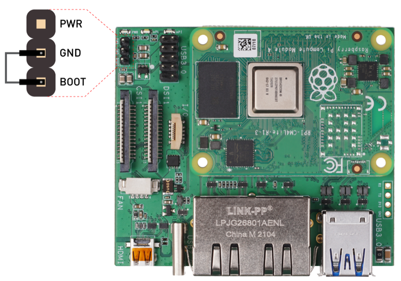

## 套餐: reRouter CM4（CPU） {#cm4}

把本地转写放进门店的最便宜做法。Paraformer 流式识别跑在 4 个 Cortex-A72 核上，没有加速器，也不做语音合成。标点和声纹在这里默认关闭，因为各自都要在 4GB 板子上常驻一个模型。

| 设备 | 作用 |
|--------|---------|
| reRouter CM4 | 运行语音服务和采集客户端；转写结果存在它上面 |
| reSpeaker XVF3800 | 4 麦阵列——回声消除、波束成形、噪声抑制在自带 DSP 上完成 |

**重要提示。** 这不是经过认证的转写产品，也不是合规控制手段。它产出的是方案页所记录质量的文本，不具备法律效力。在门店录音涉及的告知与同意义务，由你自行承担。

有两条已知弱点直接决定站点能不能用：稳态背景噪声**高于 70 dB** 时阵列的噪声抑制失效；说话人**超出约 3 m** 就落在波束成形的有效覆盖之外。换更快的板子解决不了其中任何一条。

**这块 SoC 上的 ASR 速度与准确率尚未实测。** 上游 bench 矩阵里 CM4 的 `asr_zh_en` 行仍是 TBD。批量铺开前先做试点。

## 步骤 1: 烧录 OpenWrt 固件 {#firmware type=manual required=false}

把系统写进 reRouter，然后接入网络。如果你的 reRouter 是 2025 年 11 月之后购买的，**跳过这一步**——出厂固件已经正确。

### 前置条件

- 电脑上装好 **rpiboot**，否则 eMMC 根本不会被识别
  - **Windows：** 运行 [rpiboot 安装包](https://github.com/raspberrypi/usbboot/raw/master/win32/rpiboot_setup.exe)
  - **Mac/Linux：** `git clone --depth=1 https://github.com/raspberrypi/usbboot && cd usbboot && make`
- 一根 USB-C **数据**线，两根网线

### 接线

| 设备 | 连接 | 说明 |
|--------|------------|-------|
| reRouter CM4 | 拆开外壳露出板子 | 需要接启动跳线 |
| USB-C 线 | reRouter 接电脑 | 用于烧录 eMMC |
| 电脑 | 已装 rpiboot | 否则 eMMC 不会枚举 |

1. 拆下外壳，把 **Boot** 和 **GND** 用跳线短接进入启动模式
2. 接上 USB-C 线并运行 **rpiboot**——eMMC 会挂载成一个 U 盘
3. 下载固件。用下面这两个版本，LAN 地址才是 `192.168.49.1`：[国际版](https://files.seeedstudio.com/wiki/solution/ai-sound/reRouter-firmware-backup/OpenWRT-24.10.3-RPi-4-Factory.img.gz) · [中文版](https://files.seeedstudio.com/wiki/solution/ai-sound/reRouter-firmware-backup/OpenWRT-24.10.3-RPi-4-Factory-Chinese.img.gz)
4. 用 [Raspberry Pi Imager](https://www.raspberrypi.com/software/)（选 "Use custom"）或 [balenaEtcher](https://etcher.balena.io/) 写入
5. 拔掉跳线，装回外壳，接好线缆上电

**LAN** 口接电脑，**WAN** 口接路由器。1–2 分钟后 `http://192.168.49.1` 可以打开；用户 `root`，密码为空。

### 故障排查

| 问题 | 解决办法 |
|-------|----------|
| `192.168.49.1` 打不开 | 网线插在 WAN 口了，或者固件不是上面链接的版本、用了别的地址 |
| rpiboot 认不到设备 | Boot-GND 跳线没接好，或者 USB-C 线只能充电 |
| 烧录中途失败 | 重新格式化目标存储再写一次 |
| 登录被拒 | 密码为空——什么都不填直接提交 |

---

## 步骤 2: 部署本地语音栈 {#deploy_cm4 type=docker_deploy required=true config=devices/local_rerouter.yaml}

启动两个容器：8621 端口上的 OpenVoiceStream 语音服务，8090 端口上的采集客户端。没有别的。没有配置任何云端地址，也不需要填任何凭据。

部署过程会询问识别语种、输出目录、麦克风声卡编号，以及是否开启声纹标注和标点恢复。

### 前置条件

- reRouter **仅在本次部署时**需要联网——两个镜像加上 CPU 模型集。之后这台盒子不需要上行链路。
- 目标文件系统至少 4GB 空闲。
- 8621 和 8090 端口空闲。

### 接线

| 设备 | 连接 | 说明 |
|--------|------------|-------|
| reSpeaker XVF3800 | USB 接 reRouter | 要接 USB 主机口。用 `lsusb` 确认，应显示 `2886:001a` |
| reRouter CM4 | WAN 口接路由器 | 只在拉镜像和模型时需要 |
| reRouter CM4 | LAN 口接电脑 | 用于 SSH 部署 |

部署前先记下 ALSA 声卡编号：SSH 进去运行 `arecord -l`，阵列显示为 **ArrayUAC10**，`card` 后面的数字就是部署时要填的值。

### 部署目标: reRouter CM4 {#cm4_remote type=remote device=rerouter device_name="reRouter CM4" config=devices/local_rerouter.yaml default=true}

通过 SSH 部署到 reRouter。默认地址 `192.168.49.1`，用户 `root`，出厂镜像密码为空。

### 故障排查

| 问题 | 解决办法 |
|-------|----------|
| SSH 拒绝连接 | 网线插在 WAN 口了，或者地址不是 `192.168.49.1` |
| 认证失败 | 出厂 OpenWrt 镜像 root 无密码——密码栏留空 |
| 拉镜像超时 | WAN 口到镜像仓库不通。先在设备上 `ping` 通了再重试 |
| `speech` 好几分钟一直 unhealthy | 首次启动下载模型集时的正常现象。用 `docker logs -f openvoicestream` 跟踪 |
| 模型下载卡住 | 把模型下载源在 HF 镜像和 huggingface.co 之间切换后重新部署 |
| `voice-client` 起不来，提示镜像找不到 | `c4-local` tag 尚未发布。请从 sensecraft-voice-client 的 `feature/c4-harden` 分支构建并打上该 tag，或用 `VOICE_CLIENT_IMAGE` 指向你自己的构建 |
| 内存不足 | 把声纹和标点都设为关闭——它们各自要在 4GB 里常驻一个模型 |

---

## 步骤 3: 检查本地转写结果 {#verify_cm4 type=manual verify=true required=true config=devices/verify_asr.yaml}

对着阵列说一句话，然后确认设备上出现了文件。

### 验证

1. 站在 reSpeaker 约 3 m 以内，用选定的语种说一句完整的话
2. 说完静默两秒左右——本地 VAD 需要 0.7 s 静音才会结束这一句
3. 在设备上运行 `ls -lt <输出目录>/cache/asr/ | head`，应看到一个带当前时间戳的新 `.json` 文件
4. `cat` 打开它：`text` 字段就是你说的内容。开启声纹时还会有 `speaker` 字段
5. 在门店局域网内打开 `http://<设备IP>:8090/`，同一句话会出现在实时视图里

### 故障排查

| 问题 | 解决办法 |
|-------|----------|
| 没有文件生成，网页也是空的 | 在设备上运行 `arecord -l`。看不到 ArrayUAC10 说明阵列接在非主机 USB 口上；能看到但编号和你填的不一致，就用正确编号重新部署 |
| `curl -F "file=@sample.wav" http://<设备IP>:8621/asr` 返回的文字正确，但没有文件写出 | 识别器没问题，音频通路有问题——检查声卡编号和 `docker logs sensecraft-voice-client` |
| 转写是一整行没有断句的文字 | 标点恢复关着。如果板子内存够就开启它 |
| 每句开头的字被吃掉 | 本地 VAD 切早了。客户端配置里 `speechPadSeconds` 默认 0.5 s，不要拿几条录音去精调它 |
| 房间很吵、识别很差 | 测一下背景噪声。高于约 70 dB 时阵列分不出说话人，改任何设置都救不回来 |
| CPU 满载、转写落后于说话 | 先关标点，再关声纹。这块板子按设计一次只跑一路识别 |

### 部署完成

门店盒子现在在本地转写了。

#### 快速验证

1. `docker ps`——`openvoicestream` 和 `sensecraft-voice-client` 都是 `Up`
2. `curl http://<设备IP>:8621/readyz` 返回就绪状态
3. `<输出目录>/cache/asr/` 下存在带你那句话的 `.json` 文件
4. 拔掉 WAN 网线，再说一句，确认仍然有新文件生成——这就是"只在本地"这句话的实测

#### 下一步

- 给 `<输出目录>` 定一个保留期并落实。那个目录没有任何轮转机制
- 如果不需要音频，把客户端配置里的 `voice.output` 改成 `stream`，只写文字
- 在真正的收银台位置再做一次噪声和距离检查，然后再铺更多站点

---

## 套餐: reComputer RK3576（NPU） {#rk3576}

SenseVoice 跑在 6 TOPS NPU 上，CPU 因此可以同时承担标点恢复、声纹向量和采集客户端。这块板上的实测：3.0 s 音频热态约 780 ms 转写完成（RTF 0.26），全部加载常驻 1.71 GiB。

| 设备 | 作用 |
|--------|---------|
| reComputer RK3576 | NPU 上跑语音服务，CPU 上跑采集客户端 |
| reSpeaker XVF3800 | 4 麦阵列——回声消除、波束成形、噪声抑制在自带 DSP 上完成 |

**重要提示。** 这不是经过认证的转写产品，也不是合规控制手段。它产出的是方案页所记录质量的文本，不具备法律效力。在门店录音涉及的告知与同意义务，由你自行承担。

同样的两条站点限制依然成立：稳态背景噪声**高于 70 dB** 会让阵列的噪声抑制失效；说话人**超出约 3 m** 就落在波束成形覆盖之外。板子更快并不能扩大其中任何一条。

## 步骤 1: 部署本地语音栈 {#deploy_rk3576 type=docker_deploy required=true config=devices/local_rk3576.yaml}

启动两个容器：8621 端口上的 OpenVoiceStream 语音服务（后端固定为 RKNN），8090 端口上的采集客户端。没有配置任何云端地址。

声纹和标点在这里默认开启——上面那组实测数字本来就是两者都开的结果。

### 前置条件

- 板子**仅在本次部署时**需要联网：镜像加上约 825 MB 模型产物（502 MB SenseVoice RKNN、294 MB CT-Transformer、28 MB CAM++）。2.5 MB/s 的链路上约 7 分钟。
- 至少 6GB 空闲空间。
- RKNPU 驱动已绑定。部署会检查 `/sys/bus/platform/drivers/RKNPU`；在 Seeed 厂商内核上 `/dev/rknpu` 不存在**不是**故障。

### 接线

| 设备 | 连接 | 说明 |
|--------|------------|-------|
| reSpeaker XVF3800 | reComputer 的 USB-A 口 | 必须用 USB-A 主机口。Type-C 是双角色口，可能处于 device 模式，那样什么都不会枚举 |
| reComputer RK3576 | 网线接路由器 | 用于下载镜像和模型产物 |
| 电脑 | 同一网段 | 用于 SSH 部署 |

运行 `lsusb` 确认有 `2886:001a`，再运行 `arecord -l` 记下声卡编号备用。

### 部署目标: reComputer RK3576 {#rk3576_remote type=remote device=rk3576 device_name="reComputer RK3576" config=devices/local_rk3576.yaml default=true}

通过 SSH 部署。板子的地址来自 DHCP，默认用户是 `recomputer`。

### 故障排查

| 问题 | 解决办法 |
|-------|----------|
| 预检报 "RKNPU driver not bound" | 这块板不是 RK3576，或者内核没有 NPU 驱动。原因不是缺 `/dev/rknpu`——检查读的是 `/sys/bus/platform/drivers/RKNPU` |
| `speech` 好几分钟一直 unhealthy | 下载 825 MB 模型时的正常现象。用 `docker logs -f openvoicestream` 跟踪 |
| 模型下载卡住 | 把模型下载源在 HF 镜像和 huggingface.co 之间切换后重新部署 |
| `voice-client` 起不来，提示镜像找不到 | `c4-local` tag 尚未发布。请从 sensecraft-voice-client 的 `feature/c4-harden` 分支构建并打上该 tag，或设置 `VOICE_CLIENT_IMAGE`。真机核实（2026-09-06，RK3576 `cat-remote`，该设备本地已缓存 `sensecraft-voice-client:ovs-20260901b`）：这个 tag 同样支持 `vad=none` 本地 VAD、`asr_cache`、`speaker_embedding`，把 `VOICE_CLIENT_IMAGE` 指向它可以直接顶替本套餐、不用重新构建——但这个 tag 没有发布到任何 registry，只确认在那一台设备上存在。 |
| `lsusb` 里看不到 reSpeaker | 换到 USB-A 主机口。`dmesg \| tail` 出现 `xhci-hcd` 总线注销，说明双角色控制器切到了 device 模式 |
| 每次重启都重新下载模型 | 命名卷被删了。特别是 `rk-sensevoice-rknn` 里存着 502 MB 的产物，没有它每次重建都会重下。另外 `rk-asr-models` 是个通用卷名，同一台设备上其他基于 OVS 的 RK3576 方案也会用到它（在 `cat-remote` 上实测发现与 `conversational_voice_ai` 部署共用）——它是跨方案共享的，不是本方案专属，对这套 compose 执行 `docker compose down -v` 会连带删掉那个方案缓存的模型 |

---

## 步骤 2: 检查本地转写结果 {#verify_rk3576 type=manual verify=true required=true config=devices/verify_asr.yaml}

对着阵列说一句话，然后确认设备上出现了文件。

### 验证

1. 站在 reSpeaker 约 3 m 以内，用选定的语种说一句完整的话
2. 说完静默两秒左右——本地 VAD 需要 0.7 s 静音才会结束这一句
3. 在设备上运行 `ls -lt <输出目录>/cache/asr/ | head`，应看到一个带当前时间戳的新 `.json` 文件
4. `cat` 打开它：`text` 字段是你说的内容且带标点，开启声纹时还有 `speaker` 字段
5. 在门店局域网内打开 `http://<设备IP>:8090/`，同一句话会出现在实时视图里

### 故障排查

| 问题 | 解决办法 |
|-------|----------|
| 没有文件生成，网页也是空的 | 运行 `arecord -l`。看不到 ArrayUAC10 说明阵列接在 Type-C 口上；编号与你填的不一致就用正确编号重新部署 |
| `backend` 不是 `rk:sensevoice_rknn` | NPU 路径没加载。确认 profile 传进了容器：`docker exec openvoicestream env \| grep OVS_PROFILE` |
| `curl -F "file=@sample.wav" http://<设备IP>:8621/asr` 返回的文字正确，但没有文件写出 | 识别器没问题，音频通路有问题——检查声卡编号和 `docker logs sensecraft-voice-client` |
| 每句开头的字被吃掉 | 服务端 VAD 开着了。本套餐要求 `OVS_VAD_BACKEND=none`、由客户端本地断句；服务端 VAD 每个切点大约丢一个音节 |
| 房间很吵、识别很差 | 测一下背景噪声。高于约 70 dB 时阵列分不出说话人 |
| 容器因内存压力被杀 | `mem_limit` 是按 3.82 GiB 的板子设的 3000m。如果这块板还跑别的负载，先关标点 |

### 部署完成

门店盒子现在在本地、在 NPU 上转写了。

#### 快速验证

1. `docker ps`——`openvoicestream` 和 `sensecraft-voice-client` 都是 `Up`
2. `curl -F "file=@sample.wav" http://<设备IP>:8621/asr` 返回里带 `"backend":"rk:sensevoice_rknn"`
3. `<输出目录>/cache/asr/` 下存在带你那句话的 `.json` 文件
4. 拔掉网线，再说一句，确认仍然有新文件生成

#### 下一步

- 给 `<输出目录>` 定一个保留期并落实。那个目录没有任何轮转机制
- 如果不需要音频，把客户端配置里的 `voice.output` 改成 `stream`，只写文字
- 想要稳定的声纹标签而不是自动生成的编号，就在客户端页面上把常驻人员注册一遍
