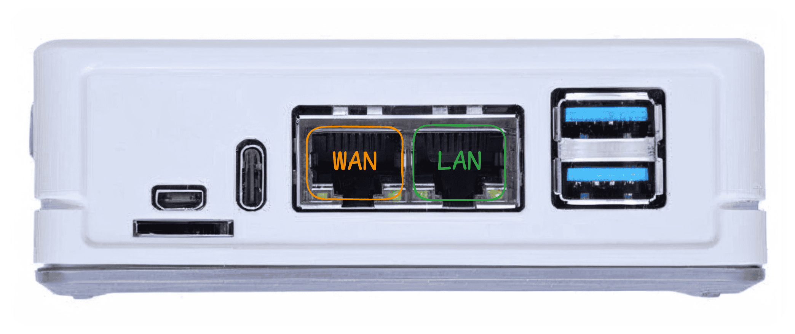

## Preset: reRouter CM4 (CPU) {#cm4}

The cheapest way to put local transcription in a store. Paraformer streaming recognition runs on four Cortex-A72 cores; there is no accelerator and no text-to-speech. Punctuation and voiceprint are off by default here because each adds a resident model to a 4 GB board.

| Device | Purpose |
|--------|---------|
| reRouter CM4 | Runs the speech service and the capture client; holds the transcripts |
| reSpeaker XVF3800 | 4-mic array — AEC, beamforming and noise suppression on its own DSP |

**Important.** This is not a certified transcription product and not a compliance control. Its output is text of the quality documented on the solution page, with no legal standing. Recording conversations in a store carries notice and consent obligations that are yours to meet.

Two known weaknesses decide whether a site works at all: steady background noise **above 70 dB** defeats the array's noise suppression, and speakers **beyond about 3 m** fall outside the beamformer's useful coverage. Neither is fixable by choosing a faster board.

**ASR speed and accuracy have not been measured on this SoC.** The upstream bench matrix still lists the CM4 `asr_zh_en` row as TBD. Run a pilot before committing a fleet.

## Step 1: Flash OpenWrt Firmware {#firmware type=manual required=false}

Write the operating system to the reRouter, then put it on your network. **Skip this step** if your reRouter was purchased after November 2025 — it already ships with the correct firmware.

### Prerequisites

- **rpiboot** on your computer, otherwise the eMMC is never recognized
  - **Windows:** run the [rpiboot installer](https://github.com/raspberrypi/usbboot/raw/master/win32/rpiboot_setup.exe)
  - **Mac/Linux:** `git clone --depth=1 https://github.com/raspberrypi/usbboot && cd usbboot && make`
- A USB-C **data** cable, and two Ethernet cables

### Wiring

| Device | Connection | Notes |
|--------|------------|-------|
| reRouter CM4 | Case removed to reach the board | Needed to set the boot jumper |
| USB-C cable | reRouter to computer | For eMMC flashing |
| Computer | rpiboot installed | Otherwise the eMMC does not enumerate |

1. Remove the case and jumper **Boot** to **GND** to enter boot mode
2. Connect the USB-C cable and run **rpiboot** — the eMMC appears as a USB drive
3. Download the firmware. Use these builds so the LAN address is `192.168.49.1`: [Global](https://files.seeedstudio.com/wiki/solution/ai-sound/reRouter-firmware-backup/OpenWRT-24.10.3-RPi-4-Factory.img.gz) · [China](https://files.seeedstudio.com/wiki/solution/ai-sound/reRouter-firmware-backup/OpenWRT-24.10.3-RPi-4-Factory-Chinese.img.gz)
4. Write it with [Raspberry Pi Imager](https://www.raspberrypi.com/software/) ("Use custom") or [balenaEtcher](https://etcher.balena.io/)
5. Remove the jumper, reassemble, connect cables, power on

Connect the **LAN** port to your computer and the **WAN** port to your router. After 1–2 minutes, `http://192.168.49.1` answers; user `root`, password empty.

### Troubleshooting

| Issue | Solution |
|-------|----------|
| `192.168.49.1` does not answer | The cable is in the WAN port, or the firmware came from somewhere other than the links above and uses a different address |
| rpiboot does not see the device | The Boot-GND jumper is not seated, or the USB-C cable is charge-only |
| Flashing fails partway | Reformat the target and write again |
| Login rejected | The password is empty — submit the form without typing one |

---

## Step 2: Deploy the Local Voice Stack {#deploy_cm4 type=docker_deploy required=true config=devices/local_rerouter.yaml}

Two containers start: the OpenVoiceStream speech service on port 8621 and the capture client on port 8090. Nothing else. No cloud endpoint is configured and no credential is asked for.

The deployment asks for the recognition language, the output directory, the microphone card ID, and whether to enable voiceprint labelling and punctuation.

### Prerequisites

- The reRouter has internet **for this deployment only** — two images plus the CPU model set. Afterwards the box needs no uplink.
- At least 4 GB free on the target filesystem.
- Ports 8621 and 8090 are free.

### Wiring

| Device | Connection | Notes |
|--------|------------|-------|
| reSpeaker XVF3800 | USB to the reRouter | A USB host port. Confirm with `lsusb` — it reports `2886:001a` |
| reRouter CM4 | WAN to your router | Needed once, to pull images and models |
| reRouter CM4 | LAN to your computer | For SSH deployment |

Before deploying, note the ALSA card number: SSH in and run `arecord -l`. The array appears as **ArrayUAC10**; the number after `card` is what the deployment asks for.

### Target {#cm4_remote type=remote device=rerouter device_name="reRouter CM4" config=devices/local_rerouter.yaml default=true}

Deploy over SSH to the reRouter. Default address `192.168.49.1`, user `root`, empty password on a stock image.

### Troubleshooting

| Issue | Solution |
|-------|----------|
| SSH refused | The cable is in the WAN port, or the address is not `192.168.49.1` |
| Authentication failed | A stock OpenWrt image has no root password — leave the field empty |
| Image pull times out | The WAN port has no route to the registry. Check it from the device with `ping` before retrying |
| `speech` stays unhealthy for minutes | Expected on first boot while the model set downloads. Follow it with `docker logs -f openvoicestream` |
| Model download stalls | Redeploy with the model source switched between the HF mirror and huggingface.co |
| `voice-client` will not start, image not found | The `c4-local` tag is not published yet. Build branch `feature/c4-harden` of sensecraft-voice-client and tag it, or set `VOICE_CLIENT_IMAGE` to your own build |
| Out of memory | Set voiceprint and punctuation to Disabled — each loads its own model into 4 GB |

---

## Step 3: Check the Local Transcript {#verify_cm4 type=manual verify=true required=true config=devices/verify_asr.yaml}

Speak one sentence near the array, then confirm a file appeared on the device.

### Verification

1. Stand within about 3 m of the reSpeaker and say a full sentence in the language you selected
2. Stay quiet for about two seconds — the local VAD needs 0.7 s of silence to close the utterance
3. On the device, run `ls -lt <output-dir>/cache/asr/ | head` — a new `.json` file carries the current timestamp
4. `cat` it: the `text` field is what you said. With voiceprint enabled there is a `speaker` field too
5. Open `http://<device-ip>:8090/` from the store LAN and watch the same sentence in the live view

### Troubleshooting

| Issue | Solution |
|-------|----------|
| No file appears, page is empty | Run `arecord -l` on the device. If ArrayUAC10 is missing, the array is on a non-host USB port; if it is present but the card number differs from what you entered, redeploy with the right one |
| `curl -F "file=@sample.wav" http://<device-ip>:8621/asr` returns correct text but no file is written | The recognizer is fine and the audio path is not — check the card ID and `docker logs sensecraft-voice-client` |
| Transcript is one long run-on line | Punctuation is disabled. Enable it if the board has the memory |
| Words are clipped at the start of each sentence | The local VAD is cutting in. `speechPadSeconds` in the client config is 0.5 s by default; do not tune it against a handful of clips |
| Recognition is poor and the room is loud | Measure the background level. Above roughly 70 dB the array cannot separate the speaker, and no setting recovers it |
| CPU pinned at 100%, transcripts lag behind speech | Turn punctuation off first, then voiceprint. This board runs one recognition at a time by design |

### Deployment Complete

The store box now transcribes locally.

#### Quick verification

1. `docker ps` — `openvoicestream` and `sensecraft-voice-client` both show `Up`
2. `curl http://<device-ip>:8621/readyz` returns a ready status
3. A `.json` file with your sentence exists under `<output-dir>/cache/asr/`
4. Unplug the WAN cable, speak again, and confirm a new file still appears — this is the local-only claim, tested

#### Next steps

- Decide a retention period for `<output-dir>` and enforce it. Nothing rotates that directory
- If audio is not needed, set `voice.output` to `stream` in the client config so only text is written
- Repeat the noise and distance check at the actual counter position before installing more sites

---

## Preset: reComputer RK3576 (NPU) {#rk3576}

SenseVoice runs on the 6 TOPS NPU, so the CPU is free to carry punctuation, voiceprint embedding and the capture client at the same time. Measured on this board: 3.0 s of audio transcribed in about 780 ms warm (RTF 0.26), 1.71 GiB resident with everything loaded.

| Device | Purpose |
|--------|---------|
| reComputer RK3576 | Runs the speech service on the NPU and the capture client on the CPU |
| reSpeaker XVF3800 | 4-mic array — AEC, beamforming and noise suppression on its own DSP |

**Important.** This is not a certified transcription product and not a compliance control. Its output is text of the quality documented on the solution page, with no legal standing. Recording conversations in a store carries notice and consent obligations that are yours to meet.

The same two site limits apply: steady background noise **above 70 dB** defeats the array's noise suppression, and speakers **beyond about 3 m** fall outside the beamformer's coverage. The faster board does not extend either one.

## Step 1: Deploy the Local Voice Stack {#deploy_rk3576 type=docker_deploy required=true config=devices/local_rk3576.yaml}

Two containers start: the OpenVoiceStream speech service on port 8621, pinned to the RKNN backend, and the capture client on port 8090. No cloud endpoint is configured.

Voiceprint and punctuation are on by default here — the measurement above already includes both.

### Prerequisites

- The board has internet **for this deployment only**: the image plus about 825 MB of model artifacts (502 MB SenseVoice RKNN, 294 MB CT-Transformer, 28 MB CAM++). Roughly 7 minutes on a 2.5 MB/s link.
- At least 6 GB free.
- The RKNPU driver is bound. The deployment checks `/sys/bus/platform/drivers/RKNPU`; a missing `/dev/rknpu` is **not** a fault on Seeed's vendor kernel.

### Wiring

| Device | Connection | Notes |
|--------|------------|-------|
| reSpeaker XVF3800 | USB-A on the reComputer | Use a USB-A host port. The Type-C port is dual-role and may sit in device mode, in which case nothing enumerates |
| reComputer RK3576 | Ethernet to your router | For the image and the model artifacts |
| Computer | Same network | For SSH deployment |

Run `lsusb` and confirm `2886:001a`, then `arecord -l` and note the card number for the deployment.

### Target {#rk3576_remote type=remote device=rk3576 device_name="reComputer RK3576" config=devices/local_rk3576.yaml default=true}

Deploy over SSH. The board takes its address from DHCP; the default user is `recomputer`.

### Troubleshooting

| Issue | Solution |
|-------|----------|
| Pre-check reports "RKNPU driver not bound" | The board is not an RK3576, or its kernel lacks the NPU driver. A missing `/dev/rknpu` is not the cause — the check reads `/sys/bus/platform/drivers/RKNPU` |
| `speech` stays unhealthy for several minutes | Expected while 825 MB of models download. Watch with `docker logs -f openvoicestream` |
| Model download stalls | Switch the model source between the HF mirror and huggingface.co, then redeploy |
| `voice-client` will not start, image not found | The `c4-local` tag is not published yet. Build branch `feature/c4-harden` of sensecraft-voice-client and tag it, or set `VOICE_CLIENT_IMAGE` |
| reSpeaker missing from `lsusb` | Move it to a USB-A host port. `dmesg \| tail` showing `xhci-hcd` bus deregistration means the dual-role controller switched to device mode |
| Restarts re-download the models | The named volumes were removed. `rk-sensevoice-rknn` in particular holds the 502 MB artifact; without it every recreate re-downloads |

---

## Step 2: Check the Local Transcript {#verify_rk3576 type=manual verify=true required=true config=devices/verify_asr.yaml}

Speak one sentence near the array, then confirm a file appeared on the device.

### Verification

1. Stand within about 3 m of the reSpeaker and say a full sentence in the language you selected
2. Stay quiet for about two seconds — the local VAD needs 0.7 s of silence to close the utterance
3. On the device, run `ls -lt <output-dir>/cache/asr/ | head` — a new `.json` file carries the current timestamp
4. `cat` it: the `text` field is what you said, with punctuation, and a `speaker` field when voiceprint is on
5. Open `http://<device-ip>:8090/` from the store LAN and watch the same sentence in the live view

### Troubleshooting

| Issue | Solution |
|-------|----------|
| No file appears, page is empty | Run `arecord -l`. A missing ArrayUAC10 means the array is on the Type-C port; a different card number than you entered means redeploy with the right one |
| `backend` is not `rk:sensevoice_rknn` | The NPU path did not load. Confirm the profile reached the container: `docker exec openvoicestream env \| grep OVS_PROFILE` |
| `curl -F "file=@sample.wav" http://<device-ip>:8621/asr` returns correct text but no file is written | The recognizer is fine and the audio path is not — check the card ID and `docker logs sensecraft-voice-client` |
| Words are clipped at the start of each sentence | Server-side VAD is on. This preset requires `OVS_VAD_BACKEND=none` with the client endpointing locally; server VAD drops roughly one syllable per cut |
| Recognition is poor and the room is loud | Measure the background level. Above roughly 70 dB the array cannot separate the speaker |
| Container killed under memory pressure | `mem_limit` is 3000m for a 3.82 GiB board. Disable punctuation first if you also run other workloads here |

### Deployment Complete

The store box now transcribes locally, on the NPU.

#### Quick verification

1. `docker ps` — `openvoicestream` and `sensecraft-voice-client` both show `Up`
2. `curl -F "file=@sample.wav" http://<device-ip>:8621/asr` replies with `"backend":"rk:sensevoice_rknn"`
3. A `.json` file with your sentence exists under `<output-dir>/cache/asr/`
4. Unplug the Ethernet cable, speak again, and confirm a new file still appears

#### Next steps

- Decide a retention period for `<output-dir>` and enforce it. Nothing rotates that directory
- If audio is not needed, set `voice.output` to `stream` in the client config so only text is written
- Register the regular speakers once through the client page if you want stable voiceprint labels instead of auto-generated ones
