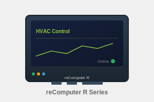

HVAC energy optimization system using KNN prediction model with OPC-UA integration.

## Preset: Standard Deployment {#default}

Deploy a KNN-based HVAC optimization system that learns from your historical data to suggest optimal settings.

| Device | Purpose |
|--------|---------|
| reComputer R1100 | Edge computing device with Docker support |

**What you'll get:**
- AI-powered temperature recommendations based on historical patterns
- OPC-UA integration for industrial HVAC systems
- Web dashboard for monitoring and control

**Requirements:** Docker installed · OPC-UA controller (or use built-in simulator)

## Step 1: HVAC Control System {#hvac type=docker_deploy required=true config=devices/deploy.yaml}

Deploy a smart temperature optimization service that learns from your building data.

### Target {#hvac_local type=local config=devices/deploy.yaml default=true}

Click the "Deploy" button below to automatically start the HVAC control service on this machine.

### Wiring

1. Ensure Docker is installed and running
2. Click deploy to start the container
3. Access the web interface at localhost:8280

### Troubleshooting

| Issue | Solution |
|-------|----------|
| Docker not running | Start Docker Desktop application |
| Port 8280 in use | Close the program using that port, or modify config to use another port |
| Container stops after starting | Run `docker logs missionpack_knn` to check error logs |
| Web page not loading | Wait 30 seconds for the service to fully start |

### Target {#hvac_remote type=remote config=devices/deploy.yaml}

Click the "Deploy" button below to automatically deploy the HVAC control service to the remote device.

### Wiring

1. Connect to remote device via SSH
2. Deploy Docker container remotely
3. Access the web interface at device IP:8280

### Troubleshooting

| Issue | Solution |
|-------|----------|
| SSH connection failed | Check IP address and credentials |
| Remote device has no Docker | Install Docker on the remote device first |
| Deployment timeout | Check remote device network, ensure it can access image registry |
| Web page not loading | Check if firewall allows port 8280 |

## Step 2: Open Dashboard {#dashboard type=web_dashboard required=true config=devices/dashboard.yaml}

The HVAC control dashboard is now live. Click below to open it in your browser.

### Troubleshooting
| Issue | Solution |
|-------|----------|
| Page not loading | Make sure the previous deployment step finished successfully and the service is healthy. |
| Wrong host/port | Update the URL with your device's IP if you deployed to a remote machine. |
### Deployment Complete

HVAC control system is ready!

#### Access

http://\<server-ip\>:8280

#### Next Steps

1. Connect to OPC-UA server (or use built-in simulator)
2. Upload training data
3. Configure parameters

#### Useful Commands

`docker logs missionpack_knn` to view logs
