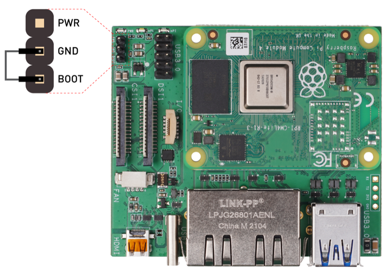
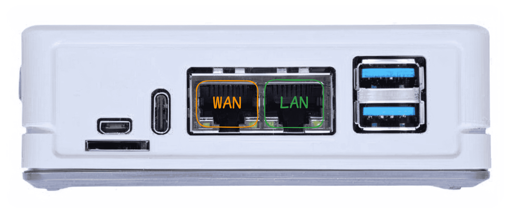
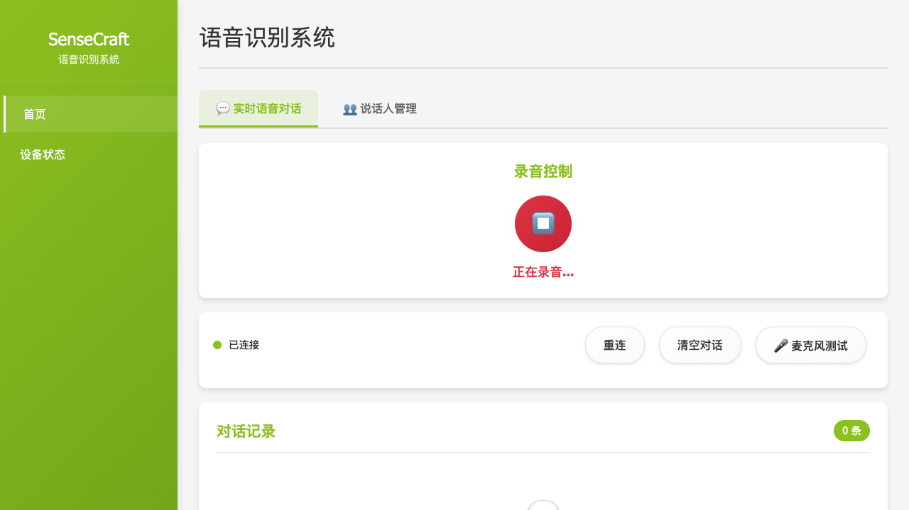

## 套餐: 标准部署 {#default}

为你的门店部署一套边缘语音采集分析系统。

| 设备 | 用途 |
|------|------|
| reRouter CM4 | 边缘计算设备，运行语音服务 |
| reSpeaker XVF3800 | 4麦克风阵列，采集门店对话 |

**部署完成后你可以：**
- 实时转录门店内的顾客对话
- 声纹识别——自动分辨不同说话人
- 对接 [SenseCraft Voice](https://test-voice-web.seeed.cn/) 云平台，多门店数据汇总分析
- 隐私优先——音频在本地处理，不上传原始录音

**前提条件：** USB-C 数据线 · 网线

## 步骤 1: 刷写 OpenWrt 固件 {#firmware type=manual required=false}

将操作系统写入 reRouter，然后连接到网络。**2025 年 11 月之后购买的新品可跳过此步骤**——已预装正确固件。

| 设备 | 连接方式 | 注意事项 |
|------|---------|---------|
| reRouter CM4 | 拆下外壳，露出主板 | 需要进入 boot 模式 |
| USB-C 数据线 | 连接 reRouter 和电脑 | 用于 eMMC 刷写 |
| 电脑 | 需先安装 rpiboot 工具 | 否则无法识别 eMMC 设备 |

**前置准备**：

- 安装 **rpiboot** 工具——不安装的话电脑无法识别 eMMC
  - **Windows：** 下载并运行 [rpiboot 安装包](https://github.com/raspberrypi/usbboot/raw/master/win32/rpiboot_setup.exe)
  - **Mac/Linux：** 源码编译——`git clone --depth=1 https://github.com/raspberrypi/usbboot && cd usbboot && make`

**刷写步骤**：

1. 拆下 reRouter 外壳，露出 CM4 主板
2. 用跳线帽连接主板上的 **Boot** 和 **GND** 引脚，进入 boot 模式（参考下图）

   

3. 用 USB-C 线连接 reRouter 到电脑，然后运行 **rpiboot**——eMMC 将显示为 USB 存储设备
4. 下载固件（**必须使用以下链接**，才能保证默认 IP 为 `192.168.49.1`）：
   - [全球版](https://files.seeedstudio.com/wiki/solution/ai-sound/reRouter-firmware-backup/OpenWRT-24.10.3-RPi-4-Factory.img.gz) | [中国版](https://files.seeedstudio.com/wiki/solution/ai-sound/reRouter-firmware-backup/OpenWRT-24.10.3-RPi-4-Factory-Chinese.img.gz)
5. 使用以下任一工具刷写固件：
   - [Raspberry Pi Imager](https://www.raspberrypi.com/software/) — 选择"自定义镜像"，选择固件文件
   - [balenaEtcher](https://etcher.balena.io/) — 选择固件文件和目标驱动器，点击"Flash"
6. 刷写完成后，拔掉 Boot-GND 跳线帽，装回外壳，接线上电

> 详细刷机说明请参考 [reRouter 刷机指南](https://wiki.seeedstudio.com/cn/OpenWrt-Getting-Started/#%E5%88%9D%E5%A7%8B%E8%AE%BE%E7%BD%AE)。

**首次连接**：

1. 用网线将电脑连接到 reRouter 的 **LAN 口**
2. 用另一根网线将 **WAN 口** 连接到路由器
3. 等待 1-2 分钟启动完成
4. 浏览器访问 `http://192.168.49.1`（这是 OpenWrt 默认 LAN 网关 IP）
5. 登录：用户名 `root`，密码留空

### 故障排查

| 问题 | 解决方法 |
|------|----------|
| 无法访问 192.168.49.1 | 1) 确认网线插在 **LAN 口**；2) 确认使用的是上面链接提供的固件（其他固件的 IP 可能不同） |
| 页面加载缓慢 | 等待 2 分钟让系统完全启动 |
| rpiboot 无法识别设备 | 确认 Boot-GND 跳线帽已连接；换一根 USB-C 线试试 |
| 刷机失败 | 格式化存储设备后重试 |
| 登录失败 | 密码为空，直接点登录 |

---

## 步骤 2: 部署语音服务 {#voice_services type=docker_deploy required=true config=devices/voice_services_deploy.yaml}

在设备上启动语音识别和分析服务。

### 部署目标 {#voice_services_local type=local config=devices/voice_services_deploy.yaml}

在本地电脑上部署语音服务。

### 接线

| 设备 | 连接方式 | 注意事项 |
|------|---------|---------|
| reSpeaker XVF3800 | USB 连接到电脑 | 确保使用数据线，不是充电线 |
| 电脑 | 需安装 Docker Desktop | Windows/Mac 需下载安装 |

1. 确保 Docker Desktop 已安装并运行
2. 确认 reSpeaker XVF3800 已通过 USB 连接
3. 确认至少 2GB 可用磁盘空间，端口 8090 未被占用
4. 验证 reSpeaker 被识别：**Windows** 设备管理器 > 声音控制器；**Mac** 系统偏好设置 > 声音 > 输入；**Linux** 执行 `arecord -l`

### 故障排查

| 问题 | 解决方法 |
|------|----------|
| Docker 未运行 | 启动 Docker Desktop 应用 |
| 端口 8090 被占用 | 关闭占用该端口的程序，或修改配置使用其他端口 |
| 找不到麦克风设备 | 重新插拔 USB，确认设备管理器中有显示 |
| 容器启动失败 | 检查 Docker 日志：`docker logs sensecraft-voice-client` |

### 部署目标 {#voice_services_remote type=remote config=devices/voice_services_deploy.yaml default=true}

将语音服务部署到远程设备（reRouter、树莓派等）。

### 接线



| 设备 | 连接方式 | 注意事项 |
|------|---------|---------|
| reSpeaker XVF3800 | USB 连接到 reRouter | 部署时会自动配置音频参数 |
| reRouter CM4 | WAN 口接路由器 | 需要联网下载容器镜像 |
| reRouter CM4 | LAN 口接电脑 | 用于 SSH 访问和部署操作 |
| 电脑 | 与 reRouter 在同一网络 | 用于执行远程部署 |

1. 确认 reRouter WAN 口已连接路由器且能上网
2. 电脑网线接 reRouter LAN 口
3. 默认 SSH：IP `192.168.49.1`，用户 `root`，无密码
4. 将 reSpeaker XVF3800 插入 reRouter USB 口

### 故障排查

| 问题 | 解决方法 |
|------|----------|
| SSH 连接被拒绝 | 确认网线插在 LAN 口，IP 是否正确 |
| 认证失败 | OpenWrt 默认密码为空，直接回车 |
| 镜像下载超时 | 检查 WAN 口网络连接，确认能访问互联网 |
| 容器启动失败 | SSH 登录后执行 `docker logs sensecraft-voice-client` 查看错误信息 |
| 找不到麦克风 | 执行 `arecord -l`，确认 reSpeaker 被识别 |
| 日志中出现 "Health check failed" | 启动时正常现象——语音客户端先于 ASR 服务就绪，等待 30 秒后自动恢复 |

---

## 步骤 3: 用户上手指引 {#user_guide type=manual required=false}

验证系统运行正常，并连接到云端平台。

**第一步：打开边缘客户端，开始录音**

1. 浏览器打开 **http://\<设备IP\>:8090**（默认地址：`http://192.168.49.1:8090`）

   

2. 点击**录音**按钮——在 reSpeaker 附近说话，实时转录文字会立即出现
3. 点击侧边栏中的**设备状态**页面

   

4. 上游服务器地址已预先配置——设备能访问服务器后会自动注册到云平台

**第二步：在云平台上找到设备并接管**

1. 打开 **https://test-voice-web.seeed.cn/**
2. 进入**门店管理**——通过设备的 IP 地址或 MAC 地址找到对应设备

   

3. 点击设备进行接管——所有语音转录记录现在可以在**记录管理**中查看

### 故障排查

| 问题 | 解决方法 |
|------|----------|
| 边缘客户端无法打开 | 重启后等待 2 分钟，服务需要时间完全启动 |
| 没有转录文字出现 | SSH 登录后执行 `arecord -l`，确认 reSpeaker 被识别 |
| 云平台找不到设备 | 检查设备状态页面中的上游服务器地址是否正确 |
| 录音按钮没有响应 | 刷新页面——ASR 服务器可能还在初始化（约需 60 秒） |
### 部署完成

语音 AI 系统已就绪！

#### 验证部署

部署完成后，确认所有服务正常运行：

```bash
# 检查容器状态——三个容器均应显示 "Up"
docker ps

# 查看语音客户端初始化日志
docker logs sensecraft-voice-client
```

然后重启设备，确保所有配置和音频权限生效：

```bash
reboot
```

重启后等待 2 分钟再继续操作。

#### 服务访问

| 服务 | 访问地址 | 用途 |
|------|---------|------|
| 边缘客户端 | http://\<设备IP\>:8090 | 实时转录、声纹管理、设备配置 |
| OpenWrt 管理 | http://\<设备IP\> | 网络配置、系统管理 |
| SenseCraft Voice 云平台 | https://test-voice-web.seeed.cn/ | 多门店分析、AI 分析、数据导出 |

---

#### 边缘客户端 (http://\<设备IP\>:8090)

边缘客户端在 reRouter 本地运行，提供三个功能模块：

##### 语音识别（ASR）


实时显示本地 ASR 服务的运行状态。在 reSpeaker 附近说话，即可看到转录文字实时出现——通过这里验证音频输入是否正常、识别准确率是否满足需求。

##### 声纹识别


注册说话人声纹，让系统自动识别谁在说话。系统从音频样本中提取唯一声纹特征——注册完成后，后续所有转录记录将自动标注说话人身份。

##### 设备状态与配置


查看 reRouter 运行状态，并调整核心参数：

- **网络设置** — 配置 Wi-Fi 连接
- **上游服务器地址** — 数据同步到云平台的地址（已预先配置，仅在使用私有化部署时需要修改）

---

#### 云端管理平台 (https://test-voice-web.seeed.cn/)

将边缘设备连接到 SenseCraft Voice 云平台，实现多门店数据汇总分析。在边缘客户端设置好上游服务器地址后，设备会自动注册到云平台。

##### 仪表板


运营数据总览，支持门店筛选——切换门店后图表即时更新。按小时展示每日采集趋势，并分析关键词热点，显示哪些关键词触发最频繁、来自哪些设备。

##### 记录管理


按设备名称、门店名称、位置或 MAC 地址搜索和筛选语音记录。两种查看模式：
- **对话模式** — 按轮次阅读转录内容
- **时间线模式** — 回放原始音频，同步查看转录文本

支持三种格式导出：Markdown、纯文本（.txt）或原始音频文件。

##### AI 分析


将筛选后的语音记录提交给 AI 进行自定义分析处理。历史分析记录按时间顺序保存，可随时回顾之前的分析结果。同一时刻只有一个 AI 提示词生效——在后端配置中切换启用的提示词。

##### 门店管理


以三级层级组织整体部署：**门店 → 位置 → 设备**。通过逻辑分组简化大规模设备管理——可按任意层级筛选记录。

##### 后端配置

配置系统的检测与处理行为：

**关键词设置**


定义用于事件检测的自定义关键词和同义词。为每个关键词指定颜色，便于在仪表板上高亮显示。支持批量新增、编辑和删除。

**AI 提示词设置**


创建自定义提示词，控制 AI 如何处理和总结语音记录。同一时刻只能启用一个提示词——按需切换，满足不同分析任务。

**用户管理**


管理云平台的用户访问权限。

---

#### 后续步骤

- [查看 Wiki 文档](https://wiki.seeedstudio.com/cn/solutions/smart-retail-voice-ai-solution-1/)
- [SenseCraft Voice 平台](https://test-voice-web.seeed.cn/)
- [购买硬件](https://www.seeedstudio.com.cn/solutions/voicecollectionanalysis-zh-hans)
