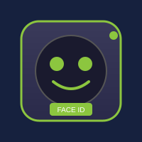
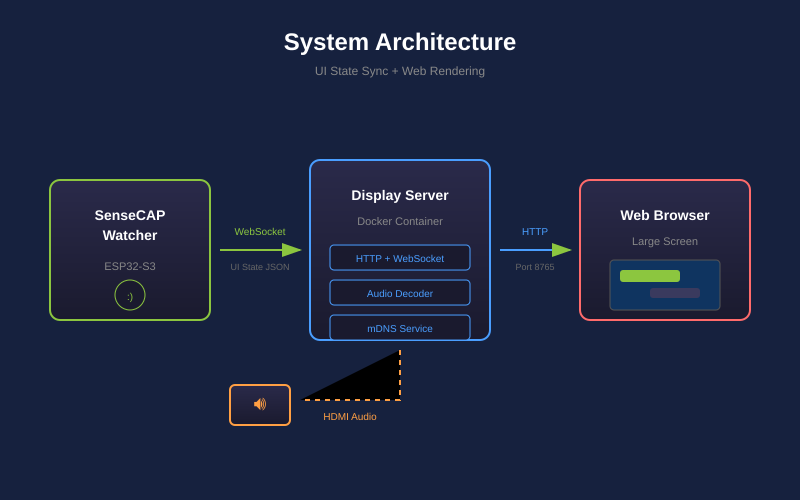

## 套餐: 人脸识别 {#face_recognition}

给小智装上"眼睛"，让它认识家人朋友，进门自动打招呼。

| 设备 | 用途 |
|------|------|
| SenseCAP Watcher | 带摄像头的 AI 语音助手 |
| USB-C 数据线 | 烧录固件 |

**部署完成后你可以：**
- 进门自动打招呼（识别到熟人会主动问候）
- 在页面上录入和管理人脸（最多 20 人）
- 语音控制开关、查询、删除人脸

**前提条件：** WiFi 网络 · [小智 App](https://github.com/78/xiaozhi-esp32) 用于绑定设备

## 步骤 1: 烧录小智固件 {#face_esp32 type=esp32_usb required=true config=devices/watcher_esp32.yaml}

将语音助手程序写入 Watcher 以启用语音交互。

### 接线

1. 用 USB-C 线连接 Watcher 到电脑
2. 串口通常会自动选好；如果没选上，Windows 选名字里带 **SERIAL-B** 的 COM 口，macOS / Linux 选编号较大的那个（如 `...53` / `ttyACM1`）
3. 点击烧录按钮

### 故障排查

| 问题 | 解决方法 |
|------|----------|
| 找不到串口 | 换一条 USB 线或换个 USB 口 |
| 选错串口（烧录无反应或立刻失败） | 列表里换另一个 CH342 串口再试 |
| 收不到串口数据 | 按住 BOOT 按钮，按一下 RESET，松开 BOOT，然后重试 |
| 烧录失败 | 重新插拔设备再试 |

---

## 步骤 2: 烧录人脸识别固件 {#face_himax type=himax_usb required=true config=devices/watcher_himax.yaml}

将人脸识别程序写入 Watcher 的 AI 芯片。

### 接线

1. 确保 Watcher 已连接到电脑
2. 串口通常会自动选好；如果没选上，Windows 选名字里带 **SERIAL-A** 的 COM 口，macOS / Linux 选编号较小的那个（如 `...51` / `ttyACM0`）—— 和上一步不是同一个口
3. 点击烧录按钮
4. 点击烧录后，按一下设备的重启按钮进入烧录模式

### 故障排查

| 问题 | 解决方法 |
|------|----------|
| 设备无响应 | 重新插拔 USB 线 |
| 烧录卡住或失败 | 按重启按钮重试 |
| 反复烧录失败 | 换一条 USB 线或换个 USB 口 |
| 烧录到 99% 失败或中途重启 | 关闭其他占用串口的程序，重新插拔 USB 后重试 |

---

## 步骤 3: 配置小智 {#face_configure type=manual required=false}

将 Watcher 连接 WiFi，通过手机 App 绑定账号。

### 连接 WiFi

设备开机后会提示配网，按语音指引完成 WiFi 连接。

### 绑定小智账号

1. 打开小智 App
2. 扫描设备上显示的二维码
3. 完成绑定

### 测试语音

说"小智小智"唤醒设备，测试语音交互是否正常。如能正常对话，说明配置成功。

### 故障排查

| 问题 | 解决方法 |
|------|----------|
| WiFi 连接失败 | 确保使用 2.4GHz 网络，检查密码 |
| 二维码不显示 | 重启设备，等待完全启动 |

---

## 步骤 4: 人脸数据库管理 {#face_enroll type=serial_camera config=devices/face_enroll.yaml required=false}

通过应用界面管理人脸识别数据库。

### 使用方法

1. 点击**连接**启动摄像头预览
2. 画面会显示实时的人脸检测框
3. 使用下方的**人脸数据库**面板管理已注册的人脸

### 注册新人脸

1. 点击人脸数据库面板中的**注册**
2. 输入姓名
3. 点击**开始采集** — 正对摄像头，保持光线充足
4. 等待采集完成（约 5 秒）
5. 新人脸会出现在列表中

### 故障排查

| 问题 | 解决方法 |
|------|----------|
| 提示"请先完成第 X 步" | 返回对应步骤选择正确的串口 |
| 摄像头无画面 | 检查 USB 连接，在步骤 2 中刷新端口 |
| 注册失败 | 确保光线充足，正对摄像头，重新尝试 |

### 部署完成

人脸识别功能已就绪！下面开始体验。

**第一步：在上方面板录入人脸**

使用**人脸数据库**面板录入家人或同事的人脸（步骤见上方"注册新人脸"）。

**第二步：语音开启人脸识别**

拔掉 USB 线，说 **"小智小智"** 唤醒设备，然后说：

> "打开人脸识别"

设备确认后，Watcher 待机时会自动扫描面前的人。

**第三步：体验自动识别**

走到 Watcher 面前 — 它会自动认出你并打招呼！

**语音命令一览**

| 说这句话 | 效果 |
|----------|------|
| "打开人脸识别" | 开启识别功能（首次使用必须先开启） |
| "关闭人脸识别" | 关闭识别功能 |
| "删除人脸 XXX" | 删除已录入的人脸 |
| "你认识谁" | 列出所有已录入的人脸 |
| "打开熟人模式" | 熟人免打扰，只在陌生人出现时提醒 |
| "关闭熟人模式" | 所有人都会触发问候 |

---

## 套餐: 大屏投屏 {#display_cast}

把小智对话投射到电视或大屏幕，适合展厅、会议室等场景。

| 设备 | 用途 |
|------|------|
| SenseCAP Watcher | AI 语音助手 |
| reComputer R1100 | 运行投屏服务 |
| HDMI 显示器 | 显示投屏内容 |

**部署完成后你可以：**
- 大屏实时显示对话内容
- 按 F 进入全屏演示模式
- mDNS 自动发现 - 语音控制连接
- 讲述模式 - AI 控制背景图片，适合演示与导览

**前提条件：** 所有设备在同一网络

## 步骤 1: 烧录 Watcher 固件 {#display_watcher type=esp32_usb required=true config=devices/display_watcher.yaml}

将语音助手程序写入 Watcher，为投屏功能做准备。

### 接线

1. 使用 USB-C 数据线连接 Watcher 到电脑
2. 串口通常会自动选好；如果没选上，Windows 选名字里带 **SERIAL-B** 的 COM 口，macOS / Linux 选编号较大的那个（如 `...53` / `ttyACM1`）
3. 如未检测到，请尝试其他 USB 口或更换数据线

### 故障排查

| 问题 | 解决方法 |
|------|----------|
| 找不到串口 | 换一条 USB 线或换个 USB 口 |
| 选错串口（烧录无反应或立刻失败） | 列表里换另一个 CH342 串口再试 |
| 烧录失败 | 重新插拔设备再试 |

---

## 步骤 2: 部署投屏服务 {#display_service type=docker_deploy required=true config=devices/display_service_deploy.yaml}

启动投屏服务，将对话内容显示在屏幕上。

### 部署目标 {#display_service_local type=local config=devices/display_service_deploy.yaml}

将投屏服务部署到您的本地电脑。

### 接线

1. 确保 Docker 已安装并运行
2. 设置显示名称（如"客厅显示器"）用于 mDNS 发现
3. 点击部署按钮启动服务

### 故障排查

| 问题 | 解决方法 |
|------|----------|
| 找不到 Docker | 安装 Docker Desktop |
| 端口 8765 被占用 | 停止占用该端口的其他服务 |

### 部署目标 {#display_service_remote type=remote config=devices/display_service_deploy.yaml default=true}

将投屏服务部署到 reComputer R1100。

### 接线

1. 将 reComputer 连接到网络和 HDMI 显示器
2. 输入 IP 地址和 SSH 凭据
3. 设置显示名称（如"会议室显示器"）用于 mDNS 发现
4. 点击部署安装到远程设备

### 故障排查

| 问题 | 解决方法 |
|------|----------|
| SSH 连接失败 | 检查 IP 地址和凭据 |
| Docker 拉取失败 | 检查网络连接，重试部署 |
| Watcher 找不到投屏设备 | 确保在同一网络，检查防火墙 |

### 部署完成

大屏投屏已就绪！

**测试方法：**
1. 在显示设备浏览器打开 `http://<设备IP>:8765`
2. 按 `F` 进入全屏模式
3. 说「投屏到[显示名称]」开始投屏

**语音命令：** 「打开投屏」、「关闭投屏」、「投屏状态」

**讲述模式（新功能）：**
投屏现在支持讲述模式，AI 可以控制背景图片——适合演示、讲故事、导览等场景。

1. 点击左上角齿轮图标打开配置面板
2. 开启「启用讲述模式」
3. 填入小智 WebSocket MCP 地址，启用 AI 自动切换背景图
4. 添加触发条件：关键词 + 图片 URL，对话匹配时自动切换背景
5. 按 `N` 切换讲述模式，点击小窗可调整大小

## 套餐: reTerminal D1001 语音智能体 {#reterminal_d1001}

把 reTerminal D1001 变成小智语音智能体：8 寸触摸屏、摄像头人脸唤醒、局域网推送面板。

| 设备 | 用途 |
|------|------|
| reTerminal D1001 | 带摄像头的触摸屏语音智能体 |
| USB-C 数据线 | 烧录固件 |

**你将获得：**
- 语音对话：唤醒词、全双工打断、多行字幕
- 屏上设置：Wi-Fi（含静态 IP）、旋转、音量、休眠、人脸唤醒模式
- 人脸唤醒：本地检测，可选远程识别端点实现"认识的人才唤醒"
- 8080 端口局域网推送面板：Markdown 上屏、屏上选择、相机快照

**前置要求：** 2.4GHz WiFi 网络 · [小智 App](https://github.com/78/xiaozhi-esp32) 用于绑定设备

## 步骤 1: 烧录 D1001 固件 {#d1001_esp32 type=esp32_usb required=true config=devices/d1001_esp32.yaml}

把语音智能体固件写入设备。

### 接线

1. 用 USB-C 数据线连接 D1001 与电脑
2. 端口通常自动选中（ESP32-P4 原生 USB，`usbmodem*` / `ttyACM*`）
3. 点击烧录按钮

### 故障排查

| 问题 | 解决方法 |
|------|----------|
| 找不到串口 | 换用支持数据的 USB-C 线，换个 USB 口 |
| 烧录中途失败 | 重插线缆重试，避免使用 USB Hub |

---

## 步骤 2: 联网与绑定 {#d1001_setup type=manual required=false}

配网和绑定都在触摸屏上完成：

1. 首次开机点击左上角网络图标，选择 2.4GHz Wi-Fi 并用屏幕键盘输入密码
2. 打开小智 App，扫描设备屏幕上的二维码完成绑定
3. 说"小智小智"测试唤醒；回答途中再说唤醒词可直接打断
4. 可选：点状态栏人形图标配置人脸唤醒（检测/识别模式、识别服务地址）

### 故障排查

| 问题 | 解决方法 |
|------|----------|
| WiFi 连接失败 | 确认是 2.4GHz 网络，屏上重新输入密码 |
| 没有二维码 | 等待开机完成，或重启设备 |
