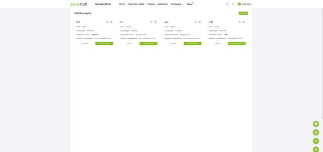
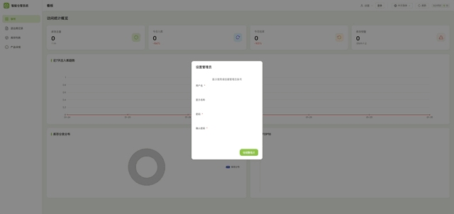
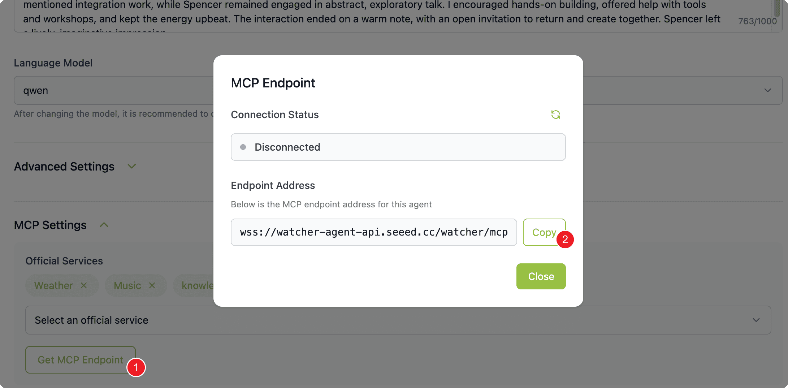
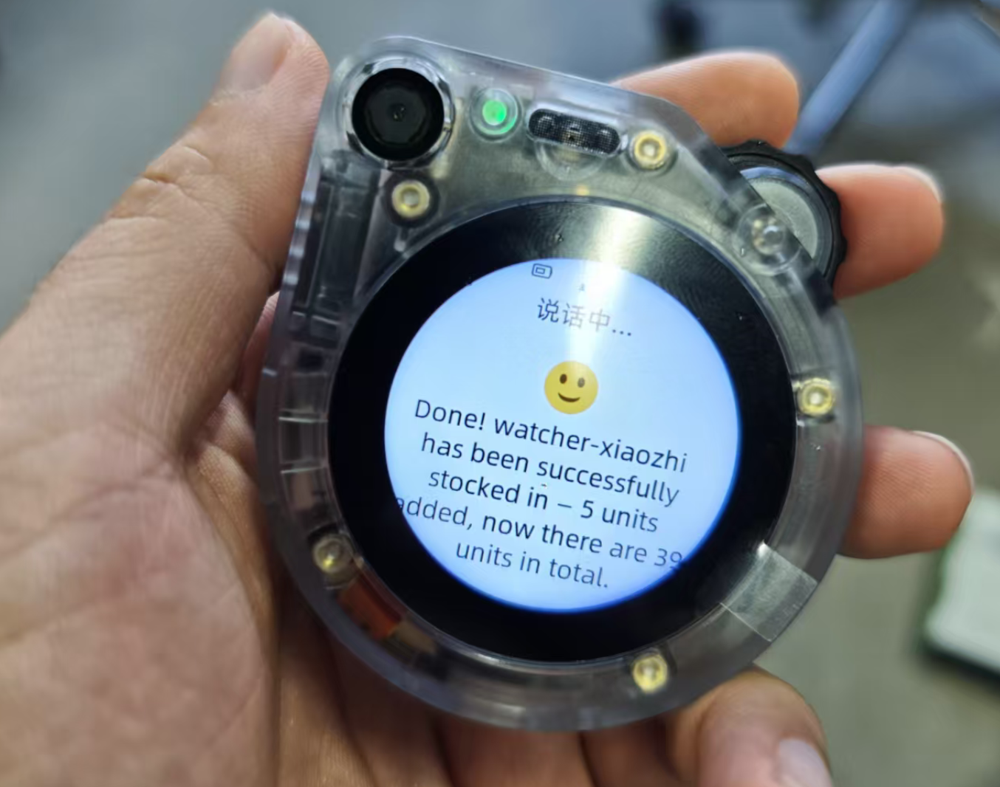
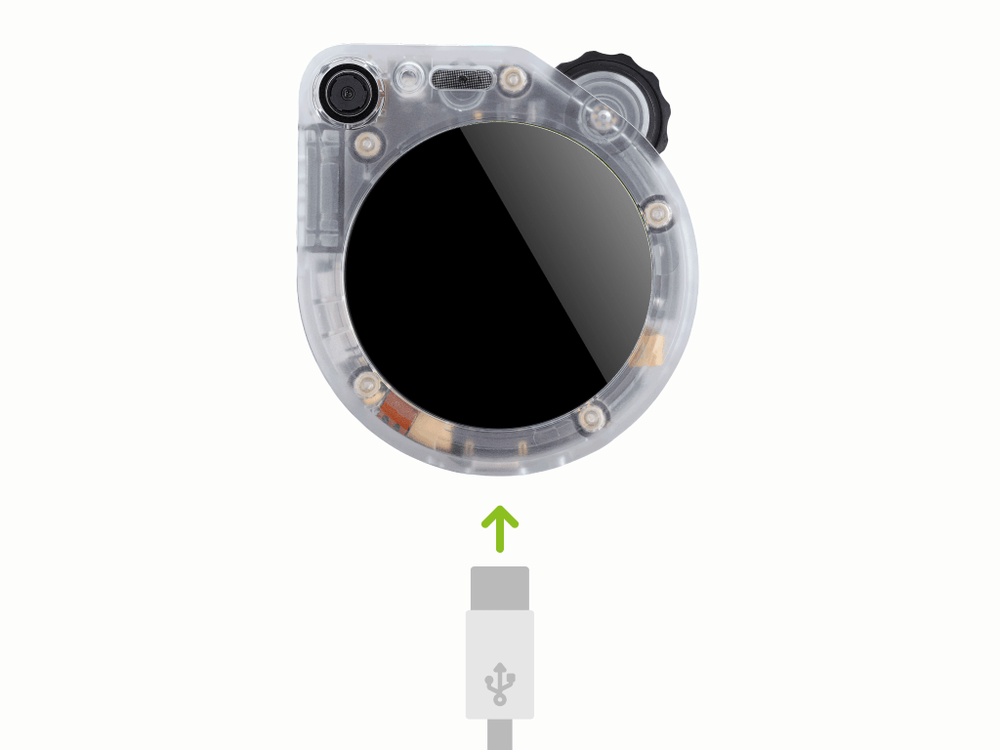
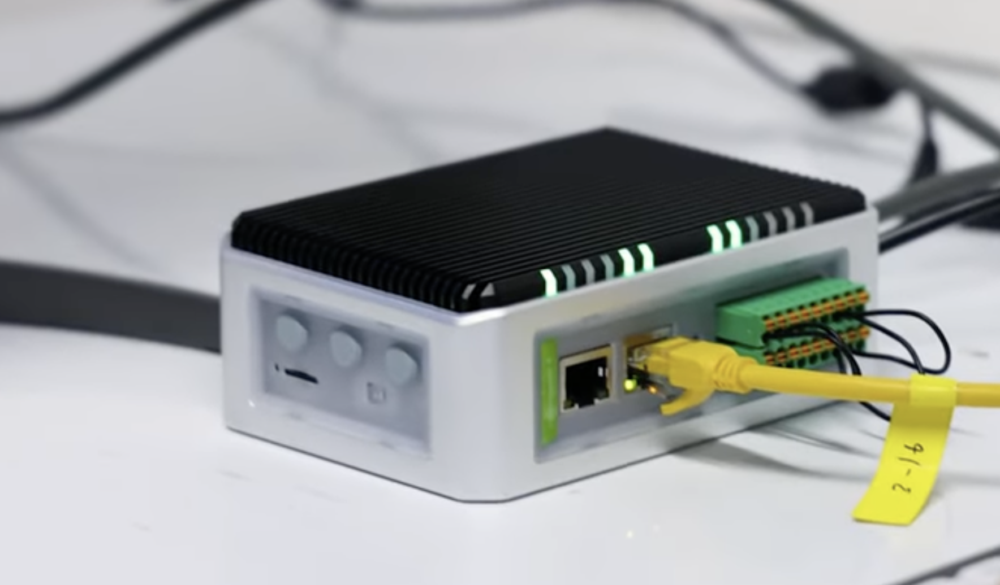
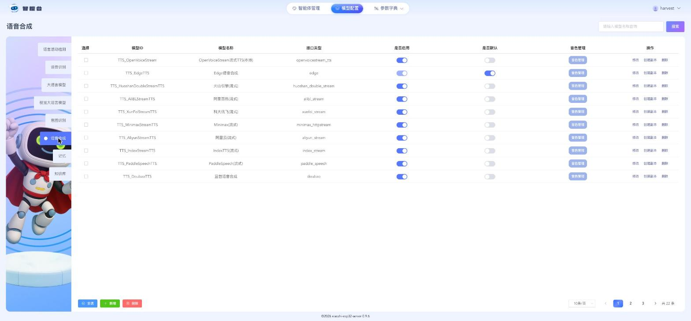
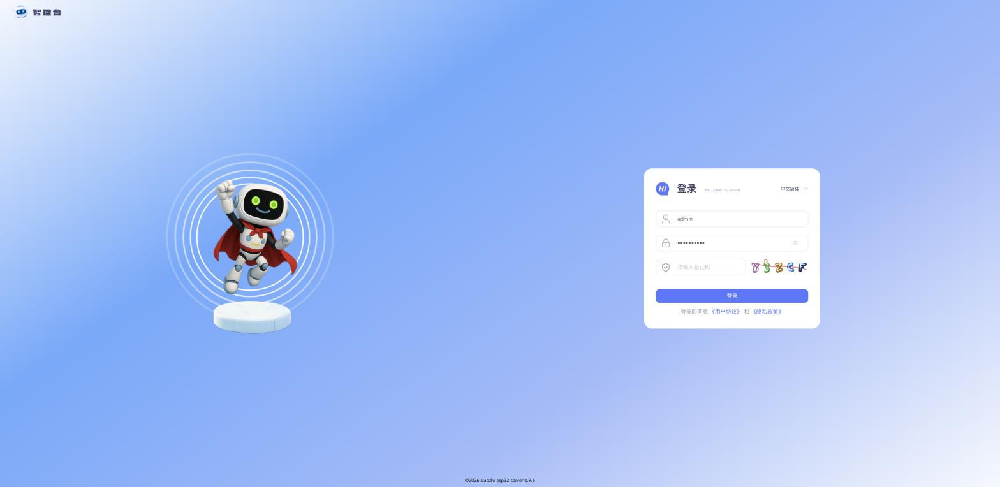
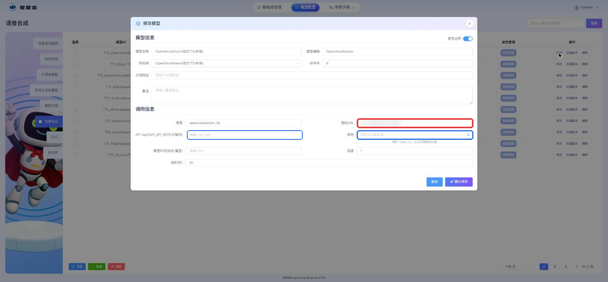
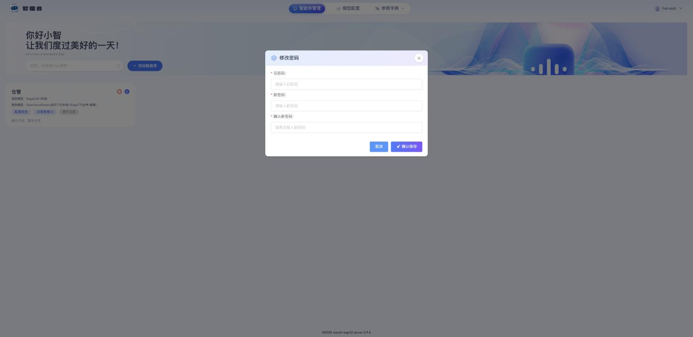

## Preset: Tier 0 · Cloud {#trial}

Only a Watcher is needed - no host required. Inventory data and voice service are hosted on the Seeed cloud, so you can experience the full voice warehouse workflow out of the box.

| Device | Purpose |
|--------|---------|
| SenseCAP Watcher | Voice assistant, receives voice commands |

**What you'll get:**
- Voice-controlled inventory (say "Stock in 10 boxes of apples" to record)
- Real-time inventory data in the browser

**Requirements:** Internet connection · SenseCraft account (free signup)

**Note:** Monthly subscription; data is hosted on Seeed cloud; face recognition and ERP/WMS integration are not supported.

## Step 1: Configure Watcher Device {#sensecraft type=manual required=true}



Connect your Watcher to SenseCraft cloud platform:

1. Power on Watcher: press and hold the top-right scroll button for 5 seconds, then release
2. On your phone, search for the WiFi hotspot named "Watcher-XXXX" and connect
3. Your browser should pop up the setup page automatically (if not, visit http://192.168.42.1 manually)
4. Wait about 5 seconds for the WiFi scan to complete, pick a 2.4GHz network, enter the password, then tap "Connect"
5. The device reboots automatically and shows a 6-digit verification code on the screen
6. Login to [SenseCraft AI Platform](https://sensecraft.seeed.cc/ai/device/local/37/), click "SenseCraft Watcher" in Models, select "Watcher Agent" → "Bind Device", and enter the 6-digit code to complete binding
7. Click "Create" to make a new Agent, click the ⚙ settings icon on the Agent card, select the "Inventory Manager" role template, adjust name and language as needed, then save

### Troubleshooting

| Issue | Solution |
|-------|----------|
| Can't find hotspot | Make sure phone WiFi is enabled, move closer to Watcher |
| WiFi setup failed | Watcher only supports 2.4GHz WiFi, check if your router has 2.4GHz enabled |
| Can't find Watcher Agent | Confirm you're logged in to SenseCraft, refresh the page |

---

## Step 2: Configure Warehouse System {#cloud_warehouse_config type=manual required=true}



The warehouse system is hosted on Seeed cloud - no deployment needed. Open the cloud warehouse system to complete initial setup:

1. Visit [Warehouse System](https://warehouse.seeed.cn/) in your browser
2. Click "Login" in the top right → "Watcher device users can self-register"
3. Ask your Watcher "What is your device ID?" — Watcher will reply with an ID string
4. Enter the device ID in the registration form, complete registration and log in
5. Click "Inventory List" on the left to import existing inventory ([Download Excel Template](https://files.seeedstudio.com/Solution/landpage_asset/smart-warehouse-management/warehouse_import-9e6e51d1.xlsx))

### Troubleshooting

| Issue | Solution |
|-------|----------|
| Page won't load | Check network connection and try again |
| Import failed | Check if Excel format matches the template |
| Forgot admin password | Go to "Device Management", delete this app (check "Delete data"), then re-initialize |

---

## Step 3: Connect to Agent {#cloud_mcp_bridge type=manual required=true}



Add an agent in the warehouse system to let Watcher control inventory:

1. Open warehouse system at [https://warehouse.seeed.cn/](https://warehouse.seeed.cn/)
2. Go to "Agent Configuration" on the left sidebar, click "Add Agent", fill in the name
3. Log into [SenseCraft AI Platform](https://sensecraft.seeed.cc/ai/device/local/37/), in the ⚙ settings page scroll to the bottom, click "MCP Setting" → "Get MCP Endpoint" → "Copy Endpoint URL"
4. Paste the copied endpoint URL in the Endpoint field
5. Click "Save and Start"
6. Click "MCP Endpoint" on the agent card, refresh status - "Connected" means success

### Troubleshooting

| Issue | Solution |
|-------|----------|
| Connection failed | Check endpoint URL is copied completely, no extra spaces |
| Status stays Disconnected | Confirm Watcher is properly bound to SenseCraft platform |

---

## Step 4: Demo & Testing {#demo type=manual verify=true required=true}



Try these voice commands — the conversation itself is your verification that the trial is working. To see the resulting inventory records, visit the SenseCraft platform at [sensecraft.seeed.cc](https://sensecraft.seeed.cc/ai/) after speaking.

| Say this | Watcher will |
|----------|--------------|
| "How many apples left?" | Query apple inventory count |
| "Stock in 10 boxes of apples" | Add 10 boxes of apples to inventory |
| "Stock out 5 boxes of bananas" | Remove 5 boxes of bananas from inventory |
| "What came in today?" | List today's stock-in records |

### Troubleshooting

| Issue | Solution |
|-------|----------|
| Watcher not responding | Confirm the Agent is connected (status shows Connected) |
| Inventory not updated | Refresh the SenseCraft page to see latest data |
| Cannot see records | Confirm your Watcher is bound to your SenseCraft account |

### Deployment Complete

Your SenseCraft trial is ready!

**Access points:**
- SenseCraft Platform: [sensecraft.seeed.cc](https://sensecraft.seeed.cc/ai/)

Try saying "Stock in 10 boxes of apples" to test voice inventory management.

---

## Preset: Tier 1 · Basic {#sensecraft_cloud}

Use [SenseCraft](https://sensecraft.seeed.cc/ai/) cloud service for voice AI. Simplest setup - just deploy the warehouse system and connect your Watcher to SenseCraft platform.

| Device | Purpose |
|--------|---------|
| SenseCAP Watcher | Voice assistant, receives voice commands |
| reComputer R1125-10 | Runs warehouse management system |
| USB-C data cable | Flash Watcher firmware |

**What you'll get:**
- Voice-controlled inventory management (stock in/out by speaking)
- Real-time inventory dashboard
- Works with SenseCAP Watcher out of the box

❌ High-accuracy face recognition not supported

**Requirements:** Internet connection · [SenseCraft account](https://sensecraft.seeed.cc/ai/) (free)

## Step 1: Update Xiaozhi Firmware {#warehouse_esp32 type=esp32_usb required=true config=devices/watcher_esp32.yaml}

Write the voice assistant program to the Watcher to enable voice interaction.

### Wiring



1. Connect Watcher to computer via USB-C cable
2. The port is usually selected for you; if not, pick the COM port containing **SERIAL-B** on Windows, or the higher-numbered one on macOS / Linux (`...53` / `ttyACM1`)
3. Click the Flash button

### Troubleshooting

| Problem | Solution |
|---------|----------|
| Serial port not found | Try a different USB cable or USB port |
| Wrong port picked (flash hangs or fails instantly) | Try the other CH342 port in the list |
| No serial data received | Hold BOOT button, press RESET, release BOOT, then retry |
| Flash failed | Unplug and reconnect the device |

---

## Step 2: Update Vision Detection Firmware {#warehouse_himax type=himax_usb required=true config=devices/watcher_himax.yaml}

Write the vision detection program to the Watcher's AI chip.

### Wiring


1. Keep the Watcher connected to your computer via the USB-C cable (same as the previous step)
2. The port is usually selected for you; if not, pick the COM port containing **SERIAL-A** on Windows, or the lower-numbered one on macOS / Linux (`...51` / `ttyACM0`) — not the same port as the previous step
3. Click the Flash button
4. After clicking Flash, press the reset button on the device to enter flash mode

### Troubleshooting

| Problem | Solution |
|---------|----------|
| Device not responding | Unplug and reconnect the USB cable |
| Flash stuck or fails | Press the reset button and try again |
| Flash fails repeatedly | Use a different USB cable or port |
| Flash fails at 99% or restarts mid-flash | Close other apps using serial ports, reconnect USB and retry |

---

## Step 3: Configure Watcher Device {#watcher_setup type=manual required=true}


Pair the Watcher over WiFi, bind it to SenseCraft cloud, then create an "Inventory Manager" agent and copy its MCP endpoint URL (you'll need it in Step 6).

### Wiring

1. Power on Watcher: press and hold the top-right scroll button for 5 seconds, then release
2. On your phone, search for the WiFi hotspot named "Watcher-XXXX" and connect
3. Your browser should pop up the setup page automatically (if not, visit http://192.168.42.1 manually)
4. Wait about 5 seconds for the WiFi scan to complete, pick a 2.4GHz network, enter the password, then tap "Connect"
5. The device reboots automatically and shows a 6-digit verification code on the screen
6. Login to [SenseCraft AI Platform](https://sensecraft.seeed.cc/ai/device/local/37/), click "SenseCraft Watcher" in Models, select "Watcher Agent" → "Bind Device", and enter the 6-digit code to complete binding
7. Click "Create" to make a new Agent, click the ⚙ settings icon on the Agent card, select the "Inventory Manager" role template, adjust name and language as needed, then save
8. Say "Enable face recognition mode" to the Watcher to switch it to face recognition detection
9. In the ⚙ settings page, scroll to the bottom, click "MCP Setting" → "Get MCP Endpoint" → "Copy Endpoint URL"

### Troubleshooting

| Issue | Solution |
|-------|----------|
| Can't find hotspot | Make sure phone WiFi is enabled, move closer to Watcher |
| WiFi setup failed | Watcher only supports 2.4GHz WiFi, check if your router has 2.4GHz enabled |
| Can't find Watcher Agent | Confirm you're logged in to SenseCraft, refresh the page |

---

## Step 4: Warehouse System {#warehouse type=docker_deploy required=true config=devices/warehouse_deploy.yaml}

Deploy the inventory management service with voice control and web dashboard.

### Target {#warehouse_local type=local config=devices/warehouse_deploy.yaml}

Run the warehouse system on this computer.

### Wiring

1. Ensure Docker is installed and running
2. Click Deploy button to start services

### Troubleshooting

| Issue | Solution |
|-------|----------|
| Port in use | Check if port 2125 is used by another service |
| Docker not running | Start Docker Desktop and retry |

### Target {#warehouse_remote type=remote config=devices/warehouse_deploy.yaml default=true}

Deploy to reComputer R1125-10 edge device.

### Wiring



1. Connect R1125-10 to power and ethernet, ensure it's on the same network as your computer
2. Enter IP address `reComputer-R110x.local` (or check your router)
3. Enter username `recomputer`, password `12345678`
4. Click Deploy and wait for installation to complete

### Troubleshooting

| Issue | Solution |
|-------|----------|
| Connection timeout | Check ethernet cable, test with ping reComputer-R110x.local |
| SSH auth failed | Verify credentials, first-time setup requires monitor connection |

---

## Step 5: Configure Warehouse System {#warehouse_config type=manual required=true}


After deployment, open the warehouse system to complete initial setup:

1. Open browser and visit `http://server-ip:2125` (use `localhost` for local deployment)
2. First visit will show "Set Administrator" dialog, fill in details and confirm
3. Click "Inventory List" on the left to import existing inventory ([Download Excel Template](https://files.seeedstudio.com/Solution/landpage_asset/smart-warehouse-management/warehouse_import-9e6e51d1.xlsx))

### Troubleshooting

| Issue | Solution |
|-------|----------|
| Page won't load | Wait 30 seconds for services to start |
| Import failed | Check if Excel format matches the template |
| Forgot admin password | Go to "Device Management", delete this app (check "Delete data"), then redeploy |

---

## Step 6: Connect to Agent {#mcp_bridge type=manual required=true}


Add an agent in the warehouse system to let Watcher control inventory:

1. Go to "Agent Configuration" on the left sidebar, click "Add Agent", fill in the name
2. Paste the endpoint URL copied from MCP Setting in Step 3
3. Click "Save and Start"
4. Click "MCP Endpoint" on the agent card, refresh status - "Connected" means success

### Troubleshooting

| Issue | Solution |
|-------|----------|
| Connection failed | Check endpoint URL is copied completely, no extra spaces |
| Status stays Disconnected | Confirm Watcher is properly bound to SenseCraft platform |

---

## Step 7: Demo & Testing {#voice_demo_test type=manual required=false}


Try these voice commands:

| Say this | Watcher will |
|----------|--------------|
| "How many apples left?" | Query apple inventory count |
| "Stock in 10 boxes of apples" | Add 10 boxes of apples to inventory |
| "Stock out 5 boxes of bananas" | Remove 5 boxes of bananas from inventory |
| "What came in today?" | List today's stock-in records |

Check the warehouse web interface to see inventory changes after speaking.

### Troubleshooting

| Issue | Solution |
|-------|----------|
| Watcher not responding | Ensure agent is connected (status shows Connected) |
| Inventory not updated | Refresh the web page to see latest data |

---

## Step 8: Test Face Recognition {#face_test type=manual required=false}

Configure face recognition in the warehouse system and verify it works:

1. Open your browser and visit `http://server-ip:2125`, go to "System Settings" → "Face Recognition"
2. Follow the on-page instructions to enroll the faces you want to recognize
3. Make sure you've said "Enable face recognition mode" to the Watcher (see Step 3)
4. Face the Watcher camera - successful recognitions appear in the warehouse system records

### Troubleshooting

| Issue | Solution |
|-------|----------|
| Face not detected | Confirm the vision detection firmware is flashed and face recognition mode is enabled |
| Inaccurate recognition | Re-enroll well-lit, front-facing photos in "System Settings → Face Recognition" |

## Step 9: Open Dashboard {#dashboard type=web_dashboard required=true config=devices/dashboard.yaml}

The warehouse management dashboard is now live. Click below to open it in your browser.

### Troubleshooting
| Issue | Solution |
|-------|----------|
| Page not loading | Make sure the previous deployment step finished successfully and the service is healthy. |
| Wrong host/port | Update the URL with your device's IP if you deployed to a remote machine. |

### Deployment Complete

Your voice-controlled warehouse system is ready!

**Access points:**
- Warehouse System: http://\<server-ip\>:2125
- SenseCraft Platform: [sensecraft.seeed.cc](https://sensecraft.seeed.cc/ai/)

Try saying "Stock in 10 boxes of apples" to test voice inventory management.

---

## Preset: Tier 2A · Advanced (Single Site) {#private_cloud}

Tier 1 plus local high-accuracy face recognition: voice AI runs on the [SenseCraft](https://sensecraft.seeed.cc/ai/) cloud service, while face recognition inference runs on your local device — inventory and face data stay on your network.

| Device | Purpose |
|--------|---------|
| SenseCAP Watcher | Voice assistant, receives voice commands |
| reComputer R2135-12 (Hailo-8) or Jetson device | Runs warehouse system + face recognition service |
| USB-C data cable | Flash Watcher firmware |

**What you'll get:**
- Voice-controlled inventory with a real-time web dashboard
- High-accuracy face recognition with records kept locally

✅ High-accuracy face recognition (with liveness detection) — the Hailo / TensorRT inference image is selected automatically by detected device model

**Requirements:** Internet connection · [SenseCraft account](https://sensecraft.seeed.cc/ai/) (free)

## Step 1: Update Xiaozhi Firmware {#warehouse_esp32 type=esp32_usb required=true config=devices/watcher_esp32.yaml}

Write the voice assistant program to the Watcher to enable voice interaction.

### Wiring


1. Connect Watcher to computer via USB-C cable
2. The port is usually selected for you; if not, pick the COM port containing **SERIAL-B** on Windows, or the higher-numbered one on macOS / Linux (`...53` / `ttyACM1`)
3. Click the Flash button

### Troubleshooting

| Problem | Solution |
|---------|----------|
| Serial port not found | Try a different USB cable or USB port |
| Wrong port picked (flash hangs or fails instantly) | Try the other CH342 port in the list |
| No serial data received | Hold BOOT button, press RESET, release BOOT, then retry |
| Flash failed | Unplug and reconnect the device |

---

## Step 2: Update Vision Detection Firmware {#warehouse_himax type=himax_usb required=true config=devices/watcher_himax.yaml}

Write the vision detection program to the Watcher's AI chip.

### Wiring


1. Keep the Watcher connected to your computer via the USB-C cable (same as the previous step)
2. The port is usually selected for you; if not, pick the COM port containing **SERIAL-A** on Windows, or the lower-numbered one on macOS / Linux (`...51` / `ttyACM0`) — not the same port as the previous step
3. Click the Flash button
4. After clicking Flash, press the reset button on the device to enter flash mode

### Troubleshooting

| Problem | Solution |
|---------|----------|
| Device not responding | Unplug and reconnect the USB cable |
| Flash stuck or fails | Press the reset button and try again |
| Flash fails repeatedly | Use a different USB cable or port |
| Flash fails at 99% or restarts mid-flash | Close other apps using serial ports, reconnect USB and retry |

---

## Step 3: Configure Watcher Device {#watcher_config type=manual required=true}


Connect your Watcher to SenseCraft cloud platform:

1. Power on Watcher: press and hold the top-right scroll button for 5 seconds, then release
2. On your phone, search for the WiFi hotspot named "Watcher-XXXX" and connect
3. Your browser should pop up the setup page automatically (if not, visit http://192.168.42.1 manually)
4. Wait about 5 seconds for the WiFi scan to complete, pick a 2.4GHz network, enter the password, then tap "Connect"
5. The device reboots automatically and shows a 6-digit verification code on the screen
6. Login to [SenseCraft AI Platform](https://sensecraft.seeed.cc/ai/device/local/37/), click "SenseCraft Watcher" in Models, select "Watcher Agent" → "Bind Device", and enter the 6-digit code to complete binding
7. Click "Create" to make a new Agent, click the ⚙ settings icon on the Agent card, select the "Inventory Manager" role template, adjust name and language as needed, then save
8. Say "Enable face recognition mode" to the Watcher to switch it to face recognition detection
9. In the ⚙ settings page, scroll to the bottom, click "MCP Setting" → "Get MCP Endpoint" → "Copy Endpoint URL" (you'll need it in Step 6)

### Troubleshooting

| Issue | Solution |
|-------|----------|
| Can't find hotspot | Make sure phone WiFi is enabled, move closer to Watcher |
| WiFi setup failed | Watcher only supports 2.4GHz WiFi, check if your router has 2.4GHz enabled |
| Can't find Watcher Agent | Confirm you're logged in to SenseCraft, refresh the page |

---

## Step 4: Warehouse System {#warehouse_2a type=docker_deploy required=true config=devices/warehouse_face_hailo_deploy.yaml}

Deploy the warehouse system together with the high-accuracy face recognition service — one device, one Compose file, two containers. The device model is auto-detected and the matching face recognition image is pre-selected (Hailo image for Hailo-8 accelerators, TensorRT image for Jetson); you can also switch it manually.

### Target {#warehouse_2a_hailo_remote type=remote device=hailo device_name="Hailo-8" config=devices/warehouse_face_hailo_deploy.yaml default=true}

Deploy to a device with a Hailo-8 accelerator (reComputer R2135-12 or Raspberry Pi + Hailo-8).

### Wiring


1. Connect the device to power and ethernet, ensure it's on the same network as your computer
2. Enter the device IP address (or check your router)
3. Enter the SSH username and password
4. Click Deploy and wait for installation to complete

### Troubleshooting

| Issue | Solution |
|-------|----------|
| Connection timeout | Check ethernet cable, ping the device IP |
| Face service won't start | Confirm the Hailo driver is installed (`ls /dev/hailo0` should exist) |
| Face service restarts in a loop with `HAILO_INVALID_DRIVER_VERSION` | Host driver and container userspace versions must match exactly. This solution's image needs HailoRT **4.21.0** (the Raspberry Pi repo's `hailo-all` only ships 4.20.0). Check: `modinfo -F version hailo_pci`. Install: `curl -sfL https://raw.githubusercontent.com/blakeblackshear/frigate/dev/docker/hailo8l/user_installation.sh \| sudo bash` then **reboot the device** |

### Target {#warehouse_2a_jetson_remote type=remote device=jetson device_name="Jetson" config=devices/warehouse_face_jetson_deploy.yaml}

Deploy to a Jetson device (Orin series); face recognition runs on TensorRT.

### Wiring

1. Connect the Jetson to power and ethernet, ensure it's on the same network as your computer
2. Enter the device IP address and SSH credentials
3. Click Deploy and wait for installation to complete

### Troubleshooting

| Issue | Solution |
|-------|----------|
| Connection timeout | Check ethernet cable, ping the device IP |
| Face service won't start | Confirm JetPack is installed (the container bind-mounts host CUDA/TensorRT) and the model engines are in place |

### Target {#warehouse_2a_hailo_local type=local device=hailo device_name="Hailo-8" config=devices/warehouse_face_hailo_deploy.yaml}

Run directly on this machine (a device with Hailo-8).

### Wiring

1. Ensure Docker is installed and running
2. Click Deploy button to start services

### Target {#warehouse_2a_jetson_local type=local device=jetson device_name="Jetson" config=devices/warehouse_face_jetson_deploy.yaml}

Run directly on this machine (a Jetson device).

### Wiring

1. Ensure Docker is installed and running
2. Click Deploy button to start services

---

## Step 5: Configure Warehouse System {#warehouse_config_private_cloud type=manual required=true}


After deployment, open the warehouse system to complete initial setup:

1. Open browser and visit `http://server-ip:2125` (use `localhost` for local deployment)
2. First visit will show "Set Administrator" dialog, fill in details and confirm
3. Click "Inventory List" on the left to import existing inventory ([Download Excel Template](https://files.seeedstudio.com/Solution/landpage_asset/smart-warehouse-management/warehouse_import-9e6e51d1.xlsx))

### Troubleshooting

| Issue | Solution |
|-------|----------|
| Page won't load | Wait 30 seconds for services to start |
| Import failed | Check if Excel format matches the template |
| Forgot admin password | Go to "Device Management", delete this app (check "Delete data"), then redeploy |

---

## Step 6: Connect to Agent {#agent_config type=manual required=true}


Add an agent in the warehouse system to let Watcher control inventory:

1. Open your browser and visit `http://server-ip:2125` (use `localhost` for local deployment)
2. Go to "Agent Configuration" on the left sidebar, click "Add Agent", fill in the name
3. Paste the endpoint URL copied from MCP Setting in Step 3
4. Click "Save and Start"
5. Click "MCP Endpoint" on the agent card, refresh status - "Connected" means success

### Troubleshooting

| Issue | Solution |
|-------|----------|
| Connection failed | Check endpoint URL is copied completely, no extra spaces |
| Status stays Disconnected | Confirm Watcher is properly bound to SenseCraft platform |

---

## Step 7: Demo & Testing {#demo_private_cloud type=manual required=false}


Try these voice commands:

| Say this | Watcher will |
|----------|--------------|
| "How many apples left?" | Query apple inventory count |
| "Stock in 10 boxes of apples" | Add 10 boxes of apples to inventory |
| "Stock out 5 boxes of bananas" | Remove 5 boxes of bananas from inventory |
| "What came in today?" | List today's stock-in records |

Check the warehouse web interface to see inventory changes after speaking.

### Troubleshooting

| Issue | Solution |
|-------|----------|
| Watcher not responding | Ensure agent is connected (status shows Connected) |
| Inventory not updated | Refresh the web page to see latest data |

## Step 8: Test Face Recognition {#face_test_2a type=manual required=false}

Configure face recognition in the warehouse system and verify it works (this tier is high-accuracy, with liveness detection):

1. Open your browser and visit `http://server-ip:2125`, go to "System Settings" → "Face Recognition"
2. Follow the on-page instructions to enroll the faces you want to recognize
3. Make sure you've said "Enable face recognition mode" to the Watcher (see Step 3)
4. Face the Watcher camera - successful recognitions appear in the warehouse system records; holding up a photo should be rejected by liveness detection

### Troubleshooting

| Issue | Solution |
|-------|----------|
| Face not detected | Confirm the vision detection firmware is flashed and face recognition mode is enabled |
| Face service not responding | Check `http://server-ip:8001/health` and confirm the face-rec container started in the deploy step |
| Inaccurate recognition | Re-enroll well-lit, front-facing photos in "System Settings → Face Recognition" |

## Step 9: Open Dashboard {#dashboard_private_cloud type=web_dashboard required=true config=devices/dashboard.yaml}

The warehouse management dashboard is now live. Click below to open it in your browser.

### Troubleshooting
| Issue | Solution |
|-------|----------|
| Page not loading | Make sure the previous deployment step finished successfully and the service is healthy. |
| Wrong host/port | Update the URL with your device's IP if you deployed to a remote machine. |

### Deployment Complete

Your private cloud warehouse system is ready!

**Access points:**
- Warehouse System: http://\<server-ip\>:2125
- Face Recognition Service: http://\<server-ip\>:8001/health

Inventory and face data stay on your network. Try saying "How many apples left?" to test.

---

## Preset: Tier 2B · Advanced (Multi Site) {#private_cloud_multi}

Self-host the voice AI server while using cloud APIs (DeepSeek, OpenAI, etc.) for LLM and TTS. Supports concurrent voice processing across multiple sites. Your data stays on your network - only API calls go to the cloud.

| Device | Purpose |
|--------|---------|
| SenseCAP Watcher | Voice assistant, receives voice commands |
| reComputer Super J4012 | Runs warehouse system + voice AI service, supports multi-channel concurrent voice processing |

**What you'll get:**
- Full control over your data - inventory stays on your network
- Flexible AI model choices (DeepSeek, GPT-4, Qwen, etc.)
- Customize voice assistant prompts and behavior

✅ Face recognition supported

**Requirements:** Internet connection · LLM API keys required

## Step 1: Update Xiaozhi Firmware {#warehouse_esp32_2b type=esp32_usb required=true config=devices/watcher_esp32.yaml}

Write the voice assistant program to the Watcher to enable voice interaction. In this tier speech recognition and synthesis run on your own server, so the firmware needs to point at it (you'll bind it in Step 6).

### Wiring


1. Connect Watcher to computer via USB-C cable
2. The port is usually selected for you; if not, pick the COM port containing **SERIAL-B** on Windows, or the higher-numbered one on macOS / Linux (`...53` / `ttyACM1`)
3. Click the Flash button

### Troubleshooting

| Problem | Solution |
|---------|----------|
| Serial port not found | Try a different USB cable or USB port |
| Wrong port picked (flash hangs or fails instantly) | Try the other CH342 port in the list |
| No serial data received | Hold BOOT button, press RESET, release BOOT, then retry |
| Flash failed | Unplug and reconnect the device |

---

## Step 2: Update Vision Detection Firmware {#warehouse_himax_2b type=himax_usb required=true config=devices/watcher_himax.yaml}

Write the vision detection program to the Watcher's AI chip, used for face recognition and object detection.

### Wiring


1. Keep the Watcher connected to your computer via the USB-C cable (same as the previous step)
2. The port is usually selected for you; if not, pick the COM port containing **SERIAL-A** on Windows, or the lower-numbered one on macOS / Linux (`...51` / `ttyACM0`) — not the same port as the previous step
3. Click the Flash button
4. After clicking Flash, press the reset button on the device to enter flash mode

### Troubleshooting

| Problem | Solution |
|---------|----------|
| Device not responding | Unplug and reconnect the USB cable |
| Flash stuck or fails | Press the reset button and try again |
| Flash fails repeatedly | Use a different USB cable or port |
| Flash fails at 99% or restarts mid-flash | Close other apps using serial ports, reconnect USB and retry |

---

## Step 3: Warehouse System {#warehouse_2b type=docker_deploy required=true config=devices/warehouse_deploy.yaml}

Deploy the inventory management service with voice control and web dashboard.

### Target {#warehouse_2b_local type=local config=devices/warehouse_deploy.yaml}

Run the warehouse system on this computer.

### Wiring

1. Ensure Docker is installed and running
2. Click Deploy button to start services

### Troubleshooting

| Issue | Solution |
|-------|----------|
| Port in use | Check if port 2125 is used by another service |
| Docker not running | Start Docker Desktop and retry |

### Target {#warehouse_2b_remote type=remote config=devices/warehouse_deploy.yaml default=true}

Deploy to reComputer Super J4012 edge device.

### Wiring


1. Connect J4012 to power and ethernet, ensure it's on the same network as your computer
2. Check your router for J4012's IP address and enter it
3. Enter username `recomputer`, password `12345678`
4. Click Deploy and wait for installation to complete

### Troubleshooting

| Issue | Solution |
|-------|----------|
| Connection timeout | Check ethernet cable, verify IP address is correct |
| SSH auth failed | Verify credentials, first-time setup requires monitor connection |

---

## Step 4: Configure Warehouse System {#warehouse_config_private_cloud_multi type=manual required=true}


After deployment, open the warehouse system to complete initial setup:

1. Open browser and visit `http://server-ip:2125` (use `localhost` for local deployment)
2. First visit will show "Set Administrator" dialog, fill in details and confirm
3. Click "Inventory List" on the left to import existing inventory ([Download Excel Template](https://files.seeedstudio.com/Solution/landpage_asset/smart-warehouse-management/warehouse_import-9e6e51d1.xlsx))

### Troubleshooting

| Issue | Solution |
|-------|----------|
| Page won't load | Wait 30 seconds for services to start |
| Import failed | Check if Excel format matches the template |
| Forgot admin password | Go to "Device Management", delete this app (check "Delete data"), then redeploy |

---

## Step 5: Voice AI Service {#voice_service_private_cloud_multi type=docker_deploy required=true config=devices/xiaozhi_console_deploy.yaml}



Local models are pinned to the top of every list — no paging needed.

Deploy the voice AI service and its management console, which give the Watcher its voice interaction capability. Select "**Private Cloud**" mode and fill in:

- **Voice Service Address**: the device running OpenVoiceStream, port 8621 (everything runs on the J4012, so `127.0.0.1`)
- **LLM API URL / model name / API key**: your cloud LLM (DeepSeek, Qwen, etc.)

Speech runs locally, only the LLM goes to the cloud. Addresses and the MCP endpoint are configured automatically.

### Target {#voice_local type=local config=devices/xiaozhi_console_deploy.yaml}

### Wiring

1. Ensure Docker is installed and running
2. Click Deploy button to start services

### Target {#voice_remote type=remote config=devices/xiaozhi_console_deploy.yaml default=true}

### Wiring

1. Enter J4012 IP address and SSH credentials
2. Click Deploy and wait for installation to complete

### Troubleshooting

| Issue | Solution |
|-------|----------|
| Image pull failed | Check network connection, or configure Docker mirror |
| Port in use | Check if ports 18000, 18003, 18004 are used by other services |
| API call failed | Verify API key is correct and has sufficient balance |

---

## Step 6: Connect Watcher to Your Local Server {#watcher_config_private_cloud_multi type=manual required=true}

Put the Watcher on WiFi and point it at the local voice server you just deployed.

> Speech recognition and synthesis both run locally, so the Watcher does **not** need to be bound to the SenseCraft cloud platform.

### Wiring

1. Power on Watcher: press and hold the top-right scroll button for 5 seconds, then release
2. On your phone, search for the WiFi hotspot named `Watcher-XXXX` and connect
3. Your browser should pop up the setup page automatically (if not, visit `http://192.168.42.1` manually)
4. **Don't join WiFi yet** — tap "**Advanced Options**" at the top of the page and enter this OTA address:

   ```
   http://<J4012 IP>:18003/xiaozhi/ota/
   ```

   Tap Save. This is what decides which server the device talks to — skip it and the Watcher falls back to the default public server.
5. Go back to the setup page, wait about 5 seconds for the WiFi scan to finish, pick a **2.4GHz** network, enter the password, then tap "Connect"
6. The device reboots automatically once connected
7. Open `http://<J4012 IP>:18003/xiaozhi/ota/` in a browser to verify — "OTA interface is running" means the server side is ready

### Troubleshooting

| Issue | Solution |
|-------|----------|
| Can't find hotspot | Make sure phone WiFi is enabled, move closer to Watcher |
| WiFi setup failed | Watcher only supports 2.4GHz WiFi, check if your router has 2.4GHz enabled |
| OTA page reports "not running" | `server.websocket` isn't set in the console. The deploy script fills it in automatically; if it's still wrong, log in to the console and check it under "Parameter Management" |
| Nothing happens after the reboot | Make sure the OTA address uses the **server IP**, not localhost, and that the device and server are on the same network |
| Want to go back to the default server | Re-enter setup mode and clear the OTA address under Advanced Options |

---

## Step 7: Create an Agent and Link It to the Warehouse {#agent_config_private_cloud_multi type=manual required=true}



> **Model addresses are filled in automatically during deployment.** To point them
> at a different device, edit the base URL (red box) under
> Model Configuration → Text-to-Speech → OpenVoiceStream → Edit:
>
> 
>
> - 🔴 **Base URL**: voice service address, format `http://<device IP>:8621`
> - 🔵 **Voice**: fetched from the device automatically once the base URL is set — no manual entry
> - 🔵 **API Key**: only needed when the voice service has `OVS_API_KEYS` enabled; leave blank otherwise

Create an agent in the management console, then paste its MCP endpoint into the warehouse system so voice commands can drive inventory.

### Wiring

**A. Log in to the console**

1. Open `http://<J4012 IP>:18002` in your browser
2. Username `admin`, initial password `Seeed@2026`
3. ⚠️ **Change the password immediately after your first login** (account menu in the top right → Change Password)

   

**B. Configure the cloud LLM**

4. Go to "Model Configuration → Large Language Model", find the model you entered during deployment, and confirm the API URL, model name and key are correct

**C. Create the agent**

5. Click "New Agent" and pick the "**Warehouse Assistant**" role template — it ships with warehouse-specific prompts and the local voice models already selected
6. Save, open the agent's "Role Configuration" page, and switch "Primary LLM" to the cloud model you just verified
7. To change the voice: open the "OVS Speaker" dropdown — it pulls the available voices from the voice service in real time

**D. Copy the MCP endpoint**

8. On the Role Configuration page, click the "**Edit Functions**" button
9. Find "MCP Endpoint" in the dialog and copy this agent's dedicated URL

   > Every agent gets a different URL (the token inside is derived from the agent's identity), so don't mix them up across sites.

**E. Add it to the warehouse system**

10. Open `http://<J4012 IP>:2125` in your browser
11. Go to "Agent Configuration" on the left sidebar, click "Add Agent", fill in the name
12. Paste the endpoint URL you just copied into the Endpoint field
13. Click "Save and Start"
14. Click "MCP Endpoint" on the agent card and refresh — **Connected** means success

> **Multi-site tip**: one agent per Watcher — just repeat C through E. Each agent has its own MCP endpoint URL.

### Troubleshooting

| Issue | Solution |
|-------|----------|
| Console won't open | The first start runs database migrations; wait 1-2 minutes and retry |
| Forgot the admin password | Redeploy the voice AI service with "clear data" checked to reset it to the default |
| No "Warehouse Assistant" role template | You're not on this solution's image — check that the voice AI service deployed successfully |
| MCP endpoint is empty | Check `server.mcp_endpoint` under "Parameter Management" in the console; the deploy script fills it in automatically |
| Status stays Disconnected | Check the endpoint URL was copied in full (token included, no stray spaces) |
| LLM doesn't respond | Verify the API key is valid and the account has credit |

---

## Step 8: Demo & Testing {#demo_private_cloud_multi type=manual required=false}


Try these voice commands:

| Say this | Watcher will |
|----------|--------------|
| "How many apples left?" | Query apple inventory count |
| "Stock in 10 boxes of apples" | Add 10 boxes of apples to inventory |
| "Stock out 5 boxes of bananas" | Remove 5 boxes of bananas from inventory |
| "What came in today?" | List today's stock-in records |

Check the warehouse web interface to see inventory changes after speaking.

### Troubleshooting

| Issue | Solution |
|-------|----------|
| Watcher not responding | Ensure agent is connected (status shows Connected) |
| Inventory not updated | Refresh the web page to see latest data |

## Step 9: Open Dashboard {#dashboard_private_cloud_multi type=web_dashboard required=true config=devices/dashboard.yaml}

The warehouse management dashboard is now live. Click below to open it in your browser.

### Troubleshooting
| Issue | Solution |
|-------|----------|
| Page not loading | Make sure the previous deployment step finished successfully and the service is healthy. |
| Wrong host/port | Update the URL with your device's IP if you deployed to a remote machine. |

### Deployment Complete

Your multi-site private cloud warehouse system is ready!

**Access points:**
- Warehouse System: http://\<server-ip\>:2125
- Voice Service Console: http://\<server-ip\>:18003

Your data stays on your network. Try saying "How many apples left?" to test.

---

## Preset: Tier 3 · Premium {#edge_computing}

Run everything locally including LLM and TTS - no internet required after deployment. Ideal for air-gapped environments or strict data compliance.

| Device | Purpose |
|--------|---------|
| SenseCAP Watcher | Voice assistant, receives voice commands |
| reComputer R2135-12 | Runs warehouse system + voice AI service |
| reComputer Robotics J5011 | Runs local LLM and TTS, fully offline |

**What you'll get:**
- 100% offline operation - works without internet
- All data stays within your local network
- Local LLM inference at ~16 tokens/sec

✅ Face recognition supported

**Requirements:** reComputer Robotics J5011 · Internet needed for initial deployment only

## Step 1: Update Xiaozhi Firmware {#warehouse_esp32_t3 type=esp32_usb required=true config=devices/watcher_esp32.yaml}

Write the voice assistant program to the Watcher to enable voice interaction. In this tier all speech processing runs on your own server, so the firmware needs to point at it (you'll bind it in Step 7).

### Wiring


1. Connect Watcher to computer via USB-C cable
2. The port is usually selected for you; if not, pick the COM port containing **SERIAL-B** on Windows, or the higher-numbered one on macOS / Linux (`...53` / `ttyACM1`)
3. Click the Flash button

### Troubleshooting

| Problem | Solution |
|---------|----------|
| Serial port not found | Try a different USB cable or USB port |
| Wrong port picked (flash hangs or fails instantly) | Try the other CH342 port in the list |
| No serial data received | Hold BOOT button, press RESET, release BOOT, then retry |
| Flash failed | Unplug and reconnect the device |

---

## Step 2: Update Vision Detection Firmware {#warehouse_himax_t3 type=himax_usb required=true config=devices/watcher_himax.yaml}

Write the vision detection program to the Watcher's AI chip, used for face recognition and object detection.

### Wiring


1. Keep the Watcher connected to your computer via the USB-C cable (same as the previous step)
2. The port is usually selected for you; if not, pick the COM port containing **SERIAL-A** on Windows, or the lower-numbered one on macOS / Linux (`...51` / `ttyACM0`) — not the same port as the previous step
3. Click the Flash button
4. After clicking Flash, press the reset button on the device to enter flash mode

### Troubleshooting

| Problem | Solution |
|---------|----------|
| Device not responding | Unplug and reconnect the USB cable |
| Flash stuck or fails | Press the reset button and try again |
| Flash fails repeatedly | Use a different USB cable or port |
| Flash fails at 99% or restarts mid-flash | Close other apps using serial ports, reconnect USB and retry |

---

## Step 3: Warehouse System {#warehouse_t3 type=docker_deploy required=true config=devices/warehouse_deploy.yaml}

Deploy the inventory management service with voice control and web dashboard.

### Target {#warehouse_t3_local type=local config=devices/warehouse_deploy.yaml}

Run the warehouse system on this computer.

### Wiring

1. Ensure Docker is installed and running
2. Click Deploy button to start services

### Troubleshooting

| Issue | Solution |
|-------|----------|
| Port in use | Check if port 2125 is used by another service |
| Docker not running | Start Docker Desktop and retry |

### Target {#warehouse_t3_remote type=remote config=devices/warehouse_deploy.yaml default=true}

Deploy to reComputer R2135-12 edge device.

### Wiring


1. Connect R2135-12 to power and ethernet, ensure it's on the same network as your computer
2. Enter IP address `reComputer-R110x.local` (or check your router)
3. Enter username `recomputer`, password `12345678`
4. Click Deploy and wait for installation to complete

### Troubleshooting

| Issue | Solution |
|-------|----------|
| Connection timeout | Check ethernet cable, test with ping reComputer-R110x.local |
| SSH auth failed | Verify credentials, first-time setup requires monitor connection |

---

## Step 4: Configure Warehouse System {#warehouse_config_edge_computing type=manual required=true}


After deployment, open the warehouse system to complete initial setup:

1. Open browser and visit `http://server-ip:2125` (use `localhost` for local deployment)
2. First visit will show "Set Administrator" dialog, fill in details and confirm
3. Click "Inventory List" on the left to import existing inventory ([Download Excel Template](https://files.seeedstudio.com/Solution/landpage_asset/smart-warehouse-management/warehouse_import-9e6e51d1.xlsx))

### Troubleshooting

| Issue | Solution |
|-------|----------|
| Page won't load | Wait 30 seconds for services to start |
| Import failed | Check if Excel format matches the template |
| Forgot admin password | Go to "Device Management", delete this app (check "Delete data"), then redeploy |

---

## Step 5: Voice AI Stack {#jetson_ai type=docker_deploy required=true config=devices/ovs_jetson_deploy.yaml}

Deploy OpenVoiceStream (speech recognition + synthesis + voiceprint) and EdgeLLM (Qwen3.5-4B) on the Jetson. The next step's voice service connects to both.

### Target {#local type=local config=devices/ovs_jetson_deploy.yaml default=true}

Deploy directly on this Jetson (the same device running SenseCraft Solution). Models download automatically — no offline package needed.

### Target {#jetson_remote type=remote config=devices/ovs_jetson_deploy.yaml}

### Wiring

1. Connect Jetson (reComputer Robotics J5011) to power and ethernet
2. Enter Jetson IP address and SSH credentials
3. Click Deploy and wait for the models to download and services to start

Two containers come up: voice service on **8621**, LLM on **8000**. **Note this Jetson's IP — the next step needs it.**

### Troubleshooting

| Issue | Solution |
|-------|----------|
| SSH connection failed | Confirm Jetson is powered on, verify IP address |
| First deploy seems stuck | Normal. The first start downloads ~10GB of models and inference engines via the hf-mirror endpoint; this can take 10+ minutes |
| Not enough disk space | This step needs at least 25GB free |
| NVIDIA runtime unavailable | Install nvidia-container-toolkit on the Jetson and restart Docker |

---
## Step 6: Voice AI Service {#voice_service_edge_computing type=docker_deploy required=true config=devices/xiaozhi_console_deploy.yaml}


Local models are pinned to the top of every list — no paging needed.

Deploy the voice AI service and its management console on the R2135-12. Select "**Edge Computing**" mode and fill in two addresses:

- **Voice Service Address**: the device running OpenVoiceStream, port 8621 (`127.0.0.1` if local)
- **Local LLM Address**: the Jetson running EdgeLLM, port 8000 (auto-filled from the previous step)

Model addresses, the device access address and the MCP endpoint are then configured automatically.

### Target {#voice_local type=local config=devices/xiaozhi_console_deploy.yaml}

### Wiring

1. Ensure Docker is installed and running
2. Click Deploy button to start services

### Target {#voice_remote type=remote config=devices/xiaozhi_console_deploy.yaml default=true}

### Wiring

1. Enter R2135-12 IP address and SSH credentials
2. Click Deploy and wait for installation to complete

### Troubleshooting

| Issue | Solution |
|-------|----------|
| Cannot connect to Jetson | Check if R2135-12 and Jetson are on the same network |
| Response is slow | Confirm Jetson service is running, visit `http://Jetson-IP:8000/health` to check |

---

## Step 7: Connect Watcher to Your Local Server {#watcher_config_edge_computing type=manual required=true}

Put the Watcher on WiFi and point it at the local voice server you just deployed instead of the cloud.

> This tier runs entirely on your LAN, so the Watcher does **not** need to be bound to the SenseCraft cloud platform.

### Wiring

1. Power on Watcher: press and hold the top-right scroll button for 5 seconds, then release
2. On your phone, search for the WiFi hotspot named `Watcher-XXXX` and connect
3. Your browser should pop up the setup page automatically (if not, visit `http://192.168.42.1` manually)
4. **Don't join WiFi yet** — tap "**Advanced Options**" at the top of the page and enter the OTA address shown after the previous deployment step:

   ```
   http://<Voice Server IP>:18003/xiaozhi/ota/
   ```

   Tap Save. This is what decides which server the device talks to — skip it and the Watcher falls back to the default public server.
5. Go back to the setup page, wait about 5 seconds for the WiFi scan to finish, pick a **2.4GHz** network, enter the password, then tap "Connect"
6. The device reboots automatically once connected
7. Open `http://<Voice Server IP>:18003/xiaozhi/ota/` in a browser to verify — "OTA interface is running" means the server side is ready

### Troubleshooting

| Issue | Solution |
|-------|----------|
| Can't find hotspot | Make sure phone WiFi is enabled, move closer to Watcher |
| WiFi setup failed | Watcher only supports 2.4GHz WiFi, check if your router has 2.4GHz enabled |
| OTA page reports "not running" | `server.websocket` isn't set in the console. The deploy script fills it in automatically; if it's still wrong, log in to the console and check it under "Parameter Management" |
| Nothing happens after the reboot | Make sure the OTA address uses the **server IP**, not localhost, and that the device and server are on the same network |
| Want to go back to the default server | Re-enter setup mode and clear the OTA address under Advanced Options |

---

## Step 8: Create an Agent and Link It to the Warehouse {#agent_config_edge_computing type=manual required=true}


> **Model addresses are filled in automatically during deployment.** To point them
> at a different device, edit the base URL (red box) under
> Model Configuration → Text-to-Speech → OpenVoiceStream → Edit:
>
> 
>
> - 🔴 **Base URL**: voice service address, format `http://<device IP>:8621`
> - 🔵 **Voice**: fetched from the device automatically once the base URL is set — no manual entry
> - 🔵 **API Key**: only needed when the voice service has `OVS_API_KEYS` enabled; leave blank otherwise

Create an agent in the management console, then paste its MCP endpoint into the warehouse system so voice commands can drive inventory.

### Wiring

**A. Log in to the console**

1. Open `http://<Voice Server IP>:18002` in your browser
2. Username `admin`, initial password `Seeed@2026`
3. ⚠️ **Change the password immediately after your first login** (account menu in the top right → Change Password)

   

**B. Create the agent**

4. Click "New Agent" and pick the "**Warehouse Assistant**" role template — it ships with warehouse-specific prompts and already has the local speech recognition, speech synthesis and LLM selected
5. Save, then open the agent's "Role Configuration" page
6. To change the voice: open the "OVS Speaker" dropdown — it pulls the available voices from the voice server in real time

**C. Copy the MCP endpoint**

7. On the Role Configuration page, click the "**Edit Functions**" button
8. Find "MCP Endpoint" in the dialog and copy this agent's dedicated URL

   > Every agent gets a different URL (the token inside is derived from the agent's identity), so make sure you copy the right one.

**D. Add it to the warehouse system**

9. Open `http://<Warehouse Server IP>:2125` in your browser
10. Go to "Agent Configuration" on the left sidebar, click "Add Agent", fill in the name
11. Paste the endpoint URL you just copied into the Endpoint field
12. Click "Save and Start"
13. Click "MCP Endpoint" on the agent card and refresh — **Connected** means success

### Troubleshooting

| Issue | Solution |
|-------|----------|
| Console won't open | The first start runs database migrations; wait 1-2 minutes and retry |
| Forgot the admin password | Redeploy the voice AI service with "clear data" checked to reset it to the default |
| No "Warehouse Assistant" role template | You're not on this solution's image — check that the voice AI service deployed successfully |
| MCP endpoint is empty | Check `server.mcp_endpoint` under "Parameter Management" in the console; the deploy script fills it in automatically |
| Status stays Disconnected | Check the endpoint URL was copied in full (token included, no stray spaces), and that the warehouse system can reach the voice server |
| Voice dropdown comes up empty | Check that the address under "Model Configuration → Text-to-Speech" points at the real voice service device |

---

## Step 9: Demo & Testing {#demo_edge_computing type=manual required=false}


Try these voice commands:

| Say this | Watcher will |
|----------|--------------|
| "How many apples left?" | Query apple inventory count |
| "Stock in 10 boxes of apples" | Add 10 boxes of apples to inventory |
| "Stock out 5 boxes of bananas" | Remove 5 boxes of bananas from inventory |
| "What came in today?" | List today's stock-in records |

Check the warehouse web interface to see inventory changes after speaking.

### Troubleshooting

| Issue | Solution |
|-------|----------|
| Watcher not responding | Ensure agent is connected (status shows Connected) |
| Inventory not updated | Refresh the web page to see latest data |

## Step 10: Open Dashboard {#dashboard_edge_computing type=web_dashboard required=true config=devices/dashboard.yaml}

The warehouse management dashboard is now live. Click below to open it in your browser.

### Troubleshooting
| Issue | Solution |
|-------|----------|
| Page not loading | Make sure the previous deployment step finished successfully and the service is healthy. |
| Wrong host/port | Update the URL with your device's IP if you deployed to a remote machine. |

### Deployment Complete

Your fully offline warehouse system is ready!

**Access points:**
- Warehouse System: http://\<server-ip\>:2125
- Voice Service Console: http://\<server-ip\>:18003
- LLM Health Check: http://\<jetson-ip\>:8000/health

100% offline operation - no internet required after deployment.
