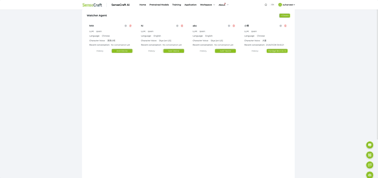
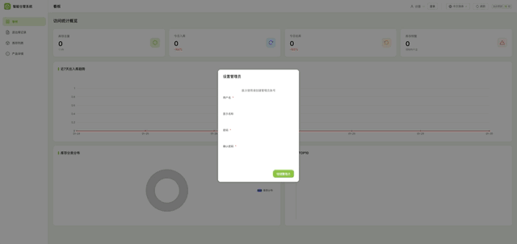
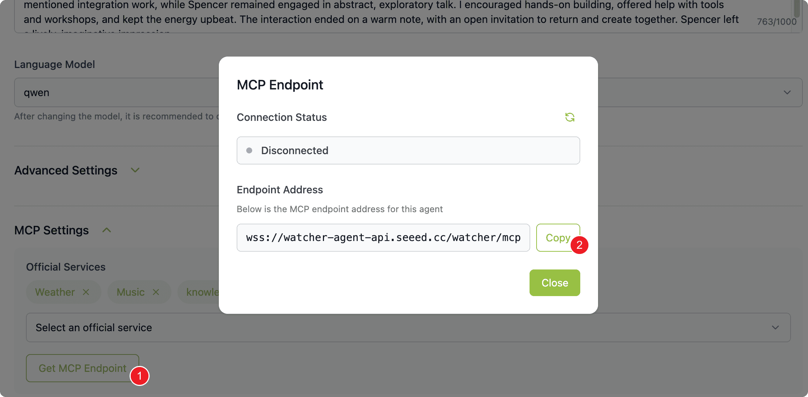
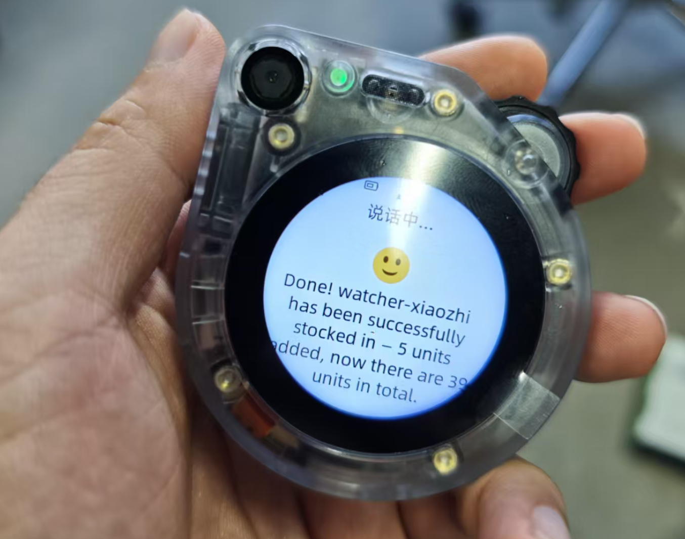
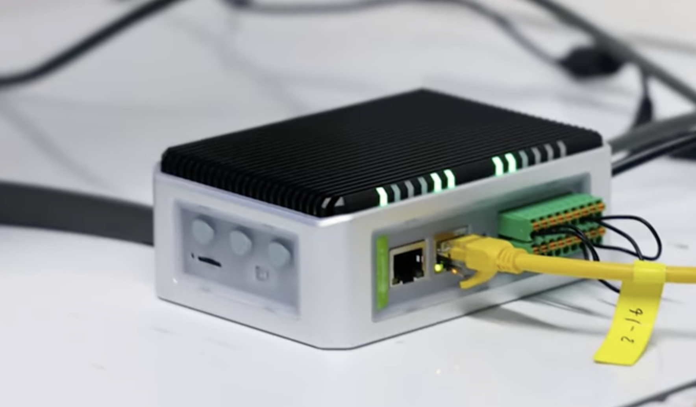

## 套餐: 套餐 0 · 云端版 {#trial}

只需一台 Watcher，无需购买主机。库存数据和语音服务全部托管在 Seeed 云端，开箱即可体验完整的语音仓管功能。

| 设备 | 用途 |
|------|------|
| SenseCAP Watcher | 语音助手，接收语音指令 |

**部署完成后你可以：**
- 语音操控库存（说"入库 10 箱苹果"就能录入）
- 网页实时查看库存数据

**前提条件：** 需要联网 · SenseCraft 账号（免费注册）

**注意：** 按月订阅制，数据托管在 Seeed 云端，不支持人脸识别，不支持对接 ERP / WMS

## 步骤 1: 配置 Watcher 设备 {#sensecraft type=manual required=true}

将 Watcher 连接到 SenseCraft 云平台：

1. 打开 Watcher 电源，按住右上角滚轮按钮 5 秒后松开开机
2. 手机搜索名为"Watcher-XXXX"的 WiFi 热点并连接
3. 连接后浏览器会自动弹出配网页面（如未弹出，手动访问 http://192.168.4.1）
4. 等待约 5 秒完成 WiFi 扫描，从列表中选择 2.4GHz 网络，输入密码，点击"连接"
5. 连接成功后设备自动重启，重启后屏幕显示 6 位验证码
6. 登录 [SenseCraft AI 平台](https://sensecraft.seeed.cc/ai/device/local/37/)，点击模型里的「SenseCraft Watcher」选择「Watcher Agent」→「Bind Device」，输入 6 位验证码完成绑定
7. 点击「Create」新建一个 Agent，点击 Agent 卡片上的 ⚙ 设置图标，在「角色模板」中选择「库存管理员」，按需调整名称和语言后保存

### 故障排除

| 问题 | 解决方法 |
|------|--------|
| 手机搜不到热点 | 确保手机 WiFi 已开启，靠近 Watcher 重试 |
| 配网失败 | Watcher 仅支持 2.4GHz WiFi，检查路由器是否开启 2.4GHz 频段 |
| 找不到 Watcher Agent | 确认已登录 SenseCraft 账号，刷新页面 |

---

## 步骤 2: 配置仓库系统 {#cloud_warehouse_config type=manual required=true}

仓管系统由 Seeed 云端托管，无需自行部署。打开云端仓库管理系统完成初始配置：

1. 浏览器访问 [仓管系统](https://warehouse.seeed.cn/)
2. 点击右上角「登录」→「Watcher 设备用户可自助注册」
3. 对 Watcher 说「你的设备 ID 是什么」，Watcher 会回报一串 ID
4. 将设备 ID 填入注册页面，完成注册后登录
5. 进入系统后，点击左侧「库存列表」导入现有库存（[下载 Excel 模板](https://files.seeedstudio.com/Solution/landpage_asset/smart-warehouse-management/warehouse_import-9e6e51d1.xlsx)）

### 故障排除

| 问题 | 解决方法 |
|------|----------|
| 页面打不开 | 检查网络连接，稍后重试 |
| 导入失败 | 检查 Excel 格式是否与模板一致 |
| 忘记管理员密码 | 进入「设备管理」删除此应用（勾选「删除数据」），然后重新初始化 |

---

## 步骤 3: 联动智能体 {#cloud_mcp_bridge type=manual required=true}

在仓库系统中添加智能体，让 Watcher 能够操作库存：

1. 浏览器访问 [仓管系统](https://warehouse.seeed.cn/)
2. 进入左侧「智能体配置」，点击「添加智能体」，填写名称
3. 登录 [SenseCraft AI 平台](https://sensecraft.seeed.cc/ai/device/local/37/)，在 ⚙ 设置页下滑到最底部，点击「MCP Setting」→「获取 MCP 端点」→「复制端点地址」
4. 在 Endpoint 中粘贴端点地址
5. 点击「保存并启动」
6. 点击智能体卡片上的「MCP 接入点」，刷新状态显示 Connected 即连接成功

### 故障排除

| 问题 | 解决方法 |
|------|----------|
| 连接失败 | 检查端点地址是否完整复制，不要包含多余空格 |
| 状态一直显示 Disconnected | 确认 Watcher 已正确绑定到 SenseCraft 平台 |

---

## 步骤 4: 效果体验 {#demo type=manual verify=true required=true}

试试这些语音指令——对话本身就是验证体验版是否就绪。说完后到 SenseCraft 平台 [sensecraft.seeed.cc](https://sensecraft.seeed.cc/ai/) 查看产生的库存记录。

| 说这句话 | Watcher 会做什么 |
|----------|------------------|
| "苹果还有多少？" | 查询苹果的库存数量 |
| "入库 10 箱苹果" | 添加 10 箱苹果到库存 |
| "出库 5 箱香蕉" | 从库存减少 5 箱香蕉 |
| "今天入库了什么？" | 列出今日入库记录 |

### 故障排除

| 问题 | 解决方法 |
|------|----------|
| Watcher 没反应 | 确认智能体已连接（状态显示 Connected） |
| 库存没更新 | 刷新 SenseCraft 页面查看最新数据 |
| 看不到记录 | 确认 Watcher 已绑定 SenseCraft 账号 |

### 部署完成

SenseCraft 体验版已就绪！

**访问入口：**
- SenseCraft 平台：[sensecraft.seeed.cc](https://sensecraft.seeed.cc/ai/)

试着说「入库 10 箱苹果」测试语音库存管理。

---

## 套餐: 套餐一 · 基础版 {#sensecraft_cloud}

使用 [SenseCraft](https://sensecraft.seeed.cc/ai/) 云服务提供语音 AI 能力。最简单的部署方式——只需部署仓管系统，将 Watcher 连接到 SenseCraft 平台即可。

| 设备 | 用途 |
|------|------|
| SenseCAP Watcher | 语音助手，接收语音指令 |
| reComputer R1125-10 | 运行仓库管理系统 |
| USB-C 数据线 | 烧录 Watcher 固件 |

**部署完成后你可以：**
- 语音操控库存（说"入库 10 箱苹果"就能录入）
- 网页实时查看库存数据
- 开箱即用，无需额外配置

❌ 不支持高精度人脸识别

**前提条件：** 需要联网 · [SenseCraft 账号](https://sensecraft.seeed.cc/ai/)（免费注册）

## 步骤 1: 仓库管理系统 {#warehouse type=docker_deploy required=true config=devices/warehouse_deploy.yaml}

部署库存管理服务，支持语音操控和网页看板。

### 部署目标 {#warehouse_local type=local config=devices/warehouse_deploy.yaml}

在本机运行仓库管理服务。

### 接线

1. 确保本机 Docker 已安装并运行
2. 点击部署按钮启动服务

### 故障排除

| 问题 | 解决方法 |
|------|----------|
| 端口被占用 | 检查 2125 端口是否被其他服务使用 |
| Docker 未运行 | 启动 Docker Desktop 后重试 |

### 部署目标 {#warehouse_remote type=remote config=devices/warehouse_deploy.yaml default=true}

部署到 reComputer R1125-10 边缘计算设备。

### 接线

1. 将 R1125-10 接上电源和网线，确保与电脑在同一网络
2. 输入 IP 地址 `reComputer-R110x.local`（或从路由器查询）
3. 输入用户名 `recomputer`，密码 `12345678`
4. 点击部署，等待安装完成

### 故障排除

| 问题 | 解决方法 |
|------|----------|
| 连接超时 | 检查网线是否插好，用 ping reComputer-R110x.local 测试 |
| SSH 认证失败 | 确认用户名密码正确，首次使用需接显示器完成初始设置 |

---

## 步骤 2: 配置仓库系统 {#warehouse_config type=manual required=true}

部署完成后，打开仓库管理系统完成初始配置：

1. 浏览器访问 `http://服务器IP:2125`（本机部署用 `localhost`）
2. 首次访问会弹出「设置管理员」窗口，填写信息后点击确定
3. 进入系统后，点击左侧「库存列表」导入现有库存（[下载 Excel 模板](https://files.seeedstudio.com/Solution/landpage_asset/smart-warehouse-management/warehouse_import-9e6e51d1.xlsx)）

### 故障排除

| 问题 | 解决方法 |
|------|----------|
| 页面打不开 | 等待 30 秒让服务启动完成 |
| 导入失败 | 检查 Excel 格式是否与模板一致 |
| 忘记管理员密码 | 进入「设备管理」删除此应用（勾选「删除数据」），然后重新部署 |

---

## 步骤 3: 更新小智固件 {#warehouse_esp32 type=esp32_usb required=true config=devices/watcher_esp32.yaml}

将支持人脸识别的语音助手程序写入 Watcher。

### 接线

1. 用 USB-C 线连接 Watcher 到电脑
2. 在上方选择串口（选 wchusbserial 开头的）
3. 点击烧录按钮

### 故障排查

| 问题 | 解决方法 |
|------|----------|
| 找不到串口 | 换一条 USB 线或换个 USB 口 |
| 收不到串口数据 | 按住 BOOT 按钮，按一下 RESET，松开 BOOT，然后重试 |
| 烧录失败 | 重新插拔设备再试 |

---

## 步骤 4: 烧录人脸识别固件 {#warehouse_himax type=himax_usb required=true config=devices/watcher_himax.yaml}

将人脸识别程序写入 Watcher 的 AI 芯片（含人脸检测、人脸特征、人体检测模型）。

### 接线

1. 确保 Watcher 已连接到电脑
2. 在上方选择串口（选 usbmodem 开头的）
3. 点击烧录按钮
4. 点击烧录后，按一下设备的重启按钮进入烧录模式

### 故障排查

| 问题 | 解决方法 |
|------|----------|
| 设备无响应 | 重新插拔 USB 线 |
| 烧录卡住或失败 | 按重启按钮重试 |
| 反复烧录失败 | 换一条 USB 线或换个 USB 口 |
| 烧录到 99% 失败或中途重启 | 关闭其他占用串口的程序，重新插拔 USB 后重试 |

---

## 步骤 5: 配置 Watcher 设备 {#sensecraft type=manual required=true}

将 Watcher 连接到 SenseCraft 云平台：

1. 打开 Watcher 电源，按住右上角滚轮按钮 5 秒后松开开机
2. 手机搜索名为"Watcher-XXXX"的 WiFi 热点并连接
3. 连接后浏览器会自动弹出配网页面（如未弹出，手动访问 http://192.168.4.1）
4. 等待约 5 秒完成 WiFi 扫描，从列表中选择 2.4GHz 网络，输入密码，点击"连接"
5. 连接成功后设备自动重启，重启后屏幕显示 6 位验证码
6. 登录 [SenseCraft AI 平台](https://sensecraft.seeed.cc/ai/device/local/37/)，点击模型里的「SenseCraft Watcher」选择「Watcher Agent」→「Bind Device」，输入 6 位验证码完成绑定
7. 点击「Create」新建一个 Agent，点击 Agent 卡片上的 ⚙ 设置图标，在「角色模板」中选择「库存管理员」，按需调整名称和语言后保存
8. 在 ⚙ 设置页下滑到最底部，点击「MCP Setting」→「获取 MCP 端点」→「复制端点地址」

### 故障排除

| 问题 | 解决方法 |
|------|--------|
| 手机搜不到热点 | 确保手机 WiFi 已开启，靠近 Watcher 重试 |
| 配网失败 | Watcher 仅支持 2.4GHz WiFi，检查路由器是否开启 2.4GHz 频段 |
| 找不到 Watcher Agent | 确认已登录 SenseCraft 账号，刷新页面 |

---

## 步骤 6: 联动智能体 {#mcp_bridge type=manual required=true}

在仓库系统中添加智能体，让 Watcher 能够操作库存：

1. 浏览器访问 `http://服务器IP:2125`（本机部署用 `localhost`）
2. 进入左侧「智能体配置」，点击「添加智能体」，填写名称
3. 在 Endpoint 中粘贴上一步从 MCP Setting 复制的端点地址
4. 点击「保存并启动」
5. 点击智能体卡片上的「MCP 接入点」，刷新状态显示 Connected 即连接成功

### 故障排除

| 问题 | 解决方法 |
|------|----------|
| 连接失败 | 检查端点地址是否完整复制，不要包含多余空格 |
| 状态一直显示 Disconnected | 确认 Watcher 已正确绑定到 SenseCraft 平台 |

---

## 步骤 7: 效果体验 {#demo type=manual required=false}

试试这些语音指令：

| 说这句话 | Watcher 会做什么 |
|----------|------------------|
| "苹果还有多少？" | 查询苹果的库存数量 |
| "入库 10 箱苹果" | 添加 10 箱苹果到库存 |
| "出库 5 箱香蕉" | 从库存减少 5 箱香蕉 |
| "今天入库了什么？" | 列出今日入库记录 |

说完后可以在仓库网页界面查看库存变化。

### 故障排除

| 问题 | 解决方法 |
|------|----------|
| Watcher 没反应 | 确认智能体已连接（状态显示 Connected） |
| 库存没更新 | 刷新网页查看最新数据 |

## 步骤 8: 打开面板 {#dashboard type=web_dashboard required=true config=devices/dashboard.yaml}

仓库管理面板已经运行。点击下方按钮在浏览器中打开。

### 故障排查
| 问题 | 解决方法 |
|------|----------|
| 页面无法加载 | 请确认前一个部署步骤已经成功，服务运行正常 |
| 主机/端口错误 | 如果你部署到远程设备，请用实际的设备 IP 更新地址 |

### 部署完成

语音仓库管理系统已就绪！

**访问入口：**
- 仓库系统：http://\<服务器IP\>:2125
- SenseCraft 平台：[sensecraft.seeed.cc](https://sensecraft.seeed.cc/ai/)

试着说「入库 10 箱苹果」测试语音库存管理。

---

## 套餐: 套餐二A · 升级版（单点位）{#private_cloud}

自建语音 AI 服务器，调用云端 API（DeepSeek、OpenAI 等）处理语音。数据不经过第三方平台，只有 API 调用。

| 设备 | 用途 |
|------|------|
| SenseCAP Watcher | 语音助手，接收语音指令 |
| reComputer R2135-12 | 运行仓管系统 + 语音 AI 服务 |

**部署完成后你可以：**
- 完全掌控数据——库存信息留在自己网络内
- 自由选择 AI 模型（DeepSeek、GPT-4、通义千问等）
- 自定义语音助手的提示词和行为

✅ 支持人脸识别

**前提条件：** 需要联网 · 需要 LLM API 密钥

## 步骤 1: 仓库管理系统 {#warehouse_2a type=docker_deploy required=true config=devices/warehouse_deploy.yaml}

部署库存管理服务，支持语音操控和网页看板。

### 部署目标 {#warehouse_2a_local type=local config=devices/warehouse_deploy.yaml}

在本机运行仓库管理服务。

### 接线

1. 确保本机 Docker 已安装并运行
2. 点击部署按钮启动服务

### 故障排除

| 问题 | 解决方法 |
|------|----------|
| 端口被占用 | 检查 2125 端口是否被其他服务使用 |
| Docker 未运行 | 启动 Docker Desktop 后重试 |

### 部署目标 {#warehouse_2a_remote type=remote config=devices/warehouse_deploy.yaml default=true}

部署到 reComputer R2135-12 边缘计算设备。

### 接线

1. 将 R2135-12 接上电源和网线，确保与电脑在同一网络
2. 输入 IP 地址 `reComputer-R110x.local`（或从路由器查询）
3. 输入用户名 `recomputer`，密码 `12345678`
4. 点击部署，等待安装完成

### 故障排除

| 问题 | 解决方法 |
|------|----------|
| 连接超时 | 检查网线是否插好，用 ping reComputer-R110x.local 测试 |
| SSH 认证失败 | 确认用户名密码正确，首次使用需接显示器完成初始设置 |

---

## 步骤 2: 配置仓库系统 {#warehouse_config type=manual required=true}

部署完成后，打开仓库管理系统完成初始配置：

1. 浏览器访问 `http://服务器IP:2125`（本机部署用 `localhost`）
2. 首次访问会弹出「设置管理员」窗口，填写信息后点击确定
3. 进入系统后，点击左侧「库存列表」导入现有库存（[下载 Excel 模板](https://files.seeedstudio.com/Solution/landpage_asset/smart-warehouse-management/warehouse_import-9e6e51d1.xlsx)）

### 故障排除

| 问题 | 解决方法 |
|------|----------|
| 页面打不开 | 等待 30 秒让服务启动完成 |
| 导入失败 | 检查 Excel 格式是否与模板一致 |
| 忘记管理员密码 | 进入「设备管理」删除此应用（勾选「删除数据」），然后重新部署 |

---

## 步骤 3: 语音 AI 服务 {#voice_service type=docker_deploy required=true config=devices/xiaozhi_deploy.yaml}

部署语音 AI 服务，为 Watcher 提供语音交互能力。部署时选择「私有云方案」，需要填写 LLM API 信息。

### 部署目标 {#voice_local type=local config=devices/xiaozhi_deploy.yaml}

### 接线

1. 确保 Docker 已安装并运行
2. 点击部署按钮启动服务

### 部署目标 {#voice_remote type=remote config=devices/xiaozhi_deploy.yaml default=true}

### 接线

1. 输入 R2135-12 的 IP 地址和 SSH 凭据
2. 点击部署，等待安装完成

### 故障排除

| 问题 | 解决方法 |
|------|----------|
| 镜像拉取失败 | 检查网络连接，或配置 Docker 镜像加速 |
| 端口被占用 | 检查 18000、18003、18004 端口是否被其他服务使用 |
| API 调用失败 | 检查 API 密钥是否正确，余额是否充足 |

---

## 步骤 4: 配置 Watcher 设备 {#watcher_config type=manual required=true}

将 Watcher 连接到 SenseCraft 云平台：

1. 打开 Watcher 电源，按住右上角滚轮按钮 5 秒后松开开机
2. 手机搜索名为"Watcher-XXXX"的 WiFi 热点并连接
3. 连接后浏览器会自动弹出配网页面（如未弹出，手动访问 http://192.168.4.1）
4. 等待约 5 秒完成 WiFi 扫描，从列表中选择 2.4GHz 网络，输入密码，点击"连接"
5. 连接成功后设备自动重启，重启后屏幕显示 6 位验证码
6. 登录 [SenseCraft AI 平台](https://sensecraft.seeed.cc/ai/device/local/37/)，点击模型里的「SenseCraft Watcher」选择「Watcher Agent」→「Bind Device」，输入 6 位验证码完成绑定
7. 点击「Create」新建一个 Agent，点击 Agent 卡片上的 ⚙ 设置图标，在「角色模板」中选择「库存管理员」，按需调整名称和语言后保存
8. 在 ⚙ 设置页下滑到最底部，点击「MCP Setting」→「获取 MCP 端点」→「复制端点地址」

### 故障排除

| 问题 | 解决方法 |
|------|--------|
| 手机搜不到热点 | 确保手机 WiFi 已开启，靠近 Watcher 重试 |
| 配网失败 | Watcher 仅支持 2.4GHz WiFi，检查路由器是否开启 2.4GHz 频段 |
| 找不到 Watcher Agent | 确认已登录 SenseCraft 账号，刷新页面 |

---

## 步骤 5: 联动智能体 {#agent_config type=manual required=true}

在仓库系统中添加智能体，让 Watcher 能够操作库存：

1. 浏览器访问 `http://服务器IP:2125`（本机部署用 `localhost`）
2. 进入左侧「智能体配置」，点击「添加智能体」，填写名称
3. 在 Endpoint 中粘贴上一步从 MCP Setting 复制的端点地址
4. 点击「保存并启动」
5. 点击智能体卡片上的「MCP 接入点」，刷新状态显示 Connected 即连接成功

### 故障排除

| 问题 | 解决方法 |
|------|----------|
| 连接失败 | 检查端点地址是否完整复制，不要包含多余空格 |
| 状态一直显示 Disconnected | 确认 Watcher 已正确绑定到 SenseCraft 平台 |

---

## 步骤 6: 效果体验 {#demo type=manual required=false}

试试这些语音指令：

| 说这句话 | Watcher 会做什么 |
|----------|------------------|
| "苹果还有多少？" | 查询苹果的库存数量 |
| "入库 10 箱苹果" | 添加 10 箱苹果到库存 |
| "出库 5 箱香蕉" | 从库存减少 5 箱香蕉 |
| "今天入库了什么？" | 列出今日入库记录 |

说完后可以在仓库网页界面查看库存变化。

### 故障排除

| 问题 | 解决方法 |
|------|----------|
| Watcher 没反应 | 确认智能体已连接（状态显示 Connected） |
| 库存没更新 | 刷新网页查看最新数据 |

## 步骤 7: 打开面板 {#dashboard type=web_dashboard required=true config=devices/dashboard.yaml}

仓库管理面板已经运行。点击下方按钮在浏览器中打开。

### 故障排查
| 问题 | 解决方法 |
|------|----------|
| 页面无法加载 | 请确认前一个部署步骤已经成功，服务运行正常 |
| 主机/端口错误 | 如果你部署到远程设备，请用实际的设备 IP 更新地址 |

### 部署完成

私有云仓管系统已就绪！

**访问入口：**
- 仓库系统：http://\<服务器IP\>:2125
- 语音服务控制台：http://\<服务器IP\>:18003

数据留在自己网络内。试着说「苹果还有多少」测试。

---

## 套餐: 套餐二B · 升级版（多点位）{#private_cloud_multi}

自建语音 AI 服务器，调用云端 API（DeepSeek、OpenAI 等）处理语音。数据不经过第三方平台，只有 API 调用。

| 设备 | 用途 |
|------|------|
| SenseCAP Watcher | 语音助手，接收语音指令 |
| reComputer Super J4012 | 运行仓管系统 + 语音 AI 服务，支持多路语音并发 |

**部署完成后你可以：**
- 完全掌控数据——库存信息留在自己网络内
- 自由选择 AI 模型（DeepSeek、GPT-4、通义千问等）
- 自定义语音助手的提示词和行为

✅ 支持人脸识别

**前提条件：** 需要联网 · 需要 LLM API 密钥

## 步骤 1: 仓库管理系统 {#warehouse_2b type=docker_deploy required=true config=devices/warehouse_deploy.yaml}

部署库存管理服务，支持语音操控和网页看板。

### 部署目标 {#warehouse_2b_local type=local config=devices/warehouse_deploy.yaml}

在本机运行仓库管理服务。

### 接线

1. 确保本机 Docker 已安装并运行
2. 点击部署按钮启动服务

### 故障排除

| 问题 | 解决方法 |
|------|----------|
| 端口被占用 | 检查 2125 端口是否被其他服务使用 |
| Docker 未运行 | 启动 Docker Desktop 后重试 |

### 部署目标 {#warehouse_2b_remote type=remote config=devices/warehouse_deploy.yaml default=true}

部署到 reComputer Super J4012 边缘计算设备。

### 接线

1. 将 J4012 接上电源和网线，确保与电脑在同一网络
2. 从路由器查询 J4012 的 IP 地址，输入到地址栏
3. 输入用户名 `recomputer`，密码 `12345678`
4. 点击部署，等待安装完成

### 故障排除

| 问题 | 解决方法 |
|------|----------|
| 连接超时 | 检查网线是否插好，确认 IP 地址正确 |
| SSH 认证失败 | 确认用户名密码正确，首次使用需接显示器完成初始设置 |

---

## 步骤 2: 配置仓库系统 {#warehouse_config type=manual required=true}

部署完成后，打开仓库管理系统完成初始配置：

1. 浏览器访问 `http://服务器IP:2125`（本机部署用 `localhost`）
2. 首次访问会弹出「设置管理员」窗口，填写信息后点击确定
3. 进入系统后，点击左侧「库存列表」导入现有库存（[下载 Excel 模板](https://files.seeedstudio.com/Solution/landpage_asset/smart-warehouse-management/warehouse_import-9e6e51d1.xlsx)）

### 故障排除

| 问题 | 解决方法 |
|------|----------|
| 页面打不开 | 等待 30 秒让服务启动完成 |
| 导入失败 | 检查 Excel 格式是否与模板一致 |
| 忘记管理员密码 | 进入「设备管理」删除此应用（勾选「删除数据」），然后重新部署 |

---

## 步骤 3: 语音 AI 服务 {#voice_service type=docker_deploy required=true config=devices/xiaozhi_deploy.yaml}

部署语音 AI 服务，为 Watcher 提供语音交互能力。部署时选择「私有云方案」，需要填写 LLM API 信息。

### 部署目标 {#voice_local type=local config=devices/xiaozhi_deploy.yaml}

### 接线

1. 确保 Docker 已安装并运行
2. 点击部署按钮启动服务

### 部署目标 {#voice_remote type=remote config=devices/xiaozhi_deploy.yaml default=true}

### 接线

1. 输入 J4012 的 IP 地址和 SSH 凭据
2. 点击部署，等待安装完成

### 故障排除

| 问题 | 解决方法 |
|------|----------|
| 镜像拉取失败 | 检查网络连接，或配置 Docker 镜像加速 |
| 端口被占用 | 检查 18000、18003、18004 端口是否被其他服务使用 |
| API 调用失败 | 检查 API 密钥是否正确，余额是否充足 |

---

## 步骤 4: 配置 Watcher 设备 {#watcher_config type=manual required=true}

将 Watcher 连接到 SenseCraft 云平台：

1. 打开 Watcher 电源，按住右上角滚轮按钮 5 秒后松开开机
2. 手机搜索名为"Watcher-XXXX"的 WiFi 热点并连接
3. 连接后浏览器会自动弹出配网页面（如未弹出，手动访问 http://192.168.4.1）
4. 等待约 5 秒完成 WiFi 扫描，从列表中选择 2.4GHz 网络，输入密码，点击"连接"
5. 连接成功后设备自动重启，重启后屏幕显示 6 位验证码
6. 登录 [SenseCraft AI 平台](https://sensecraft.seeed.cc/ai/device/local/37/)，点击模型里的「SenseCraft Watcher」选择「Watcher Agent」→「Bind Device」，输入 6 位验证码完成绑定
7. 点击「Create」新建一个 Agent，点击 Agent 卡片上的 ⚙ 设置图标，在「角色模板」中选择「库存管理员」，按需调整名称和语言后保存
8. 在 ⚙ 设置页下滑到最底部，点击「MCP Setting」→「获取 MCP 端点」→「复制端点地址」

### 故障排除

| 问题 | 解决方法 |
|------|--------|
| 手机搜不到热点 | 确保手机 WiFi 已开启，靠近 Watcher 重试 |
| 配网失败 | Watcher 仅支持 2.4GHz WiFi，检查路由器是否开启 2.4GHz 频段 |
| 找不到 Watcher Agent | 确认已登录 SenseCraft 账号，刷新页面 |

---

## 步骤 5: 联动智能体 {#agent_config type=manual required=true}

在仓库系统中添加智能体，让 Watcher 能够操作库存：

1. 浏览器访问 `http://服务器IP:2125`（本机部署用 `localhost`）
2. 进入左侧「智能体配置」，点击「添加智能体」，填写名称
3. 在 Endpoint 中粘贴上一步从 MCP Setting 复制的端点地址
4. 点击「保存并启动」
5. 点击智能体卡片上的「MCP 接入点」，刷新状态显示 Connected 即连接成功

### 故障排除

| 问题 | 解决方法 |
|------|----------|
| 连接失败 | 检查端点地址是否完整复制，不要包含多余空格 |
| 状态一直显示 Disconnected | 确认 Watcher 已正确绑定到 SenseCraft 平台 |

---

## 步骤 6: 效果体验 {#demo type=manual required=false}

试试这些语音指令：

| 说这句话 | Watcher 会做什么 |
|----------|------------------|
| "苹果还有多少？" | 查询苹果的库存数量 |
| "入库 10 箱苹果" | 添加 10 箱苹果到库存 |
| "出库 5 箱香蕉" | 从库存减少 5 箱香蕉 |
| "今天入库了什么？" | 列出今日入库记录 |

说完后可以在仓库网页界面查看库存变化。

### 故障排除

| 问题 | 解决方法 |
|------|----------|
| Watcher 没反应 | 确认智能体已连接（状态显示 Connected） |
| 库存没更新 | 刷新网页查看最新数据 |

## 步骤 7: 打开面板 {#dashboard type=web_dashboard required=true config=devices/dashboard.yaml}

仓库管理面板已经运行。点击下方按钮在浏览器中打开。

### 故障排查
| 问题 | 解决方法 |
|------|----------|
| 页面无法加载 | 请确认前一个部署步骤已经成功，服务运行正常 |
| 主机/端口错误 | 如果你部署到远程设备，请用实际的设备 IP 更新地址 |

### 部署完成

私有云仓管系统已就绪！

**访问入口：**
- 仓库系统：http://\<服务器IP\>:2125
- 语音服务控制台：http://\<服务器IP\>:18003

数据留在自己网络内。试着说「苹果还有多少」测试。

---

## 套餐: 套餐三 · 顶配版 {#edge_computing}

所有服务本地运行，包括大语言模型和语音合成——完全不需要联网。适合断网环境或对数据合规要求严格的场景。

| 设备 | 用途 |
|------|------|
| SenseCAP Watcher | 语音助手，接收语音指令 |
| reComputer R2135-12 | 运行仓管系统 + 语音 AI 服务 |
| reComputer Robotics J5011 | 运行本地大模型，完全离线 |

**部署完成后你可以：**
- 100% 离线运行——没有网络也能用
- 数据完全不出厂区/办公区
- 本地大模型响应速度约 16 tok/s

✅ 支持人脸识别

**前提条件：** 需要 reComputer Robotics J5011 · 首次部署需要网络下载镜像

## 步骤 1: 仓库管理系统 {#warehouse_t3 type=docker_deploy required=true config=devices/warehouse_deploy.yaml}

部署库存管理服务，支持语音操控和网页看板。

### 部署目标 {#warehouse_t3_local type=local config=devices/warehouse_deploy.yaml}

在本机运行仓库管理服务。

### 接线

1. 确保本机 Docker 已安装并运行
2. 点击部署按钮启动服务

### 故障排除

| 问题 | 解决方法 |
|------|----------|
| 端口被占用 | 检查 2125 端口是否被其他服务使用 |
| Docker 未运行 | 启动 Docker Desktop 后重试 |

### 部署目标 {#warehouse_t3_remote type=remote config=devices/warehouse_deploy.yaml default=true}

部署到 reComputer R2135-12 边缘计算设备。

### 接线

1. 将 R2135-12 接上电源和网线，确保与电脑在同一网络
2. 输入 IP 地址 `reComputer-R110x.local`（或从路由器查询）
3. 输入用户名 `recomputer`，密码 `12345678`
4. 点击部署，等待安装完成

### 故障排除

| 问题 | 解决方法 |
|------|----------|
| 连接超时 | 检查网线是否插好，用 ping reComputer-R110x.local 测试 |
| SSH 认证失败 | 确认用户名密码正确，首次使用需接显示器完成初始设置 |

---

## 步骤 2: 配置仓库系统 {#warehouse_config type=manual required=true}

部署完成后，打开仓库管理系统完成初始配置：

1. 浏览器访问 `http://服务器IP:2125`（本机部署用 `localhost`）
2. 首次访问会弹出「设置管理员」窗口，填写信息后点击确定
3. 进入系统后，点击左侧「库存列表」导入现有库存（[下载 Excel 模板](https://files.seeedstudio.com/Solution/landpage_asset/smart-warehouse-management/warehouse_import-9e6e51d1.xlsx)）

### 故障排除

| 问题 | 解决方法 |
|------|----------|
| 页面打不开 | 等待 30 秒让服务启动完成 |
| 导入失败 | 检查 Excel 格式是否与模板一致 |
| 忘记管理员密码 | 进入「设备管理」删除此应用（勾选「删除数据」），然后重新部署 |

---

## 步骤 3: Jetson 本地 AI {#jetson_ai type=docker_deploy required=true config=devices/llm_jetson_deploy.yaml}

在 Jetson 设备上部署本地大模型和语音合成服务。

### 部署目标 {#local type=local config=devices/llm_jetson_deploy.yaml default=true}

直接在本机 Jetson（运行 SenseCraft Solution 的这台设备）上部署。请先把 `mlc-qwen3-fs.tar.gz` 和 `models-backup.tar.gz` 放到方案目录的 `dist/` 文件夹下。

### 部署目标 {#jetson_remote type=remote config=devices/llm_jetson_deploy.yaml}

### 接线

1. 将 Jetson（reComputer Robotics J5011）接上电源和网线
2. 输入 Jetson 的 IP 地址和 SSH 凭据
3. 选择模型（推荐 Qwen3-8B，需约 4.3GB 显存）
4. 选择部署方式（推荐离线包部署）
5. 点击部署，等待镜像导入和服务启动

### 故障排除

| 问题 | 解决方法 |
|------|----------|
| SSH 连接失败 | 确认 Jetson 已开机，检查 IP 地址是否正确 |
| 显存不足 | 选择更小的模型（Qwen3-4B 约 2.5GB，Qwen3-1.7B 约 1.2GB） |
| 部署时间很长 | 离线包较大（约 5GB），耐心等待 |

---

## 步骤 4: 语音 AI 服务 {#voice_service type=docker_deploy required=true config=devices/xiaozhi_deploy.yaml}

在 R2135-12 上部署语音 AI 服务，连接 Jetson 进行推理。部署时选择「边缘计算方案」，并输入 Jetson IP 地址（如已在上一步部署则自动填充）。

### 部署目标 {#voice_local type=local config=devices/xiaozhi_deploy.yaml}

### 接线

1. 确保 Docker 已安装并运行
2. 点击部署按钮启动服务

### 部署目标 {#voice_remote type=remote config=devices/xiaozhi_deploy.yaml default=true}

### 接线

1. 输入 R2135-12 的 IP 地址和 SSH 凭据
2. 点击部署，等待安装完成

### 故障排除

| 问题 | 解决方法 |
|------|----------|
| 无法连接 Jetson | 检查 R2135-12 和 Jetson 是否在同一网络 |
| 响应很慢 | 确认 Jetson 服务已启动，访问 `http://Jetson-IP:8000/health` 检查 |

---

## 步骤 5: 配置 Watcher 设备 {#watcher_config type=manual required=true}

将 Watcher 连接到 SenseCraft 云平台：

1. 打开 Watcher 电源，按住右上角滚轮按钮 5 秒后松开开机
2. 手机搜索名为"Watcher-XXXX"的 WiFi 热点并连接
3. 连接后浏览器会自动弹出配网页面（如未弹出，手动访问 http://192.168.4.1）
4. 等待约 5 秒完成 WiFi 扫描，从列表中选择 2.4GHz 网络，输入密码，点击"连接"
5. 连接成功后设备自动重启，重启后屏幕显示 6 位验证码
6. 登录 [SenseCraft AI 平台](https://sensecraft.seeed.cc/ai/device/local/37/)，点击模型里的「SenseCraft Watcher」选择「Watcher Agent」→「Bind Device」，输入 6 位验证码完成绑定
7. 点击「Create」新建一个 Agent，点击 Agent 卡片上的 ⚙ 设置图标，在「角色模板」中选择「库存管理员」，按需调整名称和语言后保存
8. 在 ⚙ 设置页下滑到最底部，点击「MCP Setting」→「获取 MCP 端点」→「复制端点地址」

### 故障排除

| 问题 | 解决方法 |
|------|--------|
| 手机搜不到热点 | 确保手机 WiFi 已开启，靠近 Watcher 重试 |
| 配网失败 | Watcher 仅支持 2.4GHz WiFi，检查路由器是否开启 2.4GHz 频段 |
| 找不到 Watcher Agent | 确认已登录 SenseCraft 账号，刷新页面 |

---

## 步骤 6: 联动智能体 {#agent_config type=manual required=true}

在仓库系统中添加智能体，让 Watcher 能够操作库存：

1. 浏览器访问 `http://服务器IP:2125`（本机部署用 `localhost`）
2. 进入左侧「智能体配置」，点击「添加智能体」，填写名称
3. 在 Endpoint 中粘贴上一步从 MCP Setting 复制的端点地址
4. 点击「保存并启动」
5. 点击智能体卡片上的「MCP 接入点」，刷新状态显示 Connected 即连接成功

### 故障排除

| 问题 | 解决方法 |
|------|----------|
| 连接失败 | 检查端点地址是否完整复制，不要包含多余空格 |
| 状态一直显示 Disconnected | 确认 Watcher 已正确绑定到 SenseCraft 平台 |

---

## 步骤 7: 效果体验 {#demo type=manual required=false}

试试这些语音指令：

| 说这句话 | Watcher 会做什么 |
|----------|------------------|
| "苹果还有多少？" | 查询苹果的库存数量 |
| "入库 10 箱苹果" | 添加 10 箱苹果到库存 |
| "出库 5 箱香蕉" | 从库存减少 5 箱香蕉 |
| "今天入库了什么？" | 列出今日入库记录 |

说完后可以在仓库网页界面查看库存变化。

### 故障排除

| 问题 | 解决方法 |
|------|----------|
| Watcher 没反应 | 确认智能体已连接（状态显示 Connected） |
| 库存没更新 | 刷新网页查看最新数据 |

## 步骤 8: 打开面板 {#dashboard type=web_dashboard required=true config=devices/dashboard.yaml}

仓库管理面板已经运行。点击下方按钮在浏览器中打开。

### 故障排查
| 问题 | 解决方法 |
|------|----------|
| 页面无法加载 | 请确认前一个部署步骤已经成功，服务运行正常 |
| 主机/端口错误 | 如果你部署到远程设备，请用实际的设备 IP 更新地址 |

### 部署完成

全离线仓管系统已就绪！

**访问入口：**
- 仓库系统：http://\<服务器IP\>:2125
- 语音服务控制台：http://\<服务器IP\>:18003
- 大模型健康检查：http://\<Jetson-IP\>:8000/health

部署完成后 100% 离线运行，无需联网。
