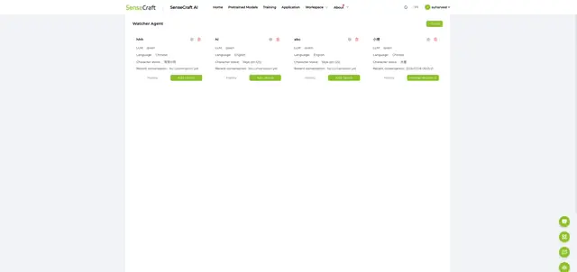
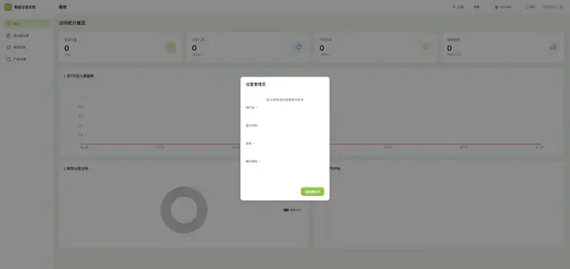
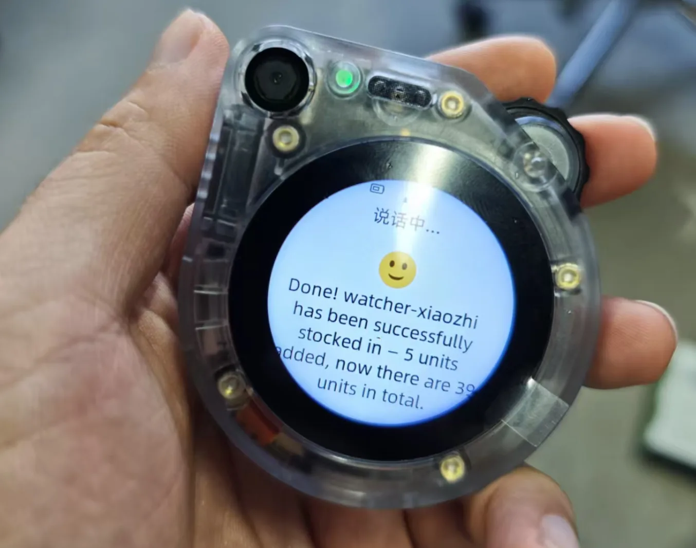
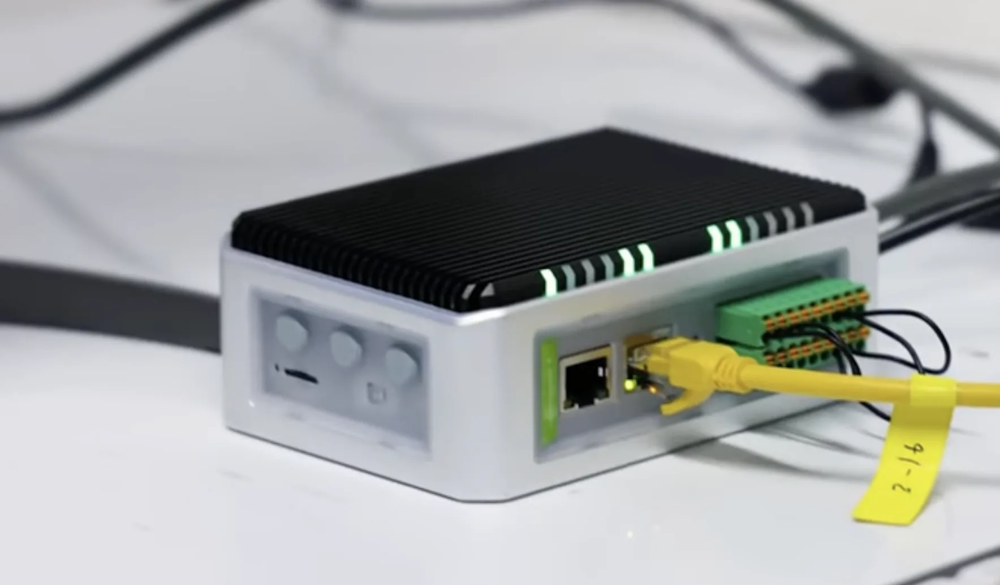
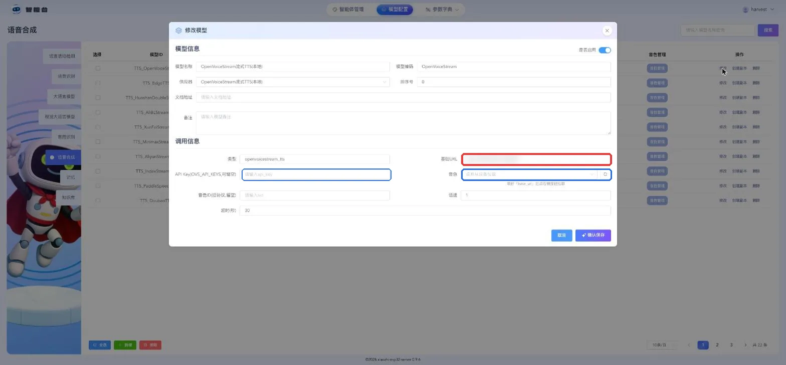

## 套餐: 套餐 0 · 云端版 {#trial}

只需一台 SenseCAP Watcher，无需主机。库存数据和语音服务托管在 Seeed 云端。

- **网络：** Watcher 需要 2.4GHz WiFi 并联网（不支持 5GHz）。
- **账号：** SenseCraft 账号（免费注册）；仓库系统用 Watcher 的设备 ID 自助注册，没有单独的管理员账号。
- **限制：** 按月订阅，数据托管在 Seeed 云端，不支持人脸识别，不支持对接 ERP / WMS。

## 步骤 1: 配置 Watcher 设备 {#sensecraft type=manual required=true}



将 Watcher 连接到 SenseCraft 云平台：

1. 打开 Watcher 电源，按住右上角滚轮按钮 5 秒后松开开机
2. 手机搜索名为"Watcher-XXXX"的 WiFi 热点并连接
3. 连接后浏览器会自动弹出配网页面（如未弹出，手动访问 http://192.168.42.1）
4. 等待约 5 秒完成 WiFi 扫描，从列表中选择 2.4GHz 网络，输入密码，点击"连接"
5. 连接成功后设备自动重启，重启后屏幕显示 6 位验证码
6. 登录 [SenseCraft AI 平台](https://sensecraft.seeed.cc/ai/device/local/37/)，点击模型里的「SenseCraft Watcher」选择「Watcher Agent」→「Bind Device」，输入 6 位验证码完成绑定
7. 点击「Create」新建一个 Agent，点击 Agent 卡片上的 ⚙ 设置图标，在「角色模板」中选择「库存管理员」，按需调整名称和语言后保存

### 故障排除

| 现象 | 处理 |
|------|--------|
| 手机搜不到热点 | 确保手机 WiFi 已开启，靠近 Watcher 重试 |
| 配网失败 | Watcher 仅支持 2.4GHz WiFi，检查路由器是否开启 2.4GHz 频段 |
| 找不到 Watcher Agent | 确认已登录 SenseCraft 账号，刷新页面 |

---

## 步骤 2: 配置仓库系统 {#cloud_warehouse_config type=manual required=true}



仓管系统由 Seeed 云端托管，无需自行部署。打开云端仓库管理系统完成初始配置：

1. 浏览器访问 [仓管系统](https://warehouse.seeed.cn/)
2. 点击右上角「登录」→「Watcher 设备用户可自助注册」
3. 对 Watcher 说「你的设备 ID 是什么」，Watcher 会回报一串 ID
4. 将设备 ID 填入注册页面，完成注册后登录
5. 进入系统后，点击左侧「库存列表」导入现有库存（[下载 Excel 模板](https://files.seeedstudio.com/Solution/landpage_asset/smart-warehouse-management/warehouse_import-9e6e51d1.xlsx)）

### 故障排除

| 现象 | 处理 |
|------|----------|
| 页面打不开 | 检查网络连接，稍后重试 |
| 导入失败 | 检查 Excel 格式是否与模板一致 |
| 忘记管理员密码 | 进入「设备管理」删除此应用（勾选「删除数据」），然后重新初始化 |

---

## 步骤 3: 联动智能体 {#cloud_mcp_bridge type=manual required=true}


在仓库系统中添加智能体，让 Watcher 能够操作库存：

1. 浏览器访问 [仓管系统](https://warehouse.seeed.cn/)
2. 进入左侧「智能体配置」，点击「添加智能体」，填写名称
3. 登录 [SenseCraft AI 平台](https://sensecraft.seeed.cc/ai/device/local/37/)，在 ⚙ 设置页下滑到最底部，点击「MCP Setting」→「获取 MCP 端点」→「复制端点地址」
4. 在 Endpoint 中粘贴端点地址
5. 点击「保存并启动」
6. 点击智能体卡片上的「MCP 接入点」，刷新状态显示 Connected 即连接成功

### 故障排除

| 现象 | 处理 |
|------|----------|
| 连接失败 | 检查端点地址是否完整复制，不要包含多余空格 |
| 状态一直显示 Disconnected | 确认 Watcher 已正确绑定到 SenseCraft 平台 |

---

## 步骤 4: 效果体验 {#demo type=manual verify=true required=true}



试试这些语音指令，说完后到 SenseCraft 平台 [sensecraft.seeed.cc](https://sensecraft.seeed.cc/ai/) 查看产生的库存记录。

| 说这句话 | Watcher 会做什么 |
|----------|------------------|
| "苹果还有多少？" | 查询苹果的库存数量 |
| "入库 10 箱苹果" | 添加 10 箱苹果到库存 |
| "出库 5 箱香蕉" | 从库存减少 5 箱香蕉 |
| "今天入库了什么？" | 列出今日入库记录 |

### 故障排除

| 现象 | 处理 |
|------|----------|
| Watcher 没反应 | 确认智能体已连接（状态显示 Connected） |
| 库存没更新 | 刷新 SenseCraft 页面查看最新数据 |
| 看不到记录 | 确认 Watcher 已绑定 SenseCraft 账号 |
| 网络或服务中断期间出入库失败 | 中断期间的请求不会补发，恢复后重新操作；服务与 Watcher 尽量有线连接、同处一个局域网，服务器配 UPS 供电 |

### 部署完成

SenseCraft 体验版已就绪！

**访问入口：**
- SenseCraft 平台：[sensecraft.seeed.cc](https://sensecraft.seeed.cc/ai/)

试着说「入库 10 箱苹果」测试语音库存管理。

#### 验收清单

1. **智能体已连接**——SenseCraft 平台上 Agent 卡片的 MCP Endpoint 状态显示「已连接」。
2. **语音入库有回声**——对 Watcher 说「入库 10 箱苹果」，几秒内应回复确认品名和新总量。
3. **记录能查到**——刷新 [warehouse.seeed.cn](https://warehouse.seeed.cn/)，确认刚才的入库出现在今日记录里。
4. **查询正常**——说「苹果还有多少」，回复数量应与刚入库后一致。

---

## 套餐: 套餐一 · 基础版 {#sensecraft_cloud}

使用 [SenseCraft](https://sensecraft.seeed.cc/ai/) 云服务提供语音 AI 能力，只需部署仓库系统并将 Watcher 连接到 SenseCraft 平台。

- **外设：** SenseCAP Watcher（仅支持 2.4GHz WiFi）、USB-C 数据线（烧录固件）。
- **网络：** 需要联网；配置期间 Watcher、仓库服务器与本机在同一局域网。
- **账号：** [SenseCraft 账号](https://sensecraft.seeed.cc/ai/)（免费注册）；仓库系统管理员账号在首次访问时创建。
- **限制：** 不支持高精度人脸识别。

## 步骤 1: 更新小智固件 {#warehouse_esp32 type=esp32_usb required=true config=devices/watcher_esp32.yaml}

将语音助手程序写入 Watcher 以启用语音交互。

### 接线


1. 用 USB-C 线连接 Watcher 到电脑
2. 串口通常会自动选好；如果没选上，Windows 选名字里带 **SERIAL-B** 的 COM 口，macOS / Linux 选编号较大的那个（如 `...53` / `ttyACM1`）
3. 点击烧录按钮

### 故障排查

| 现象 | 处理 |
|------|----------|
| 找不到串口 | 换一条 USB 线或换个 USB 口 |
| 选错串口（烧录无反应或立刻失败） | 列表里换另一个 CH342 串口再试 |
| 收不到串口数据 | 按住 BOOT 按钮，按一下 RESET，松开 BOOT，然后重试 |
| 烧录失败 | 重新插拔设备再试 |

---

## 步骤 2: 更新视觉检测固件 {#warehouse_himax type=himax_usb required=true config=devices/watcher_himax.yaml}

将视觉检测程序写入 Watcher 的 AI 芯片。

### 接线


1. 确保 Watcher 仍通过 USB-C 线连接到电脑（与上一步相同）
2. 串口通常会自动选好；如果没选上，Windows 选名字里带 **SERIAL-A** 的 COM 口，macOS / Linux 选编号较小的那个（如 `...51` / `ttyACM0`）—— 和上一步不是同一个口
3. 点击烧录按钮
4. 点击烧录后，按一下设备的重启按钮进入烧录模式

### 故障排查

| 现象 | 处理 |
|------|----------|
| 设备无响应 | 重新插拔 USB 线 |
| 烧录卡住或失败 | 按重启按钮重试 |
| 反复烧录失败 | 换一条 USB 线或换个 USB 口 |
| 烧录到 99% 失败或中途重启 | 关闭其他占用串口的程序，重新插拔 USB 后重试 |

---

## 步骤 3: 配置 Watcher 设备 {#watcher_setup type=manual required=true}


先通过 WiFi 配对 Watcher，绑定到 SenseCraft 云平台，再创建一个「库存管理员」智能体并复制其 MCP 端点地址（步骤 6 会用到）。

### 接线

1. 打开 Watcher 电源，按住右上角滚轮按钮 5 秒后松开开机
2. 手机搜索名为"Watcher-XXXX"的 WiFi 热点并连接
3. 连接后浏览器会自动弹出配网页面（如未弹出，手动访问 http://192.168.42.1）
4. 等待约 5 秒完成 WiFi 扫描，从列表中选择 2.4GHz 网络，输入密码，点击"连接"
5. 连接成功后设备自动重启，重启后屏幕显示 6 位验证码
6. 登录 [SenseCraft AI 平台](https://sensecraft.seeed.cc/ai/device/local/37/)，点击模型里的「SenseCraft Watcher」选择「Watcher Agent」→「Bind Device」，输入 6 位验证码完成绑定
7. 点击「Create」新建一个 Agent，点击 Agent 卡片上的 ⚙ 设置图标，在「角色模板」中选择「库存管理员」，按需调整名称和语言后保存
8. 对 Watcher 说「开启人脸识别模式」，让设备切换到人脸识别检测
9. 在 ⚙ 设置页下滑到最底部，点击「MCP Setting」→「获取 MCP 端点」→「复制端点地址」

### 故障排除

| 现象 | 处理 |
|------|--------|
| 手机搜不到热点 | 确保手机 WiFi 已开启，靠近 Watcher 重试 |
| 配网失败 | Watcher 仅支持 2.4GHz WiFi，检查路由器是否开启 2.4GHz 频段 |
| 找不到 Watcher Agent | 确认已登录 SenseCraft 账号，刷新页面 |

---

## 步骤 4: 仓库管理系统 {#warehouse type=docker_deploy required=true config=devices/warehouse_deploy.yaml}

部署库存管理服务，支持语音操控和网页看板。

### 部署完成

服务启动后，浏览器访问 `http://<服务器IP>:2125` 进入下一步配置。

### 部署目标 {#warehouse_local type=local config=devices/warehouse_deploy.yaml}

在本机运行仓库管理服务，需要至少 2 GB 可用磁盘。

### 接线

1. 确保本机 Docker 已安装并运行
2. 点击部署按钮启动服务

### 故障排除

| 现象 | 处理 |
|------|----------|
| 端口被占用 | 检查 2125 端口是否被其他服务使用 |
| Docker 未运行 | 启动 Docker Desktop 后重试 |

### 部署目标 {#warehouse_remote type=remote config=devices/warehouse_deploy.yaml default=true}

部署到 reComputer R1100 系列（4 GB 内存起），需要至少 2 GB 可用磁盘。

### 接线



1. 将 R1100 系列设备接上电源和网线，确保与电脑在同一网络
2. 输入 IP 地址 `reComputer-R110x.local`（或从路由器查询）
3. 输入用户名 `recomputer`，密码 `12345678`
4. 点击部署，等待安装完成

### 故障排除

| 现象 | 处理 |
|------|----------|
| 连接超时 | 检查网线是否插好，用 ping reComputer-R110x.local 测试 |
| SSH 认证失败 | 确认用户名密码正确，首次使用需接显示器完成初始设置 |

---

## 步骤 5: 配置仓库系统 {#warehouse_config type=manual required=true}


部署完成后，打开仓库管理系统完成初始配置：

1. 浏览器访问 `http://服务器IP:2125`（本机部署用 `localhost`）
2. 首次访问会弹出「设置管理员」窗口，填写信息后点击确定
3. 进入系统后，点击左侧「库存列表」导入现有库存（[下载 Excel 模板](https://files.seeedstudio.com/Solution/landpage_asset/smart-warehouse-management/warehouse_import-9e6e51d1.xlsx)）

### 故障排除

| 现象 | 处理 |
|------|----------|
| 页面打不开 | 等待 30 秒让服务启动完成 |
| 导入失败 | 检查 Excel 格式是否与模板一致 |
| 忘记管理员密码 | 进入「设备管理」删除此应用（勾选「删除数据」），然后重新部署 |

---

## 步骤 6: 联动智能体 {#mcp_bridge type=manual required=true}


在仓库系统中添加智能体，让 Watcher 能够操作库存：

1. 进入左侧「智能体配置」，点击「添加智能体」，填写名称
2. 在 Endpoint 中粘贴步骤 3 从 MCP Setting 复制的端点地址
3. 点击「保存并启动」
4. 点击智能体卡片上的「MCP 接入点」，刷新状态显示 Connected 即连接成功

### 故障排除

| 现象 | 处理 |
|------|----------|
| 连接失败 | 检查端点地址是否完整复制，不要包含多余空格 |
| 状态一直显示 Disconnected | 确认 Watcher 已正确绑定到 SenseCraft 平台 |

---

## 步骤 7: 效果体验 {#voice_demo_test type=manual required=false}


试试这些语音指令：

| 说这句话 | Watcher 会做什么 |
|----------|------------------|
| "苹果还有多少？" | 查询苹果的库存数量 |
| "入库 10 箱苹果" | 添加 10 箱苹果到库存 |
| "出库 5 箱香蕉" | 从库存减少 5 箱香蕉 |
| "今天入库了什么？" | 列出今日入库记录 |

说完后可以在仓库网页界面查看库存变化。

### 故障排除

| 现象 | 处理 |
|------|----------|
| Watcher 没反应 | 确认智能体已连接（状态显示 Connected） |
| 库存没更新 | 刷新网页查看最新数据 |
| 网络或服务中断期间出入库失败 | 中断期间的请求不会补发，恢复后重新操作；服务与 Watcher 尽量有线连接、同处一个局域网，服务器配 UPS 供电 |

---

## 步骤 8: 测试人脸识别 {#face_test type=manual required=false}

在仓管系统中配置人脸识别并验证效果：

1. 浏览器访问 `http://服务器IP:2125`，进入「系统设置」→「人脸识别」
2. 按页面指引完成配置，录入需要识别的人员人脸
3. 确认已对 Watcher 说过「开启人脸识别模式」（见步骤 3）
4. 面对 Watcher 摄像头，识别成功后可在仓管系统中查看识别记录

### 故障排除

| 现象 | 处理 |
|------|----------|
| 识别不到人脸 | 确认视觉检测固件已烧录，且已对 Watcher 说「开启人脸识别模式」 |
| 识别结果不准 | 在「系统设置 → 人脸识别」重新录入光线充足、正面清晰的人脸照片 |

## 步骤 9: 打开面板 {#dashboard type=web_dashboard required=true config=devices/dashboard.yaml}

仓库管理面板已经运行。点击下方按钮在浏览器中打开。

### 故障排查

| 现象 | 处理 |
|------|----------|
| 页面无法加载 | 请确认前一个部署步骤已经成功，服务运行正常 |
| 主机/端口错误 | 如果你部署到远程设备，请用实际的设备 IP 更新地址 |

### 部署完成

语音仓库管理系统已就绪！

**访问入口：**
- 仓库系统：http://\<服务器IP\>:2125
- SenseCraft 平台：[sensecraft.seeed.cc](https://sensecraft.seeed.cc/ai/)

试着说「入库 10 箱苹果」测试语音库存管理。

#### 验收清单

1. **健康检查通过**——`curl -f http://<服务器IP>:2125/health` 返回成功。
2. **管理员能登录**——用步骤 5 创建的管理员账号登录 `http://<服务器IP>:2125`。
3. **语音入库有回声**——对 Watcher 说「入库 10 箱苹果」，应回复确认品名和新总量。
4. **查询正常**——说「苹果还有多少」，回复应与仓库面板一致。

---

## 步骤 10: 烧录 reTerminal D1001（D1001 选项） {#d1001_flash_sensecraft_cloud type=esp32_usb required=false config=devices/d1001_voice_terminal.yaml}

仅在语音终端选择 reTerminal D1001 时执行。选 SenseCAP Watcher 的跳过本步和下一步；选 D1001 的则跳过本套餐的 Watcher 步骤——小智固件、Himax 视觉固件、Watcher 配置三步，D1001 的摄像头挂在同一颗芯片上，不需要单独的视觉固件。

### 接线

1. 用 USB-C 数据线连接 D1001 与电脑
2. 端口自动选中（ESP32-P4 原生 USB，`usbmodem*` / `ttyACM*`）
3. 点击烧录，等待六个分段全部写完

### 故障排查

| 现象 | 处理 |
|------|----------|
| 找不到串口 | 换用支持数据的 USB-C 线，换个 USB 口 |
| 烧录中途失败 | 重插线缆重试，避免使用 USB Hub |

---

## 步骤 11: 配置 D1001 并联动（D1001 选项） {#d1001_setup_sensecraft_cloud type=manual required=false}

D1001 在触摸屏上配网，不走手机热点——这是与 Watcher 的主要差别。之后的智能体、MCP 接入点、仓库系统配置完全一致。

### 接线

1. 开机后点击状态栏的网络图标
2. 选择 **2.4GHz** 网络，在屏上输入密码，等待 IP 地址出现
3. 联网后设备屏幕显示激活码。在固件所指向的小智服务控制台完成绑定（默认 `https://api.tenclass.net/xiaozhi/ota/`；SenseCraft 的「Watcher Agent」绑定入口只适用于 Watcher），并为该智能体选择「库存管理员」角色模板
4. 复制该智能体的 MCP 接入点地址
5. 在仓库系统左侧「智能体配置」→「添加智能体」，把地址粘贴到 Endpoint 字段，点击「保存并启动」
6. 点击智能体卡片上的「MCP 接入点」刷新状态，显示 **已连接** 即成功

### 验收

说「小智小智」唤醒设备，再说「入库 10 箱苹果」。屏幕回报入库成功，面板库存增加 10。

### 故障排查

| 现象 | 处理 |
|------|----------|
| WiFi 连接失败 | 只支持 2.4GHz，在屏上重新输入密码 |
| 没有激活码 | 等待开机完成，或重启设备 |
| 状态一直是未连接 | 检查地址是否完整复制，不要有多余空格 |

---

## 套餐: 套餐二A · 升级版（单点位）{#private_cloud}

在套餐一的基础上增加本地高精度人脸识别（含活体检测）：语音 AI 使用 [SenseCraft](https://sensecraft.seeed.cc/ai/) 云服务，人脸识别在本地设备上推理，库存与人脸数据留在自己网络内。

- **外设：** SenseCAP Watcher（仅支持 2.4GHz WiFi）、USB-C 数据线（烧录固件）。
- **网络：** 需要联网；Watcher、仓库服务器与本机在同一局域网。
- **账号：** [SenseCraft 账号](https://sensecraft.seeed.cc/ai/)（免费注册）；仓库系统管理员账号在首次访问时创建。

## 步骤 1: 更新小智固件 {#warehouse_esp32 type=esp32_usb required=true config=devices/watcher_esp32.yaml}

将语音助手程序写入 Watcher 以启用语音交互。

### 接线


1. 用 USB-C 线连接 Watcher 到电脑
2. 串口通常会自动选好；如果没选上，Windows 选名字里带 **SERIAL-B** 的 COM 口，macOS / Linux 选编号较大的那个（如 `...53` / `ttyACM1`）
3. 点击烧录按钮

### 故障排查

| 现象 | 处理 |
|------|----------|
| 找不到串口 | 换一条 USB 线或换个 USB 口 |
| 选错串口（烧录无反应或立刻失败） | 列表里换另一个 CH342 串口再试 |
| 收不到串口数据 | 按住 BOOT 按钮，按一下 RESET，松开 BOOT，然后重试 |
| 烧录失败 | 重新插拔设备再试 |

---

## 步骤 2: 更新视觉检测固件 {#warehouse_himax type=himax_usb required=true config=devices/watcher_himax.yaml}

将视觉检测程序写入 Watcher 的 AI 芯片。

### 接线


1. 确保 Watcher 仍通过 USB-C 线连接到电脑（与上一步相同）
2. 串口通常会自动选好；如果没选上，Windows 选名字里带 **SERIAL-A** 的 COM 口，macOS / Linux 选编号较小的那个（如 `...51` / `ttyACM0`）—— 和上一步不是同一个口
3. 点击烧录按钮
4. 点击烧录后，按一下设备的重启按钮进入烧录模式

### 故障排查

| 现象 | 处理 |
|------|----------|
| 设备无响应 | 重新插拔 USB 线 |
| 烧录卡住或失败 | 按重启按钮重试 |
| 反复烧录失败 | 换一条 USB 线或换个 USB 口 |
| 烧录到 99% 失败或中途重启 | 关闭其他占用串口的程序，重新插拔 USB 后重试 |

---

## 步骤 3: 配置 Watcher 设备 {#watcher_config type=manual required=true}


将 Watcher 连接到 SenseCraft 云平台：

1. 打开 Watcher 电源，按住右上角滚轮按钮 5 秒后松开开机
2. 手机搜索名为"Watcher-XXXX"的 WiFi 热点并连接
3. 连接后浏览器会自动弹出配网页面（如未弹出，手动访问 http://192.168.42.1）
4. 等待约 5 秒完成 WiFi 扫描，从列表中选择 2.4GHz 网络，输入密码，点击"连接"
5. 连接成功后设备自动重启，重启后屏幕显示 6 位验证码
6. 登录 [SenseCraft AI 平台](https://sensecraft.seeed.cc/ai/device/local/37/)，点击模型里的「SenseCraft Watcher」选择「Watcher Agent」→「Bind Device」，输入 6 位验证码完成绑定
7. 点击「Create」新建一个 Agent，点击 Agent 卡片上的 ⚙ 设置图标，在「角色模板」中选择「库存管理员」，按需调整名称和语言后保存
8. 对 Watcher 说「开启人脸识别模式」，让设备切换到人脸识别检测
9. 在 ⚙ 设置页下滑到最底部，点击「MCP Setting」→「获取 MCP 端点」→「复制端点地址」（步骤 6 联动智能体会用到）

### 故障排除

| 现象 | 处理 |
|------|--------|
| 手机搜不到热点 | 确保手机 WiFi 已开启，靠近 Watcher 重试 |
| 配网失败 | Watcher 仅支持 2.4GHz WiFi，检查路由器是否开启 2.4GHz 频段 |
| 找不到 Watcher Agent | 确认已登录 SenseCraft 账号，刷新页面 |

---

## 步骤 4: 仓库管理系统 {#warehouse_2a type=docker_deploy required=true config=devices/warehouse_face_hailo_deploy.yaml}

部署仓管系统和高精度人脸识别服务。系统会按设备型号默认选中对应的人脸识别镜像，也可手动切换。

### 部署目标 {#warehouse_2a_hailo_remote type=remote device=hailo device_name="Hailo-8" config=devices/warehouse_face_hailo_deploy.yaml default=true}

部署到带 Hailo-8 加速卡的设备（reComputer Industrial R21 系列，4 GB 内存起；或 Raspberry Pi + Hailo-8），需要至少 4 GB 可用磁盘。

### 接线


1. 将设备接上电源和网线，确保与电脑在同一网络
2. 输入设备 IP 地址（或从路由器查询）
3. 输入 SSH 用户名和密码
4. 点击部署，等待安装完成

### 故障排除

| 现象 | 处理 |
|------|----------|
| 连接超时 | 检查网线是否插好，用 ping 测试设备 IP |
| 人脸服务启动失败 | 确认设备已安装 Hailo 驱动（`ls /dev/hailo0` 应存在） |
| 人脸服务反复重启，日志报 `HAILO_INVALID_DRIVER_VERSION` | 宿主机需要 HailoRT **4.21.0** 驱动（树莓派官方源的 `hailo-all` 只到 4.20.0）。查看版本：`modinfo -F version hailo_pci`；安装：`curl -sfL https://raw.githubusercontent.com/blakeblackshear/frigate/dev/docker/hailo8l/user_installation.sh \| sudo bash`，然后**重启设备** |

### 部署目标 {#warehouse_2a_jetson_remote type=remote device=jetson device_name="Jetson" config=devices/warehouse_face_jetson_deploy.yaml}

部署到 Jetson 设备（Orin 系列），需要至少 4 GB 可用磁盘。

### 接线

1. 将 Jetson 接上电源和网线，确保与电脑在同一网络
2. 输入设备 IP 地址和 SSH 凭据
3. 点击部署，等待安装完成

### 故障排除

| 现象 | 处理 |
|------|----------|
| 连接超时 | 检查网线是否插好，用 ping 测试设备 IP |
| 人脸服务启动失败 | 确认 JetPack 已安装，且模型引擎已就位 |

### 部署目标 {#warehouse_2a_hailo_local type=local device=hailo device_name="Hailo-8" config=devices/warehouse_face_hailo_deploy.yaml}

在本机（带 Hailo-8 的设备）直接运行，需要至少 4 GB 可用磁盘。

### 接线

1. 确保本机 Docker 已安装并运行
2. 点击部署按钮启动服务

### 部署目标 {#warehouse_2a_jetson_local type=local device=jetson device_name="Jetson" config=devices/warehouse_face_jetson_deploy.yaml}

在本机（Jetson 设备）直接运行，需要至少 4 GB 可用磁盘。

### 接线

1. 确保本机 Docker 已安装并运行
2. 点击部署按钮启动服务

---

## 步骤 5: 配置仓库系统 {#warehouse_config_private_cloud type=manual required=true}


部署完成后，打开仓库管理系统完成初始配置：

1. 浏览器访问 `http://服务器IP:2125`（本机部署用 `localhost`）
2. 首次访问会弹出「设置管理员」窗口，填写信息后点击确定
3. 进入系统后，点击左侧「库存列表」导入现有库存（[下载 Excel 模板](https://files.seeedstudio.com/Solution/landpage_asset/smart-warehouse-management/warehouse_import-9e6e51d1.xlsx)）

### 故障排除

| 现象 | 处理 |
|------|----------|
| 页面打不开 | 等待 30 秒让服务启动完成 |
| 导入失败 | 检查 Excel 格式是否与模板一致 |
| 忘记管理员密码 | 进入「设备管理」删除此应用（勾选「删除数据」），然后重新部署 |

---

## 步骤 6: 联动智能体 {#agent_config type=manual required=true}


在仓库系统中添加智能体，让 Watcher 能够操作库存：

1. 浏览器访问 `http://服务器IP:2125`（本机部署用 `localhost`）
2. 进入左侧「智能体配置」，点击「添加智能体」，填写名称
3. 在 Endpoint 中粘贴步骤 3 从 MCP Setting 复制的端点地址
4. 点击「保存并启动」
5. 点击智能体卡片上的「MCP 接入点」，刷新状态显示 Connected 即连接成功

### 故障排除

| 现象 | 处理 |
|------|----------|
| 连接失败 | 检查端点地址是否完整复制，不要包含多余空格 |
| 状态一直显示 Disconnected | 确认 Watcher 已正确绑定到 SenseCraft 平台 |

---

## 步骤 7: 效果体验 {#demo_private_cloud type=manual required=false}


试试这些语音指令：

| 说这句话 | Watcher 会做什么 |
|----------|------------------|
| "苹果还有多少？" | 查询苹果的库存数量 |
| "入库 10 箱苹果" | 添加 10 箱苹果到库存 |
| "出库 5 箱香蕉" | 从库存减少 5 箱香蕉 |
| "今天入库了什么？" | 列出今日入库记录 |

说完后可以在仓库网页界面查看库存变化。

### 故障排除

| 现象 | 处理 |
|------|----------|
| Watcher 没反应 | 确认智能体已连接（状态显示 Connected） |
| 库存没更新 | 刷新网页查看最新数据 |
| 网络或服务中断期间出入库失败 | 中断期间的请求不会补发，恢复后重新操作；服务与 Watcher 尽量有线连接、同处一个局域网，服务器配 UPS 供电 |

## 步骤 8: 测试人脸识别 {#face_test_2a type=manual required=false}

在仓管系统中配置人脸识别并验证效果（本套餐为高精度识别，含活体检测）：

1. 浏览器访问 `http://服务器IP:2125`，进入「系统设置」→「人脸识别」
2. 按页面指引完成配置，录入需要识别的人员人脸
3. 确认已对 Watcher 说过「开启人脸识别模式」（见步骤 3）
4. 面对 Watcher 摄像头，识别成功后可在仓管系统中查看识别记录；用照片对着摄像头应被活体检测拒绝

### 故障排除

| 现象 | 处理 |
|------|----------|
| 识别不到人脸 | 确认视觉检测固件已烧录，且已对 Watcher 说「开启人脸识别模式」 |
| 人脸服务无响应 | 访问 `http://服务器IP:8001/health` 检查服务状态，确认部署步骤中 face-rec 容器已启动 |
| 识别结果不准 | 在「系统设置 → 人脸识别」重新录入光线充足、正面清晰的人脸照片 |

## 步骤 9: 打开面板 {#dashboard_private_cloud type=web_dashboard required=true config=devices/dashboard.yaml}

仓库管理面板已经运行。点击下方按钮在浏览器中打开。

### 故障排查

| 现象 | 处理 |
|------|----------|
| 页面无法加载 | 请确认前一个部署步骤已经成功，服务运行正常 |
| 主机/端口错误 | 如果你部署到远程设备，请用实际的设备 IP 更新地址 |

### 部署完成

私有云仓管系统已就绪！

**访问入口：**
- 仓库系统：http://\<服务器IP\>:2125
- 人脸识别服务：http://\<服务器IP\>:8001/health

库存与人脸数据留在自己网络内。试着说「苹果还有多少」测试。

#### 验收清单

1. **两个健康检查都通过**——`curl -f http://<服务器IP>:2125/health` 与 `curl -f http://<服务器IP>:8001/health` 均返回成功。
2. **语音入库有回声**——对 Watcher 说「入库 10 箱苹果」，应回复确认品名和新总量。
3. **查询正常**——说「苹果还有多少」，回复应与仓库面板一致。
4. **人脸识别触发**——按步骤 8 录入人脸后，对着 Watcher 摄像头，确认仓库系统里出现识别记录。

---

## 步骤 10: 烧录 reTerminal D1001（D1001 选项） {#d1001_flash_private_cloud type=esp32_usb required=false config=devices/d1001_voice_terminal.yaml}

仅在语音终端选择 reTerminal D1001 时执行。选 SenseCAP Watcher 的跳过本步和下一步；选 D1001 的则跳过本套餐的 Watcher 步骤——小智固件、Himax 视觉固件、Watcher 配置三步，D1001 的摄像头挂在同一颗芯片上，不需要单独的视觉固件。

### 接线

1. 用 USB-C 数据线连接 D1001 与电脑
2. 端口自动选中（ESP32-P4 原生 USB，`usbmodem*` / `ttyACM*`）
3. 点击烧录，等待六个分段全部写完

### 故障排查

| 现象 | 处理 |
|------|----------|
| 找不到串口 | 换用支持数据的 USB-C 线，换个 USB 口 |
| 烧录中途失败 | 重插线缆重试，避免使用 USB Hub |

---

## 步骤 11: 配置 D1001 并联动（D1001 选项） {#d1001_setup_private_cloud type=manual required=false}

D1001 在触摸屏上配网，不走手机热点——这是与 Watcher 的主要差别。之后的智能体、MCP 接入点、仓库系统配置完全一致。

### 接线

1. 开机后点击状态栏的网络图标
2. 选择 **2.4GHz** 网络，在屏上输入密码，等待 IP 地址出现
3. 联网后设备屏幕显示激活码。在固件所指向的小智服务控制台完成绑定（默认 `https://api.tenclass.net/xiaozhi/ota/`；SenseCraft 的「Watcher Agent」绑定入口只适用于 Watcher），并为该智能体选择「库存管理员」角色模板
4. 复制该智能体的 MCP 接入点地址
5. 在仓库系统左侧「智能体配置」→「添加智能体」，把地址粘贴到 Endpoint 字段，点击「保存并启动」
6. 点击智能体卡片上的「MCP 接入点」刷新状态，显示 **已连接** 即成功

### 验收

说「小智小智」唤醒设备，再说「入库 10 箱苹果」。屏幕回报入库成功，面板库存增加 10。

### 故障排查

| 现象 | 处理 |
|------|----------|
| WiFi 连接失败 | 只支持 2.4GHz，在屏上重新输入密码 |
| 没有激活码 | 等待开机完成，或重启设备 |
| 状态一直是未连接 | 检查地址是否完整复制，不要有多余空格 |

---

## 套餐: 套餐二B · 升级版（多点位）{#private_cloud_multi}

一台 reComputer J40 系列（Jetson Orin NX 16GB）运行仓管系统、人脸识别（含活体检测）和本地语音服务。语音识别与合成在本地运行，只有大模型调用走云端 API（DeepSeek、通义千问等）。最多 3 台 Watcher 共用这一台服务器，每个点位一台。

- **外设：** SenseCAP Watcher × 1–3（仅支持 2.4GHz WiFi）、USB-C 数据线（烧录固件）。
- **网络：** 需要联网调用大模型；各点位 Watcher 需能访问这台 J40。
- **API Key：** 语音 AI 服务步骤填写 LLM API Key，由你选用的 OpenAI 兼容服务商（如 DeepSeek、阿里云百炼）控制台生成，不是 Seeed 签发的。

## 步骤 1: 更新小智固件 {#warehouse_esp32_2b type=esp32_usb required=true config=devices/watcher_esp32.yaml}

将语音助手程序写入 Watcher 以启用语音交互。本套餐的语音识别与合成由本地服务器处理，固件需要指向自建服务器（步骤 7 会做绑定）。

### 接线


1. 用 USB-C 线连接 Watcher 到电脑
2. 串口通常会自动选好；如果没选上，Windows 选名字里带 **SERIAL-B** 的 COM 口，macOS / Linux 选编号较大的那个（如 `...53` / `ttyACM1`）
3. 点击烧录按钮

### 故障排查

| 现象 | 处理 |
|------|----------|
| 找不到串口 | 换一条 USB 线或换个 USB 口 |
| 选错串口（烧录无反应或立刻失败） | 列表里换另一个 CH342 串口再试 |
| 收不到串口数据 | 按住 BOOT 按钮，按一下 RESET，松开 BOOT，然后重试 |
| 烧录失败 | 重新插拔设备再试 |

---

## 步骤 2: 更新视觉检测固件 {#warehouse_himax_2b type=himax_usb required=true config=devices/watcher_himax.yaml}

将视觉检测程序写入 Watcher 的 AI 芯片，用于人脸识别和物体检测。

### 接线


1. 确保 Watcher 仍通过 USB-C 线连接到电脑（与上一步相同）
2. 串口通常会自动选好；如果没选上，Windows 选名字里带 **SERIAL-A** 的 COM 口，macOS / Linux 选编号较小的那个（如 `...51` / `ttyACM0`）—— 和上一步不是同一个口
3. 点击烧录按钮
4. 点击烧录后，按一下设备的重启按钮进入烧录模式

### 故障排查

| 现象 | 处理 |
|------|----------|
| 设备无响应 | 重新插拔 USB 线 |
| 烧录卡住或失败 | 按重启按钮重试 |
| 反复烧录失败 | 换一条 USB 线或换个 USB 口 |
| 烧录到 99% 失败或中途重启 | 关闭其他占用串口的程序，重新插拔 USB 后重试 |

---

## 步骤 3: 仓库管理系统 + 人脸识别 {#warehouse_2b type=docker_deploy required=true config=devices/warehouse_face_jetson_deploy.yaml}

在 J40 系列设备上一并部署库存管理服务与高精度人脸识别服务。

### 部署目标 {#warehouse_2b_remote type=remote config=devices/warehouse_face_jetson_deploy.yaml default=true}

部署到 reComputer J40 系列，需要至少 4 GB 可用磁盘。

### 接线


1. 将 J40 系列设备接上电源和网线，确保与电脑在同一网络
2. 从路由器查询 J40 系列设备的 IP 地址，输入到地址栏
3. 输入用户名 `recomputer`，密码 `12345678`
4. 点击部署，等待安装完成

### 故障排除

| 现象 | 处理 |
|------|----------|
| 连接超时 | 检查网线是否插好，确认 IP 地址正确 |
| SSH 认证失败 | 确认用户名密码正确，首次使用需接显示器完成初始设置 |
| 人脸服务起不来 | 确认 J40 系列设备已安装 JetPack |
| 人脸服务首次启动要几分钟 | JetPack 版本不是 6.2 时首次启动会重建推理引擎，只发生一次 |

### 部署目标 {#warehouse_2b_local type=local config=devices/warehouse_face_jetson_deploy.yaml}

直接在本机运行，仅当本机就是 J40 系列设备时适用。需要至少 4 GB 可用磁盘。

### 接线

1. 确保本机 Docker 已安装并运行
2. 点击部署按钮启动服务

### 故障排除

| 现象 | 处理 |
|------|----------|
| 端口被占用 | 检查 2125 与 8001 端口是否被其他服务使用 |
| Docker 未运行 | 启动 Docker 后重试 |

---

## 步骤 4: 配置仓库系统 {#warehouse_config_private_cloud_multi type=manual required=true}


部署完成后，打开仓库管理系统完成初始配置：

1. 浏览器访问 `http://服务器IP:2125`（本机部署用 `localhost`）
2. 首次访问会弹出「设置管理员」窗口，填写信息后点击确定
3. 进入系统后，点击左侧「库存列表」导入现有库存（[下载 Excel 模板](https://files.seeedstudio.com/Solution/landpage_asset/smart-warehouse-management/warehouse_import-9e6e51d1.xlsx)）

### 故障排除

| 现象 | 处理 |
|------|----------|
| 页面打不开 | 等待 30 秒让服务启动完成 |
| 导入失败 | 检查 Excel 格式是否与模板一致 |
| 忘记管理员密码 | 进入「设备管理」删除此应用（勾选「删除数据」），然后重新部署 |

---

## 步骤 5: 语音服务 {#voice_stack_private_cloud_multi type=docker_deploy required=true config=devices/ovs_voice_deploy.yaml}

在 J40 系列设备上部署 OpenVoiceStream，提供语音识别、语音合成与声纹能力，下一步的语音 AI 服务会连接到它。

### 部署目标 {#voice_stack_local type=local config=devices/ovs_voice_deploy.yaml}

直接在本机部署，仅当本机就是 J40 系列设备时适用。需要至少 15 GB 可用磁盘，模型自动下载。

### 部署目标 {#voice_stack_remote type=remote config=devices/ovs_voice_deploy.yaml default=true}

部署到 reComputer J40 系列（与步骤 3 是同一台设备），需要至少 15 GB 可用磁盘。

### 接线

1. 将 J40 系列设备接上电源和网线
2. 输入 J40 系列设备的 IP 地址和 SSH 凭据（与步骤 3 是同一台设备）
3. 点击部署，等待模型下载与服务启动

部署完成后服务监听 **8621**，最多 **3 路语音并发**，每台 Watcher 一路，第 4 路会被拒绝。**记下这台机器的局域网 IP，下一步填「语音服务地址」要用。**

> 即使语音服务与下一步装在同一台机器上，也**不能填 `127.0.0.1`**。

### 故障排除

| 现象 | 处理 |
|------|----------|
| 首次部署很久没反应 | 首次启动要下载约 5GB 模型，视网络可能要十几分钟 |
| 磁盘空间不足 | 该步骤需要至少 15GB 可用空间 |
| 提示 NVIDIA runtime 不可用 | 确认已安装 nvidia-container-toolkit 并重启 Docker |
| 部署中止，提示容器名冲突 | 设备上已有手工安装的语音服务或另一个套餐的语音步骤，两者不能共存。按提示 `docker rm -f` 原有容器后重试 |
| 部署完但 8621 不通 | 模型仍在加载，`curl localhost:8621/readyz` 返回 200 即就绪 |
| Watcher 报 `4429 too_many_sessions` | 3 路已占满，检查是否有 Watcher 卡在未结束的会话里 |

---

## 步骤 6: 语音 AI 服务 {#voice_service_private_cloud_multi type=docker_deploy required=true config=devices/xiaozhi_console_deploy.yaml}


部署语音 AI 服务与智控台，为 Watcher 提供语音交互能力。部署时选择「**私有云方案**」，填写：

- **语音服务地址**：上一步部署 OpenVoiceStream 的 **J40 系列设备局域网 IP**，端口 8621（不能填 `127.0.0.1`）
- **LLM API 地址 / 模型名称 / 密钥**：云端大模型信息（如 DeepSeek、通义千问）

部署完成后会自动配好地址与 MCP 接入点。


### 部署目标 {#voice_local type=local config=devices/xiaozhi_console_deploy.yaml}

在本机部署，需要至少 6 GB 可用磁盘。

### 接线

1. 确保 Docker 已安装并运行
2. 点击部署按钮启动服务

### 部署目标 {#voice_remote type=remote config=devices/xiaozhi_console_deploy.yaml default=true}

部署到 J40 系列设备，需要至少 6 GB 可用磁盘。

### 接线

1. 输入 J40 系列设备的 IP 地址和 SSH 凭据
2. 点击部署，等待安装完成

### 故障排除

| 现象 | 处理 |
|------|----------|
| 镜像拉取失败 | 检查网络连接，或配置 Docker 镜像加速 |
| 端口被占用 | 检查 18000、18002、18003、18004 端口是否被其他服务使用 |
| API 调用失败 | 检查 API 密钥是否正确，余额是否充足 |

---

## 步骤 7: 配置 Watcher 连接本地服务器 {#watcher_config_private_cloud_multi type=manual required=true}

把 Watcher 配上 WiFi，并让它连到刚部署的本地语音服务器。

> 语音识别与合成都在本地运行，Watcher **不需要**绑定 SenseCraft 云平台。

### 接线

1. 打开 Watcher 电源，按住右上角滚轮按钮 5 秒后松开开机
2. 手机搜索名为 `Watcher-XXXX` 的 WiFi 热点并连接
3. 连接后浏览器会自动弹出配网页面（如未弹出，手动访问 `http://192.168.42.1`）
4. **先别急着连 WiFi** —— 在页面顶部点击「**高级选项**」，在 OTA 地址栏填入：

   ```
   http://<J40 系列设备的 IP>:18002/xiaozhi/ota/
   ```

   点击保存。这一步决定了设备连哪台服务器，漏了就会去连默认的公有服务器。
5. 回到配网页面，等待约 5 秒完成 WiFi 扫描，从列表中选择 **2.4GHz** 网络，输入密码，点击「连接」
6. 连接成功后设备自动重启
7. 用浏览器打开 `http://<J40 系列设备的 IP>:18002/xiaozhi/ota/` 自检，显示「OTA 接口运行正常」即说明服务端就绪

> **启用人脸识别**：配网完成后对 Watcher 说「**开启人脸识别模式**」，再到仓管系统「系统设置 → 人脸识别」录入人员照片。不说这句话，Watcher 不会上送人脸帧。

### 故障排除

| 现象 | 处理 |
|------|--------|
| 手机搜不到热点 | 确保手机 WiFi 已开启，靠近 Watcher 重试 |
| 配网失败 | Watcher 仅支持 2.4GHz WiFi，检查路由器是否开启 2.4GHz 频段 |
| OTA 地址页面显示「运行不正常」 | 登录智控台「参数管理」，检查 `server.websocket` 是否已填写 |
| 设备重启后没反应 | 确认 OTA 地址填的是**服务器 IP**而不是 localhost，且设备与服务器在同一网络 |
| 想改回默认服务器 | 重新进入配网模式，在高级选项里清空 OTA 地址 |

---

## 步骤 8: 创建智能体并联动仓库 {#agent_config_private_cloud_multi type=manual required=true}

在智控台创建智能体，再把它的 MCP 接入点填进仓库系统，让语音能操作库存。
> **部署时填的地址如需改动**：在智控台「模型配置 → 语音合成 → OpenVoiceStream → 修改」
> 里改红框处的基础 URL。
>
> 
>
> - 🔴 **基础 URL**：语音服务地址，格式 `http://<设备IP>:8621`
> - 🔵 **音色**：填好基础 URL 后展开即自动从设备拉取，无需手填
> - 🔵 **API Key**：仅当语音服务开启了 `OVS_API_KEYS` 时才需要填，否则留空


### 接线

**A. 登录智控台**

1. 浏览器访问 `http://<J40 系列设备的 IP>:18002`
2. 用户名 `admin`，初始密码 `Seeed@2026`
3. ⚠️ **首次登录后请立即修改密码**（右上角账号菜单 → 修改密码）

   

**B. 配置云端大模型**

4. 进入「模型配置 → 大语言模型」，找到部署时填写的模型，确认 API 地址、模型名称、密钥无误

**C. 创建智能体**

5. 点击「新建智能体」，角色模板选择「**仓库智能助手**」——该模板已预置仓库场景的提示词与本地语音模型
6. 保存后进入该智能体的「角色配置」页，把「主语言模型」切换成上一步配好的云端模型
7. 如需调整音色：点击「OVS Speaker」下拉，会实时从语音服务拉取可用音色

**D. 取 MCP 接入点地址**

8. 在角色配置页点击「**编辑功能**」按钮
9. 在弹窗中找到「MCP 接入点」，点击复制该智能体的专属地址

   > 每个智能体的地址不同，多点位部署时别复制混了。

**E. 填进仓库系统**

10. 浏览器访问 `http://<J40 系列设备的 IP>:2125`
11. 进入左侧「智能体配置」，点击「添加智能体」，填写名称
12. 在 Endpoint 中粘贴刚才复制的接入点地址
13. 点击「保存并启动」
14. 点击智能体卡片上的「MCP 接入点」，刷新状态显示 **Connected** 即连接成功

> **多点位提示**：每台 Watcher 对应一个智能体，重复 C~E 即可。各智能体的 MCP 接入点地址互不相同。

### 故障排除

| 现象 | 处理 |
|------|----------|
| 打不开智控台 | 首次启动要跑数据库迁移，等 1~2 分钟后重试 |
| 忘记 admin 密码 | 重新部署语音 AI 服务并勾选清除数据，密码会恢复默认 |
| 角色模板里没有「仓库智能助手」 | 说明用的不是本方案的镜像，检查语音 AI 服务是否部署成功 |
| MCP 接入点是空的 | 在智控台「参数管理」里检查 `server.mcp_endpoint` 是否已填写 |
| 状态一直显示 Disconnected | 检查端点地址是否完整复制（含 token，不要有多余空格） |
| 大模型不响应 | 检查 API 密钥是否有效、账户是否欠费 |

---

## 步骤 9: 效果体验 {#demo_private_cloud_multi type=manual required=false}


试试这些语音指令：

| 说这句话 | Watcher 会做什么 |
|----------|------------------|
| "苹果还有多少？" | 查询苹果的库存数量 |
| "入库 10 箱苹果" | 添加 10 箱苹果到库存 |
| "出库 5 箱香蕉" | 从库存减少 5 箱香蕉 |
| "今天入库了什么？" | 列出今日入库记录 |

说完后可以在仓库网页界面查看库存变化。

### 故障排除

| 现象 | 处理 |
|------|----------|
| Watcher 没反应 | 确认智能体已连接（状态显示 Connected） |
| 库存没更新 | 刷新网页查看最新数据 |
| 网络或服务中断期间出入库失败 | 中断期间的请求不会补发，恢复后重新操作；服务与 Watcher 尽量有线连接、同处一个局域网，服务器配 UPS 供电 |

## 步骤 10: 打开面板 {#dashboard_private_cloud_multi type=web_dashboard required=true config=devices/dashboard.yaml}

仓库管理面板已经运行。点击下方按钮在浏览器中打开。

### 故障排查

| 现象 | 处理 |
|------|----------|
| 页面无法加载 | 请确认前一个部署步骤已经成功，服务运行正常 |
| 主机/端口错误 | 如果你部署到远程设备，请用实际的设备 IP 更新地址 |

### 部署完成

私有云仓管系统已就绪！

**访问入口：**
- 仓库系统：http://\<服务器IP\>:2125
- 智控台：http://\<服务器IP\>:18002

数据留在自己网络内。试着说「苹果还有多少」测试。

#### 验收清单

1. **健康检查通过**——`curl -f http://<服务器IP>:2125/health`（仓库）与 `curl -f http://<服务器IP>:8621/readyz`（语音服务）均返回成功。
2. **各点位 Watcher 均已连接**——控制台上对应 Agent 卡片的 MCP Endpoint 状态显示「已连接」。
3. **各点位语音入库有回声**——在每台 Watcher 上说「入库 10 箱苹果」，各自回复该点位的品名和总量。
4. **查询正常**——在某台 Watcher 上说「苹果还有多少」，数量应只属于该点位，不与其他点位混淆。

---

## 套餐: 套餐三 · 顶配版 {#edge_computing}

所有服务本地运行，包括大语言模型和语音合成，支持人脸识别。适合断网环境或对数据合规要求严格的场景。

- **外设：** SenseCAP Watcher（仅支持 2.4GHz WiFi）、USB-C 数据线（烧录固件）。
- **网络：** 首次部署需要联网下载镜像和模型，部署完成后无需联网。
- **API Key：** 不需要。

## 步骤 1: 更新小智固件 {#warehouse_esp32_t3 type=esp32_usb required=true config=devices/watcher_esp32.yaml}

将语音助手程序写入 Watcher 以启用语音交互。本套餐的语音全部由本地服务器处理，固件需要指向自建服务器（步骤 7 会做绑定）。

### 接线


1. 用 USB-C 线连接 Watcher 到电脑
2. 串口通常会自动选好；如果没选上，Windows 选名字里带 **SERIAL-B** 的 COM 口，macOS / Linux 选编号较大的那个（如 `...53` / `ttyACM1`）
3. 点击烧录按钮

### 故障排查

| 现象 | 处理 |
|------|----------|
| 找不到串口 | 换一条 USB 线或换个 USB 口 |
| 选错串口（烧录无反应或立刻失败） | 列表里换另一个 CH342 串口再试 |
| 收不到串口数据 | 按住 BOOT 按钮，按一下 RESET，松开 BOOT，然后重试 |
| 烧录失败 | 重新插拔设备再试 |

---

## 步骤 2: 更新视觉检测固件 {#warehouse_himax_t3 type=himax_usb required=true config=devices/watcher_himax.yaml}

将视觉检测程序写入 Watcher 的 AI 芯片，用于人脸识别和物体检测。

### 接线


1. 确保 Watcher 仍通过 USB-C 线连接到电脑（与上一步相同）
2. 串口通常会自动选好；如果没选上，Windows 选名字里带 **SERIAL-A** 的 COM 口，macOS / Linux 选编号较小的那个（如 `...51` / `ttyACM0`）—— 和上一步不是同一个口
3. 点击烧录按钮
4. 点击烧录后，按一下设备的重启按钮进入烧录模式

### 故障排查

| 现象 | 处理 |
|------|----------|
| 设备无响应 | 重新插拔 USB 线 |
| 烧录卡住或失败 | 按重启按钮重试 |
| 反复烧录失败 | 换一条 USB 线或换个 USB 口 |
| 烧录到 99% 失败或中途重启 | 关闭其他占用串口的程序，重新插拔 USB 后重试 |

---

## 步骤 3: 仓库管理系统 {#warehouse_t3 type=docker_deploy required=true config=devices/warehouse_face_hailo_deploy.yaml}

部署库存管理服务，支持语音操控和网页看板。

### 部署目标 {#warehouse_t3_local type=local config=devices/warehouse_face_hailo_deploy.yaml}

在本机运行仓库管理服务，需要至少 4 GB 可用磁盘。

### 接线

1. 确保本机 Docker 已安装并运行
2. 点击部署按钮启动服务

### 故障排除

| 现象 | 处理 |
|------|----------|
| 端口被占用 | 检查 2125 端口是否被其他服务使用 |
| Docker 未运行 | 启动 Docker Desktop 后重试 |

### 部署目标 {#warehouse_t3_remote type=remote config=devices/warehouse_face_hailo_deploy.yaml default=true}

部署到 reComputer Industrial R21 系列（Hailo-8，4 GB 内存起），需要至少 4 GB 可用磁盘。

### 接线


1. 将 Industrial R21 系列设备接上电源和网线，确保与电脑在同一网络
2. 输入 IP 地址 `reComputer-R110x.local`（或从路由器查询）
3. 输入用户名 `recomputer`，密码 `12345678`
4. 点击部署，等待安装完成

### 故障排除

| 现象 | 处理 |
|------|----------|
| 连接超时 | 检查网线是否插好，用 ping reComputer-R110x.local 测试 |
| SSH 认证失败 | 确认用户名密码正确，首次使用需接显示器完成初始设置 |

---

## 步骤 4: 配置仓库系统 {#warehouse_config_edge_computing type=manual required=true}


部署完成后，打开仓库管理系统完成初始配置：

1. 浏览器访问 `http://服务器IP:2125`（本机部署用 `localhost`）
2. 首次访问会弹出「设置管理员」窗口，填写信息后点击确定
3. 进入系统后，点击左侧「库存列表」导入现有库存（[下载 Excel 模板](https://files.seeedstudio.com/Solution/landpage_asset/smart-warehouse-management/warehouse_import-9e6e51d1.xlsx)）

### 故障排除

| 现象 | 处理 |
|------|----------|
| 页面打不开 | 等待 30 秒让服务启动完成 |
| 导入失败 | 检查 Excel 格式是否与模板一致 |
| 忘记管理员密码 | 进入「设备管理」删除此应用（勾选「删除数据」），然后重新部署 |

---

## 步骤 5: 语音 AI 栈 {#jetson_ai type=docker_deploy required=true config=devices/ovs_jetson_deploy.yaml}

在 Jetson 上部署 OpenVoiceStream（语音识别 + 语音合成 + 声纹）和 EdgeLLM（对话大模型 Qwen3.5-4B）。下一步的语音服务会连接到这两个地址。

### 部署目标 {#jetson_ai_local type=local config=devices/ovs_jetson_deploy.yaml}

直接在本机 Jetson 上部署。需要至少 25 GB 可用磁盘，模型自动下载。

### 部署目标 {#jetson_remote type=remote config=devices/ovs_jetson_deploy.yaml default=true}

部署到 reComputer J50 系列，需要至少 25 GB 可用磁盘。

### 接线

1. 将 Jetson（reComputer J50 系列）接上电源和网线
2. 输入 Jetson 的 IP 地址和 SSH 凭据
3. 点击部署，等待模型下载与服务启动

部署完成后会起两个容器：语音服务在 **8621**，大模型在 **8000**。**记下这台 Jetson 的 IP，下一步要填。**

### 故障排除

| 现象 | 处理 |
|------|----------|
| SSH 连接失败 | 确认 Jetson 已开机，检查 IP 地址是否正确 |
| 首次部署很久没反应 | 首次启动要下载约 10GB 的模型与推理引擎，视网络可能要十几分钟 |
| 磁盘空间不足 | 该步骤需要至少 25GB 可用空间 |
| 提示 NVIDIA runtime 不可用 | 在 Jetson 上确认已安装 nvidia-container-toolkit 并重启 Docker |
| 部署中止，提示容器名冲突 | 设备上已有手工安装的语音服务，两者不能共存。按提示 `docker rm -f` 原有容器后重试，模型无需重新下载 |

---
## 步骤 6: 语音 AI 服务 {#voice_service_edge_computing type=docker_deploy required=true config=devices/xiaozhi_console_deploy.yaml}


在 Industrial R21 系列设备上部署语音 AI 服务与智控台。部署时选择「**边缘计算方案**」，并填写两个地址：

- **语音服务地址**：上一步部署 OpenVoiceStream 的 Jetson 局域网 IP，端口 8621（不能填 `127.0.0.1`）
- **本地 LLM 地址**：上一步记下的 Jetson 局域网 IP，端口 8000（与语音服务同机时可留空）

部署完成后会自动配好模型地址、设备接入地址和 MCP 接入点。


### 部署目标 {#voice_local type=local config=devices/xiaozhi_console_deploy.yaml}

在本机部署，需要至少 6 GB 可用磁盘。

### 接线

1. 确保 Docker 已安装并运行
2. 点击部署按钮启动服务

### 部署目标 {#voice_remote type=remote config=devices/xiaozhi_console_deploy.yaml default=true}

部署到 Industrial R21 系列设备，需要至少 6 GB 可用磁盘。

### 接线

1. 输入 Industrial R21 系列设备的 IP 地址和 SSH 凭据
2. 点击部署，等待安装完成

### 故障排除

| 现象 | 处理 |
|------|----------|
| 无法连接 Jetson | 检查 Industrial R21 系列设备和 Jetson 是否在同一网络 |
| 响应很慢 | 确认 Jetson 服务已启动，访问 `http://Jetson-IP:8000/v1/models` 检查 |

---

## 步骤 7: 配置 Watcher 连接本地服务器 {#watcher_config_edge_computing type=manual required=true}

把 Watcher 配上 WiFi，并让它连到刚部署的本地语音服务器（而不是云端）。

> 本套餐是纯局域网方案，Watcher **不需要**绑定 SenseCraft 云平台。

### 接线

1. 打开 Watcher 电源，按住右上角滚轮按钮 5 秒后松开开机
2. 手机搜索名为 `Watcher-XXXX` 的 WiFi 热点并连接
3. 连接后浏览器会自动弹出配网页面（如未弹出，手动访问 `http://192.168.42.1`）
4. **先别急着连 WiFi** —— 在页面顶部点击「**高级选项**」，在 OTA 地址栏填入上一步部署完成后显示的地址：

   ```
   http://<语音服务器IP>:18002/xiaozhi/ota/
   ```

   点击保存。这一步决定了设备连哪台服务器，漏了就会去连默认的公有服务器。
5. 回到配网页面，等待约 5 秒完成 WiFi 扫描，从列表中选择 **2.4GHz** 网络，输入密码，点击「连接」
6. 连接成功后设备自动重启
7. 用浏览器打开 `http://<语音服务器IP>:18002/xiaozhi/ota/` 自检，显示「OTA 接口运行正常」即说明服务端就绪

> **启用人脸识别**：配网完成后对 Watcher 说「**开启人脸识别模式**」，再到仓管系统「系统设置 → 人脸识别」录入人员照片。不说这句话，Watcher 不会上送人脸帧。

### 故障排除

| 现象 | 处理 |
|------|--------|
| 手机搜不到热点 | 确保手机 WiFi 已开启，靠近 Watcher 重试 |
| 配网失败 | Watcher 仅支持 2.4GHz WiFi，检查路由器是否开启 2.4GHz 频段 |
| OTA 地址页面显示「运行不正常」 | 登录智控台「参数管理」，检查 `server.websocket` 是否已填写 |
| 设备重启后没反应 | 确认 OTA 地址填的是**服务器 IP**而不是 localhost，且设备与服务器在同一网络 |
| 想改回默认服务器 | 重新进入配网模式，在高级选项里清空 OTA 地址 |

---

## 步骤 8: 创建智能体并联动仓库 {#agent_config_edge_computing type=manual required=true}

在智控台创建智能体，再把它的 MCP 接入点填进仓库系统，让语音能操作库存。
> **部署时填的地址如需改动**：在智控台「模型配置 → 语音合成 → OpenVoiceStream → 修改」
> 里改红框处的基础 URL。
>
> 
>
> - 🔴 **基础 URL**：语音服务地址，格式 `http://<设备IP>:8621`
> - 🔵 **音色**：填好基础 URL 后展开即自动从设备拉取，无需手填
> - 🔵 **API Key**：仅当语音服务开启了 `OVS_API_KEYS` 时才需要填，否则留空


### 接线

**A. 登录智控台**

1. 浏览器访问 `http://<语音服务器IP>:18002`
2. 用户名 `admin`，初始密码 `Seeed@2026`
3. ⚠️ **首次登录后请立即修改密码**（右上角账号菜单 → 修改密码）

   

**B. 创建智能体**

4. 点击「新建智能体」，角色模板选择「**仓库智能助手**」——该模板已预置仓库场景的提示词，并已选好本地的语音识别、语音合成、大语言模型
5. 保存后进入该智能体的「角色配置」页
6. 如需调整音色：点击「OVS Speaker」下拉，会实时从语音服务器拉取可用音色

**C. 取 MCP 接入点地址**

7. 在角色配置页点击「**编辑功能**」按钮
8. 在弹窗中找到「MCP 接入点」，点击复制该智能体的专属地址

   > 每个智能体的地址不同，别复制错。

**D. 填进仓库系统**

9. 浏览器访问 `http://<仓库服务器IP>:2125`
10. 进入左侧「智能体配置」，点击「添加智能体」，填写名称
11. 在 Endpoint 中粘贴刚才复制的接入点地址
12. 点击「保存并启动」
13. 点击智能体卡片上的「MCP 接入点」，刷新状态显示 **Connected** 即连接成功

### 故障排除

| 现象 | 处理 |
|------|----------|
| 打不开智控台 | 首次启动要跑数据库迁移，等 1~2 分钟后重试 |
| 忘记 admin 密码 | 重新部署语音 AI 服务并勾选清除数据，密码会恢复默认 |
| 角色模板里没有「仓库智能助手」 | 说明用的不是本方案的镜像，检查语音 AI 服务是否部署成功 |
| MCP 接入点是空的 | 在智控台「参数管理」里检查 `server.mcp_endpoint` 是否已填写 |
| 状态一直显示 Disconnected | 检查端点地址是否完整复制（含 token，不要有多余空格），并确认仓库系统与语音服务器网络互通 |
| 音色下拉拉不到内容 | 检查「模型配置 → 语音合成」里的地址是否指向真实的语音服务设备 |

---

## 步骤 9: 效果体验 {#demo_edge_computing type=manual required=false}


试试这些语音指令：

| 说这句话 | Watcher 会做什么 |
|----------|------------------|
| "苹果还有多少？" | 查询苹果的库存数量 |
| "入库 10 箱苹果" | 添加 10 箱苹果到库存 |
| "出库 5 箱香蕉" | 从库存减少 5 箱香蕉 |
| "今天入库了什么？" | 列出今日入库记录 |

说完后可以在仓库网页界面查看库存变化。

### 故障排除

| 现象 | 处理 |
|------|----------|
| Watcher 没反应 | 确认智能体已连接（状态显示 Connected） |
| 库存没更新 | 刷新网页查看最新数据 |
| 网络或服务中断期间出入库失败 | 中断期间的请求不会补发，恢复后重新操作；服务与 Watcher 尽量有线连接、同处一个局域网，服务器配 UPS 供电 |

## 步骤 10: 打开面板 {#dashboard_edge_computing type=web_dashboard required=true config=devices/dashboard.yaml}

仓库管理面板已经运行。点击下方按钮在浏览器中打开。

### 故障排查

| 现象 | 处理 |
|------|----------|
| 页面无法加载 | 请确认前一个部署步骤已经成功，服务运行正常 |
| 主机/端口错误 | 如果你部署到远程设备，请用实际的设备 IP 更新地址 |

### 部署完成

全离线仓管系统已就绪！

**访问入口：**
- 仓库系统：http://\<服务器IP\>:2125
- 智控台：http://\<服务器IP\>:18002
- 大模型接口：http://\<Jetson-IP\>:8000/v1/models

部署完成后 100% 离线运行，无需联网。

#### 验收清单

1. **三个健康检查都通过**——`curl -f http://<服务器IP>:2125/health`（仓库，Industrial R21 系列设备上）、`curl -f http://<Jetson-IP>:8621/readyz`（语音，J50 系列设备上）、`curl -f http://<Jetson-IP>:8000/v1/models`（大模型，J50 系列设备上）均返回成功。
2. **断网也能用**——在路由器/网关处拔掉联网线（Industrial R21 系列设备、J50 系列设备和 Watcher 之间的局域网连接保持不动），Watcher 在局域网内仍应可达。
3. **断网状态下语音入库有回声**——保持断网，对 Watcher 说「入库 10 箱苹果」，应正常回复。
4. **断网状态下查询正常**——说「苹果还有多少」，回复应与面板一致，全程保持断网。

## 步骤 11: 烧录 reTerminal D1001（D1001 选项） {#d1001_flash_edge_computing type=esp32_usb required=false config=devices/d1001_voice_terminal.yaml}

仅在语音终端选择 reTerminal D1001 时执行。选 SenseCAP Watcher 的跳过本步和下一步；选 D1001 的则跳过本套餐的 Watcher 步骤——小智固件、Himax 视觉固件、Watcher 配置三步，D1001 的摄像头挂在同一颗芯片上，不需要单独的视觉固件。

### 接线

1. 用 USB-C 数据线连接 D1001 与电脑
2. 端口自动选中（ESP32-P4 原生 USB，`usbmodem*` / `ttyACM*`）
3. 点击烧录，等待六个分段全部写完

### 故障排查

| 现象 | 处理 |
|------|----------|
| 找不到串口 | 换用支持数据的 USB-C 线，换个 USB 口 |
| 烧录中途失败 | 重插线缆重试，避免使用 USB Hub |

---

## 步骤 12: 把 D1001 指向本地服务器（D1001 选项） {#d1001_setup_edge_computing type=manual required=false}

D1001 出厂指向公共小智服务，需要和 Watcher 一样改 OTA 地址。改地址只能在配网页面上做，D1001 进入配网页面用的是 boot 键，不是滚轮键。

### 接线

1. 开机，在启动过程中点按 boot 键，设备进入配网模式并广播配置热点
2. 手机连接该热点，配置页面会自动弹出（未弹出则访问 `http://192.168.4.1`）
3. **先别连 WiFi**——点开「**高级选项**」，填入上一步部署得到的语音服务 OTA 地址并保存：

   ```
   http://<语音服务器IP>:18002/xiaozhi/ota/
   ```

4. 返回配置页面，选择 **2.4GHz** 网络，输入密码并连接
5. 打开 `http://<语音服务器IP>:18002` 控制台，用「仓储助手」角色模板创建智能体，在「编辑功能」中复制它的 MCP 接入点地址
6. 在仓库系统左侧「智能体配置」→「添加智能体」，把地址粘贴到 Endpoint 字段，点击「保存并启动」
7. 点击智能体卡片上的「MCP 接入点」刷新状态，显示 **已连接** 即成功

> 触摸屏上的网络图标也能配网，但 OTA 地址只能在配网页面填写，所以首次请走 boot 键这条路径。

### 验收

说「小智小智」唤醒设备，再说「入库 10 箱苹果」。屏幕回报入库成功，面板库存增加 10。

### 故障排查

| 现象 | 处理 |
|------|----------|
| 没有出现配置热点 | 点按必须落在启动过程中，重新上电再试 |
| WiFi 连接失败 | 只支持 2.4GHz，重新输入密码 |
| 重启后没反应 | 确认 OTA 地址填的是服务器 IP 而不是 localhost，且设备与服务器在同一网络 |
| 状态一直是未连接 | 检查地址是否完整复制，不要有多余空格 |

---
