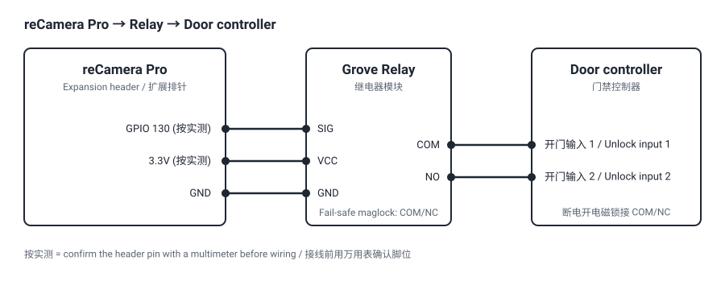
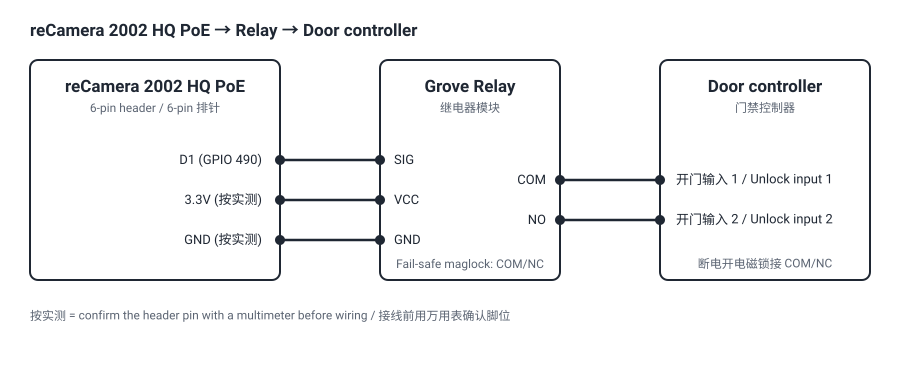
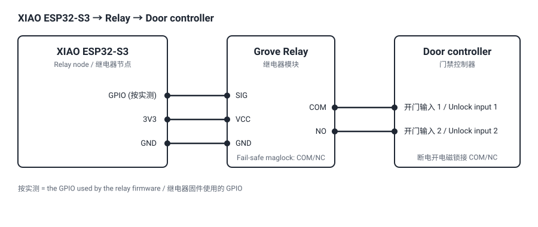
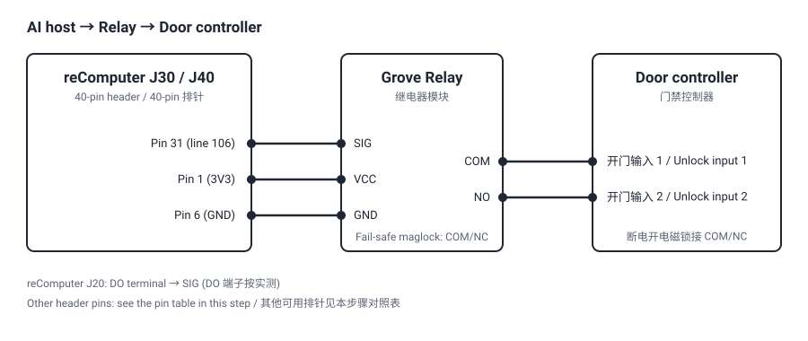

## 套餐: A. reCamera Pro 直控 {#a_ai_camera}

reCamera Pro 识别人脸并判定是否开门，GPIO 直接驱动继电器。

- **服务器：** 一台装 Docker 的 Linux 服务器（不需要 GPU），运行人脸库、管理界面和 MQTT broker。
- **外设：** 继电器模块，干接点接门禁控制器的开门输入。

## 步骤 1: 部署人脸库与管理界面 {#p1_cloud_facedb type=docker_deploy required=true config=devices/cloud_facedb.yaml}

在一台服务器上启动人脸库、MQTT broker 和管理界面。

### 前置条件

- 一台装有 Docker 和 compose 插件的 Linux 服务器，门口设备能访问到它，不需要 GPU。
- 服务器时钟已开启 NTP 同步，门口设备以它为准。
- 服务器上 8080（人脸库）、8088（管理界面）、1883（MQTT）端口空闲。
- 「门口设备」按本套餐选：reCamera Pro。
- 签名密钥和 admin token 自动生成，部署后在本步骤底部「自动生成的密钥」里查看，登录管理界面用 admin token。

### 故障排查

| 现象 | 处理 |
|---|---|
| 找不到 `docker compose` | 在服务器上安装 `docker-compose-plugin`。 |
| 提示 `NTP is not synchronised` | 在服务器上执行 `sudo timedatectl set-ntp true`。 |
| 8080 端口被占用 | 修改人脸库端口，后续步骤的人脸库地址用同一个端口。 |
| 8088 端口被占用 | 释放 8088 端口，后续步骤的管理界面页面固定打开这个端口。 |
| 人脸库接口返回 404 | 首次注册前属正常。 |
| 管理界面打不开 | 在服务器上执行 `docker logs usa-web` 查看原因。 |

### 部署目标 {#p1_facedb_remote type=remote config=devices/cloud_facedb.yaml default=true}

部署到门口设备可以访问的一台 Linux 服务器。

### 部署目标 {#p1_facedb_local type=local config=devices/cloud_facedb.yaml}

部署到这台电脑。门口设备必须能访问这台电脑的 IP。

## 步骤 2: 注册人员 {#p1_register type=web_dashboard required=true config=devices/register_person.yaml}

在管理界面「人员库」为每个人上传 3 到 8 张照片完成注册。

### 前置条件

- 步骤 1 的 admin token。
- 每人 3 到 8 张清晰的正脸照片。
- 步骤 1 已填写识别服务地址，否则注册的人不会被识别。
- 已知限制：这里注册的人目前还不能被 reCamera Pro 端侧模型识别，本套餐中这一步只验证注册与下发。

### 故障排查

| 现象 | 处理 |
|---|---|
| 注册被拒，提示少于三张图 | 至少上传 3 张照片。 |
| 新注册的人门仍不开 | 等 30 s 让设备拉取新版本后再试。 |
| 回滚被拒并提示某个人 | 此人已被删除。通过注册或编辑发布新版本，不要回滚。 |
| 设备提示 `model_tag` 不匹配 | 把识别服务地址指向门口设备上的识别服务，重新部署步骤 1 后重新注册。 |

## 步骤 3: 接继电器 {#p1_wire type=manual required=true config=devices/p1_recamera_pro_wiring.yaml}

把继电器接到摄像头和门禁控制器。

### 接线

1. 用万用表确认 GPIO 130 是排针上哪个脚、输出为 3.3 V。
2. 摄像头 GPIO 130 → 继电器 SIG，3.3 V → VCC，GND → GND。想先测试可改接 LED 加限流电阻到 GPIO 130 与 GND。
3. 继电器 COM、NO 接门禁控制器的开门输入（断电开门的电磁锁接 COM、NC）。

### 故障排查

| 现象 | 处理 |
|---|---|
| GPIO 130 被其他程序占用 | 换一个空闲 GPIO，下一步填写对应编号。 |

## 步骤 4: 激活并配置 F1 门禁 {#p1_install type=recamera_pro_app required=true config=devices/p1_recamera_pro.yaml}

在摄像头上启动 F1 门禁并写入门禁设置，摄像头上正在运行的其他应用会被停止。

### 前置条件

先在摄像头上装好 F1 门禁（0.1.5 或以上）：

1. 登录摄像头的网页控制台，打开**应用中心**。
2. 找到 **F1 门禁**，点**安装**，等待安装完成。

表单中的服务器 IP、端口、匹配阈值与签名密钥自动取自步骤 1，只需填写门名称、GPIO 编号、继电器触点与断电后门的状态。

### 故障排查

| 现象 | 处理 |
|---|---|
| 提示应用未安装 | 按前置条件在应用中心安装 F1 门禁。 |
| 提示 `unknown parameter` | F1 门禁版本低于 0.1.5，在应用中心更新后重新部署。 |
| 激活超时 | 刚装完第一次激活较慢，重试一次。 |
| 提示 `npu.direct is busy` | 在应用中心停止正在运行的其他应用后重新部署。 |
| 上电时门开了一次 | 继电器触点选反了，改正后重新部署。 |

## 步骤 5: 核对人脸库已到设备 {#p1_facedb_status type=web_dashboard required=true verify=true config=devices/network_face_database.yaml}

在管理界面「设备」页确认门口设备用上了刚发布的库版本。

### 前置条件

- 门口设备已上电并联网。
- 至少注册了一个人。

### 故障排查

| 现象 | 处理 |
|---|---|
| `desired_version` 落后于服务端 `current` | 等 30 s 后刷新页面。 |
| `active_version` 落后于 `desired_version` | 查看 `last_error`，多为匹配阈值与步骤 1 不一致，用相同的值重新部署设备步骤。 |
| `signature.verified` 为 `null` | 正常，验签失败会显示在 `last_error`。 |
| `clock.valid` 为 `false` | 没有 NTP 的设备上属正常。 |
| 有人出现在 `only_on_device` | 有人直接在设备上注册过，下一个版本会覆盖。 |
| 页面为空 | 还没有设备上报，检查门口设备是否在线。 |

## 步骤 6: 验证这道门 {#p1_verify type=manual required=true verify=true config=devices/remote_unlock.yaml}

测试这道门：注册的人能开，照片不能开，远程开门可用。

### 前置条件

- 门禁控制器已接好，至少注册了一个人。
- 此人的一张打印照片。
- 步骤 1 的 admin token。

### 部署完成

1. 已注册的人站到摄像头前：继电器响一次，管理界面出现放行事件。
2. 马上退开再上前：管理界面出现 `debounced`，继电器不再响。
3. 举起打印照片：管理界面出现 `liveness_failed`，继电器不响。
4. 在管理界面「设备」页点开门：继电器响一次，回执为 `executed`。
5. 删除一个人：30 s 内门不再为他打开，回滚到仍包含此人的版本会被拒绝。
6. 正式使用前：MQTT broker 改用 TLS 和按设备分配的账号，管理界面放到 HTTPS 后面。

### 故障排查

| 现象 | 处理 |
|---|---|
| 照片能开门 | 停用这道门，检查识别服务 `/health` 中活体为 `loaded`。 |
| 回执为 `executed` 但继电器不响 | 检查继电器接线和设备上配置的引脚。 |
| 一次靠近继电器响两次 | 调大设备上的去抖时间后重测。 |
| 审计校验失败 | 保留日志文件，检查是否有两个进程在写它。 |
| 事件不再上报但门仍能开 | 摄像头在本地开门，检查它与 MQTT broker 1883 端口的连接。 |

## 套餐: B. reCamera PoE {#a_recamera_poe}

reCamera 2002 HQ PoE 识别人脸、判定是否开门，并用底板排针直接驱动继电器，开门路径不经过网络。

- **服务器：** 一台装 Docker 的 Linux 服务器（不需要 GPU），运行人脸库、管理界面和 MQTT broker。
- **摄像头：** reCamera 2002 HQ PoE，PoE 供电。
- **外设：** Grove Relay（SKU 103020005，SPST-NO，3.3–5 V 触发）接底板排针 D1，干接点接门禁控制器的开门输入。门控输入是常闭型时换 Grove - SPDT Relay 30A（SKU 103020012）。

## 步骤 1: 部署人脸库与管理界面 {#p6_cloud_facedb type=docker_deploy required=true config=devices/cloud_facedb.yaml}

在一台服务器上启动人脸库、MQTT broker 和管理界面。

### 前置条件

- 一台装有 Docker 和 compose 插件的 Linux 服务器，门口设备能访问到它，不需要 GPU。
- 服务器时钟已开启 NTP 同步，门口设备以它为准。
- 服务器上 8080（人脸库）、8088（管理界面）、1883（MQTT）端口空闲。
- 「门口设备」按本套餐选：标准版 reCamera。
- 签名密钥和 admin token 自动生成，部署后在本步骤底部「自动生成的密钥」里查看，登录管理界面用 admin token。

### 故障排查

| 现象 | 处理 |
|---|---|
| 找不到 `docker compose` | 在服务器上安装 `docker-compose-plugin`。 |
| 提示 `NTP is not synchronised` | 在服务器上执行 `sudo timedatectl set-ntp true`。 |
| 8080 端口被占用 | 修改人脸库端口，后续步骤的人脸库地址用同一个端口。 |
| 8088 端口被占用 | 释放 8088 端口，后续步骤的管理界面页面固定打开这个端口。 |
| 人脸库接口返回 404 | 首次注册前属正常。 |
| 管理界面打不开 | 在服务器上执行 `docker logs usa-web` 查看原因。 |

### 部署目标 {#p6_facedb_remote type=remote config=devices/cloud_facedb.yaml default=true}

部署到门口设备可以访问的一台 Linux 服务器。

### 部署目标 {#p6_facedb_local type=local config=devices/cloud_facedb.yaml}

部署到这台电脑。门口设备必须能访问这台电脑的 IP。

## 步骤 2: 注册人员 {#p6_register type=web_dashboard required=true config=devices/register_person.yaml}

在管理界面「人员库」为每个人上传 3 到 8 张照片完成注册。

### 前置条件

- 步骤 1 的 admin token。
- 每人 3 到 8 张清晰的正脸照片。
- 步骤 1 已填写识别服务地址，否则注册的人不会被识别。

### 故障排查

| 现象 | 处理 |
|---|---|
| 注册被拒，提示少于三张图 | 至少上传 3 张照片。 |
| 新注册的人门仍不开 | 等 30 s 让设备拉取新版本后再试。 |
| 回滚被拒并提示某个人 | 此人已被删除。通过注册或编辑发布新版本，不要回滚。 |
| 设备提示 `model_tag` 不匹配 | 把识别服务地址指向门口设备上的识别服务，重新部署步骤 1 后重新注册。 |

## 步骤 3: 在摄像头上安装 F1 门禁 {#p6_install type=recamera_cpp required=true config=devices/p6_recamera_poe.yaml}

在 reCamera PoE 上安装门禁应用并写入人脸库设置。

### 前置条件

- 摄像头通过 USB-C 连接（IP `192.168.42.1`）或在同一网络，并知道 `recamera` 用户的 SSH 密码。
- 摄像头能访问 `http://<服务器 IP>:8080`。
- `/userdata` 至少 20 MB 空闲。

### 接线

准备：Grove Relay（SKU 103020005）、它自带的 4 芯 Grove 线、杜邦线（排针不是 Grove 座，Grove 线另一端要转成单根）、一路 3.3–5 V 电源、万用表。

排针脚位（[官方 wiki](https://wiki.seeedstudio.com/reCamera_hq_poe_hardware_and_specs/)）：**GND、GPIO488、GPIO487、TX、GPIO490、RX**。三路 IO 是 D1 = GPIO490、CLK = GPIO487、SMD = GPIO488，本方案用 D1。

1. **排针没有供电脚**，继电器的 VCC 要单独供电：一个 5 V USB 充电头，或门控侧已有的 12 V 经 DC-DC 降到 5 V，电源的地接到排针 GND。GPIO 输出的是 3.3 V 逻辑电平，而 Grove Relay 工作电流 100 mA，GPIO 带不动，只接 SIG。这条路线不需要 XIAO。
2. **电平未文档化**，接继电器之前先用万用表量 GPIO490 的高电平。
3. **接三根线**，继电器的 NC 线不接：排针 GPIO490 → 继电器 **SIG**，外部电源 3.3–5 V → **VCC**，排针 GND → **GND**（外部电源的地也接到这里）。
4. **先用 LED 试。** LED 加限流电阻接在 GPIO490 与 GND 之间，部署后看它是否按配置的脉宽亮一次；确认引脚和极性都对，再换成继电器。
5. **确认继电器每个脉冲响一次。** 不响就回到第 2 步核对电平。
6. **接门禁控制器。** 继电器 **COM** 与 **NO** 接门控的开门输入，这两个端子上量不到我们的电压。断电开门的电磁锁需要常闭触点，Grove Relay 没有 NC 端子，换 Grove - SPDT Relay 30A（SKU 103020012），接 COM 与 NC。
7. 在表单中填写设备 ID 和执行器 ID。人脸库地址、匹配阈值、签名密钥已从步骤 1 带入；只有摄像头访问服务器的地址不同才需要改地址。然后部署。

### 故障排查

| 现象 | 处理 |
|---|---|
| 摄像头上仍是原厂 face-recognition 应用 | 在摄像头上移除 `face-recognition` 后重新部署。 |
| `agent.log` 结尾是 `thresholds are not single-sourced` | 重新部署这一步，不要手动修改 `/userdata/f1-access/face-recognition.conf`。 |
| 一个库版本都没激活 | 确认摄像头能访问人脸库地址；匹配阈值若被改成与步骤 1 不同的值，改回后重新部署。 |
| 启动时门开了一次 | 有效电平选错，接门禁控制器之前先改正。 |
| 继电器一直不响 | 确认接的是排针 D1，且 `/userdata/f1-access/face-recognition.conf` 中 `[gpio] enabled = true`。 |

## 步骤 4: 核对人脸库已到设备 {#p6_facedb_status type=web_dashboard required=true verify=true config=devices/network_face_database.yaml}

在管理界面「设备」页确认门口设备用上了刚发布的库版本。

### 前置条件

- 摄像头已上电并联网。
- 至少注册了一个人。
- 步骤 1 的设备控制端点里已填入这台摄像头。

### 故障排查

| 现象 | 处理 |
|---|---|
| `desired_version` 落后于服务端 `current` | 等 30 s 后刷新页面。 |
| `active_version` 落后于 `desired_version` | 查看 `last_error`，多为匹配阈值与步骤 1 不一致，用相同的值重新部署设备步骤。 |
| `signature.verified` 为 `null` | 正常，验签失败会显示在 `last_error`。 |
| `clock.valid` 为 `false` | 没有 NTP 的设备上属正常。 |
| 有人出现在 `only_on_device` | 有人直接在设备上注册过，下一个版本会覆盖。 |
| 页面为空 | 在步骤 1 填写设备控制端点并重新部署。 |

## 步骤 5: 验证这道门 {#p6_verify type=manual required=true verify=true config=devices/remote_unlock.yaml}

测试这道门：注册的人能开，照片不能开，远程开门可用。

### 前置条件

- 门禁控制器已接好，至少注册了一个人。
- 此人的一张打印照片。
- 步骤 1 的 admin token。

### 部署完成

1. 已注册的人站到摄像头前：继电器响一次，管理界面出现放行事件。
2. 马上退开再上前：管理界面出现 `debounced`，继电器不再响。
3. 举起打印照片：管理界面出现 `liveness_failed`，继电器不响。
4. 在管理界面「设备」页点开门：继电器响一次，回执为 `executed`。
5. 删除一个人：30 s 内门不再为他打开，回滚到仍包含此人的版本会被拒绝。
6. 断开服务器后站到摄像头前：门照常打开。
7. 正式使用前：MQTT broker 改用 TLS 和按设备分配的账号，管理界面放到 HTTPS 后面。

### 故障排查

| 现象 | 处理 |
|---|---|
| 照片能开门 | 停用这道门，检查识别服务 `/health` 中活体为 `loaded`。 |
| 回执为 `executed` 但继电器不响 | 检查排针 D1 的接线和继电器的触发电平。 |
| 一次靠近继电器响两次 | 调大设备上的去抖时间后重测。 |
| 审计校验失败 | 保留日志文件，检查是否有两个进程在写它。 |
| 管理界面没有事件 | 检查摄像头能访问服务器 1883 端口。 |

## 套餐: C. 标准版 reCamera（2002 / 2002w） {#a_recamera_std}

reCamera 2002 或 2002w 识别人脸并判定是否开门。摄像头没有可用排针，开门指令经 MQTT 发到继电器节点。

- **服务器：** 一台装 Docker 的 Linux 服务器（不需要 GPU），运行人脸库、管理界面和 MQTT broker。
- **摄像头：** reCamera 2002 或 2002w。
- **继电器节点：** 一台接同一 MQTT broker 的 R1000 或 XIAO ESP32-S3，外接继电器模块，干接点接门禁控制器的开门输入。broker 不可用时门打不开。

## 步骤 1: 部署人脸库与管理界面 {#p5_cloud_facedb type=docker_deploy required=true config=devices/cloud_facedb.yaml}

在一台服务器上启动人脸库、MQTT broker 和管理界面。

### 前置条件

- 一台装有 Docker 和 compose 插件的 Linux 服务器，门口设备能访问到它，不需要 GPU。
- 服务器时钟已开启 NTP 同步，门口设备以它为准。
- 服务器上 8080（人脸库）、8088（管理界面）、1883（MQTT）端口空闲。
- 「门口设备」按本套餐选：标准版 reCamera。
- 签名密钥和 admin token 自动生成，部署后在本步骤底部「自动生成的密钥」里查看，登录管理界面用 admin token。

### 故障排查

| 现象 | 处理 |
|---|---|
| 找不到 `docker compose` | 在服务器上安装 `docker-compose-plugin`。 |
| 提示 `NTP is not synchronised` | 在服务器上执行 `sudo timedatectl set-ntp true`。 |
| 8080 端口被占用 | 修改人脸库端口，后续步骤的人脸库地址用同一个端口。 |
| 8088 端口被占用 | 释放 8088 端口，后续步骤的管理界面页面固定打开这个端口。 |
| 人脸库接口返回 404 | 首次注册前属正常。 |
| 管理界面打不开 | 在服务器上执行 `docker logs usa-web` 查看原因。 |

### 部署目标 {#p5_facedb_remote type=remote config=devices/cloud_facedb.yaml default=true}

部署到门口设备可以访问的一台 Linux 服务器。

### 部署目标 {#p5_facedb_local type=local config=devices/cloud_facedb.yaml}

部署到这台电脑。门口设备必须能访问这台电脑的 IP。

## 步骤 2: 注册人员 {#p5_register type=web_dashboard required=true config=devices/register_person.yaml}

在管理界面「人员库」为每个人上传 3 到 8 张照片完成注册。

### 前置条件

- 步骤 1 的 admin token。
- 每人 3 到 8 张清晰的正脸照片。
- 步骤 1 已填写识别服务地址，否则注册的人不会被识别。

### 故障排查

| 现象 | 处理 |
|---|---|
| 注册被拒，提示少于三张图 | 至少上传 3 张照片。 |
| 新注册的人门仍不开 | 等 30 s 让设备拉取新版本后再试。 |
| 回滚被拒并提示某个人 | 此人已被删除。通过注册或编辑发布新版本，不要回滚。 |
| 设备提示 `model_tag` 不匹配 | 把识别服务地址指向门口设备上的识别服务，重新部署步骤 1 后重新注册。 |

## 步骤 3: 在摄像头上安装 F1 门禁 {#p5_install type=recamera_cpp required=true config=devices/p5_recamera_std.yaml}

在 reCamera 上安装门禁应用并写入人脸库设置。

### 前置条件

- 摄像头通过 USB-C 连接（IP `192.168.42.1`）或在同一网络，并知道 `recamera` 用户的 SSH 密码。
- 摄像头能访问 `http://<服务器 IP>:8080`。
- `/userdata` 至少 20 MB 空闲。
- 一台连到同一 MQTT broker 的 R1000 或 XIAO ESP32-S3 继电器节点，并已设置好它的 Relay ID。

### 接线

1. 摄像头没有可用排针，继电器接到继电器节点上：XIAO ESP32-S3 按继电器固件的 GPIO → 继电器 SIG，3V3 → VCC，GND → GND；R1000 则接到其 Modbus 点位号对应的输出。
2. 继电器 COM、NO 接门禁控制器的开门输入（断电开门的电磁锁接 COM、NC）。
3. 在表单中填写设备 ID，执行器 ID 填继电器节点上配置的 Relay ID。人脸库地址、匹配阈值、签名密钥已从步骤 1 带入；只有摄像头访问服务器的地址不同才需要改地址。然后部署。

### 故障排查

| 现象 | 处理 |
|---|---|
| 摄像头上仍是原厂 face-recognition 应用 | 在摄像头上移除 `face-recognition` 后重新部署。 |
| `agent.log` 结尾是 `thresholds are not single-sourced` | 重新部署这一步，不要手动修改 `/userdata/f1-access/face-recognition.conf`。 |
| 一个库版本都没激活 | 确认摄像头能访问人脸库地址；匹配阈值若被改成与步骤 1 不同的值，改回后重新部署。 |
| 提示 `mqtt.host` 不匹配 | 在 `/userdata/f1-access/face-recognition.conf` 中设置 `[mqtt] host = localhost`。 |
| 已下发开门但继电器不响 | 确认继电器节点已连上 broker，且它的 Relay ID 与执行器 ID 一致。 |

## 步骤 4: 核对人脸库已到设备 {#p5_facedb_status type=web_dashboard required=true verify=true config=devices/network_face_database.yaml}

在管理界面「设备」页确认门口设备用上了刚发布的库版本。

### 前置条件

- 摄像头已上电并联网。
- 至少注册了一个人。
- 步骤 1 的设备控制端点里已填入这台摄像头。

### 故障排查

| 现象 | 处理 |
|---|---|
| `desired_version` 落后于服务端 `current` | 等 30 s 后刷新页面。 |
| `active_version` 落后于 `desired_version` | 查看 `last_error`，多为匹配阈值与步骤 1 不一致，用相同的值重新部署设备步骤。 |
| `signature.verified` 为 `null` | 正常，验签失败会显示在 `last_error`。 |
| `clock.valid` 为 `false` | 没有 NTP 的设备上属正常。 |
| 有人出现在 `only_on_device` | 有人直接在设备上注册过，下一个版本会覆盖。 |
| 页面为空 | 在步骤 1 填写设备控制端点并重新部署。 |

## 步骤 5: 验证这道门 {#p5_verify type=manual required=true verify=true config=devices/remote_unlock.yaml}

测试这道门：注册的人能开，照片不能开，远程开门可用。

### 前置条件

- 门禁控制器已接好，至少注册了一个人。
- 此人的一张打印照片。
- 步骤 1 的 admin token。

### 部署完成

1. 已注册的人站到摄像头前：继电器响一次，管理界面出现放行事件。
2. 马上退开再上前：管理界面出现 `debounced`，继电器不再响。
3. 举起打印照片：管理界面出现 `liveness_failed`，继电器不响。
4. 在管理界面「设备」页点开门：继电器响一次，回执为 `executed`。
5. 删除一个人：30 s 内门不再为他打开，回滚到仍包含此人的版本会被拒绝。
6. 正式使用前：MQTT broker 改用 TLS 和按设备分配的账号，管理界面放到 HTTPS 后面。

### 故障排查

| 现象 | 处理 |
|---|---|
| 照片能开门 | 停用这道门，检查识别服务 `/health` 中活体为 `loaded`。 |
| 回执为 `executed` 但继电器不响 | 检查继电器接线和继电器节点上配置的引脚。 |
| 一次靠近继电器响两次 | 调大设备上的去抖时间后重测。 |
| 审计校验失败 | 保留日志文件，检查是否有两个进程在写它。 |
| 管理界面没有事件 | 检查摄像头能访问服务器 1883 端口。 |

## 套餐: D. AI 主机 + 现有摄像头 {#b_ai_host}

AI 主机拉取门口现有摄像头的 RTSP 流，识别人脸并判定是否开门。

- **服务器：** 一台装 Docker 的 Linux 服务器（不需要 GPU），运行人脸库、管理界面和 MQTT broker。
- **摄像头：** 门口现有的 RTSP 摄像头。
- **外设：** 继电器模块，干接点接门禁控制器的开门输入。

## 步骤 1: 部署人脸库与管理界面 {#p2_cloud_facedb type=docker_deploy required=true config=devices/cloud_facedb.yaml}

在一台服务器上启动人脸库、MQTT broker 和管理界面。

### 前置条件

- 一台装有 Docker 和 compose 插件的 Linux 服务器，门口设备能访问到它，不需要 GPU。
- 服务器时钟已开启 NTP 同步，门口设备以它为准。
- 服务器上 8080（人脸库）、8088（管理界面）、1883（MQTT）端口空闲。
- 「门口设备」按本套餐选：AI 主机。
- 签名密钥和 admin token 自动生成，部署后在本步骤底部「自动生成的密钥」里查看，登录管理界面用 admin token。

### 故障排查

| 现象 | 处理 |
|---|---|
| 找不到 `docker compose` | 在服务器上安装 `docker-compose-plugin`。 |
| 提示 `NTP is not synchronised` | 在服务器上执行 `sudo timedatectl set-ntp true`。 |
| 8080 端口被占用 | 修改人脸库端口，后续步骤的人脸库地址用同一个端口。 |
| 8088 端口被占用 | 释放 8088 端口，后续步骤的管理界面页面固定打开这个端口。 |
| 人脸库接口返回 404 | 首次注册前属正常。 |
| 管理界面打不开 | 在服务器上执行 `docker logs usa-web` 查看原因。 |

### 部署目标 {#p2_facedb_remote type=remote config=devices/cloud_facedb.yaml default=true}

部署到门口设备可以访问的一台 Linux 服务器。

### 部署目标 {#p2_facedb_local type=local config=devices/cloud_facedb.yaml}

部署到这台电脑。门口设备必须能访问这台电脑的 IP。

## 步骤 2: 注册人员 {#p2_register type=web_dashboard required=true config=devices/register_person.yaml}

在管理界面「人员库」为每个人上传 3 到 8 张照片完成注册。

### 前置条件

- 步骤 1 的 admin token。
- 每人 3 到 8 张清晰的正脸照片。
- 步骤 1 已填写识别服务地址，否则注册的人不会被识别。

### 故障排查

| 现象 | 处理 |
|---|---|
| 注册被拒，提示少于三张图 | 至少上传 3 张照片。 |
| 新注册的人门仍不开 | 等 30 s 让设备拉取新版本后再试。 |
| 回滚被拒并提示某个人 | 此人已被删除。通过注册或编辑发布新版本，不要回滚。 |
| 设备提示 `model_tag` 不匹配 | 把识别服务地址指向门口设备上的识别服务，重新部署步骤 1 后重新注册。 |

## 步骤 3: 部署门禁节点 {#p2_deploy type=docker_deploy required=true config=devices/p2_j20.yaml}

在主机上拉起识别服务与门禁节点。按主机型号与继电器接法选择部署目标。

### 前置条件

- 主机上装好 Docker 与 compose 插件。
- 摄像头的 RTSP 地址已在主机上测通。
- 能访问 `sensecraft-statics.seeed.cc`，用于下载约 32 MB 模型文件。
- 至少 15 GB 可用空间。首次启动约需 4 分钟（reComputer J40 实测）。
- 门锁类型：断电开门（fail-safe）还是断电保持锁闭（fail-secure）。

### 故障排查

| 现象 | 处理 |
|---|---|
| `access-node` 反复重启，日志有 `config error:` | 执行 `docker compose exec access-node access-node check-config` 查看被拒的配置项。 |
| `access-node` 一直 `unhealthy` | 执行 `docker compose exec access-node access-node healthcheck` 查看哪一项不通。 |
| 提示 `LIVENESS IS NOT LOADED` | 确认模型下载完成后重新部署。 |
| RTSP 在笔记本上能播、主机上不能 | 检查主机到摄像头的网络和 RTSP 账号密码。 |
| 明文人脸库地址被拒 | 先部署步骤 1 生成签名密钥，再重新部署这一步。 |
| 启动时门开了一次 | 有效电平反了，接门禁控制器之前先改正。 |

### 部署目标 {#p2_j20 type=remote device=recomputer_j20 device_name="reComputer J20" config=devices/p2_j20.yaml default=true}

继电器接 J20 的 DO 输出。**GPIO 接口选 sysfs**，填写 DO 的 sysfs 编号。

### 接线

1. 用万用表确认哪个 sysfs 编号对应哪个 DO 端子（DO1–DO4 预期为 463/464/465/462）以及 DO 的输出类型。
2. DO 端子 → 继电器 SIG，继电器 VCC、GND 接电源。
3. 继电器 COM、NO 接门禁控制器的开门输入（断电开门的电磁锁接 COM、NC）。
4. 在表单中设置 GPIO 接口 `sysfs`、DO 的 sysfs GPIO 编号、有效电平、继电器触点、失效模式。

### 故障排查

| 现象 | 处理 |
|---|---|
| 提示 `gpio N is ALREADY EXPORTED` | 该输出被其他程序占用，换一路 DO 或停掉那个程序。 |

### 部署目标 {#p2_jetson type=remote device=recomputer_j40 device_name="reComputer J30 / J40" config=devices/p2_j20.yaml}

继电器接 40-pin 排针。**GPIO 接口选 libgpiod**，**GPIO 控制器填 gpiochip0**，线号按下表填写：

| 排针 pin | 名称 | `gpiochip0` line |
|---|---|---|
| 7  | GPIO09    | 144 |
| 11 | UART1_RTS | 112 |
| 12 | I2S0_SCLK | 50  |
| 13 | SPI1_SCK  | 122 |
| 15 | GPIO12    | 85  |
| 16 | SPI1_CS1  | 126 |
| 18 | SPI1_CS0  | 125 |
| 22 | SPI1_MISO | 123 |
| 29 | GPIO01    | 105 |
| 31 | GPIO11    | 106 |
| 32 | GPIO07    | 41  |
| 33 | GPIO13    | 43  |
| 35 | I2S0_FS   | 53  |
| 36 | UART1_CTS | 113 |
| 37 | SPI1_MOSI | 124 |
| 38 | I2S0_SDIN | 52  |
| 40 | I2S0_SDOUT| 51  |

pin 1/17 是 3V3，2/4 是 5V，6/9/14/20/25/30/34/39 是 GND。

### 接线

1. 在主机上执行 `gpioinfo`，从表中选一条未标 `[used]` 的线。
2. pin 31（line 106）→ 继电器 SIG，pin 1（3V3）→ VCC，pin 6（GND）→ GND。想先测试可改接 LED 加限流电阻到 pin 31 与 GND。
3. 继电器 COM、NO 接门禁控制器的开门输入（断电开门的电磁锁接 COM、NC）。
4. 在表单中设置 GPIO 接口 `libgpiod`、GPIO 控制器 `gpiochip0`、GPIO 线号 `106`、有效电平、继电器触点、失效模式。

### 故障排查

| 现象 | 处理 |
|---|---|
| 提示 `/dev/gpiochip0 does not exist on this box` | 执行 `gpioinfo`，填写它列出的控制器名。 |

### 部署目标 {#p3_mqtt_relay type=remote device=mqtt_relay device_name="MQTT 继电器" config=devices/p3_mqtt_relay.yaml}

主机不在门边、或一台主机管多道门时选这个。开门指令经 MQTT 发到继电器节点，broker 不可用期间门打不开。

### 前置条件

- 主机能访问 MQTT broker（步骤 1 的服务器，1883 端口）。
- 继电器节点已运行并连上 broker，继电器 ID 在整个站点内唯一。

### 接线

1. XIAO ESP32-S3：继电器固件使用的 GPIO → 继电器 SIG，3V3 → VCC，GND → GND；接线前用万用表确认 GPIO。
2. reComputer R1000：继电器接到表单中 Modbus 点位 ID 对应的输出。
3. 继电器 COM、NO 接门禁控制器的开门输入（断电开门的电磁锁接 COM、NC）。
4. 在表单中设置继电器后端、继电器 ID、继电器触点、失效模式。

### 故障排查

| 现象 | 处理 |
|---|---|
| 提示 `Cannot reach the MQTT broker` | 检查主机能访问服务器 1883 端口。 |
| 提示 `No retained state from relay` | 继电器节点还没连上 broker，检查它的网络和继电器 ID。 |
| 开门被接受但继电器不响 | 订阅 `access/v1/relay/<id>/state`，查看 `result`（`duplicate`、`expired` 或 `rejected`）。 |
| 断电恢复后门自己开了 | 有程序以 retained 方式发布 `access/v1/relay/<id>/set`，关闭 retain。 |
| 脉宽被拒 | 使用 500–5000 ms。 |

## 步骤 4: 核对人脸库已到设备 {#p2_facedb_status type=web_dashboard required=true verify=true config=devices/network_face_database.yaml}

在管理界面「设备」页确认门口设备用上了刚发布的库版本。

### 前置条件

- 门口设备已上电并联网。
- 至少注册了一个人。

### 故障排查

| 现象 | 处理 |
|---|---|
| `desired_version` 落后于服务端 `current` | 等 30 s 后刷新页面。 |
| `active_version` 落后于 `desired_version` | 查看 `last_error`，多为匹配阈值与步骤 1 不一致，用相同的值重新部署设备步骤。 |
| `signature.verified` 为 `null` | 正常，验签失败会显示在 `last_error`。 |
| `clock.valid` 为 `false` | 没有 NTP 的设备上属正常。 |
| 有人出现在 `only_on_device` | 有人直接在设备上注册过，下一个版本会覆盖。 |
| 页面为空 | 还没有设备上报，检查门口设备是否在线。 |

## 步骤 5: 验证这道门 {#p2_verify type=manual required=true verify=true config=devices/remote_unlock.yaml}

测试这道门：注册的人能开，照片不能开，远程开门可用。

### 前置条件

- 门禁控制器已接好，至少注册了一个人。
- 此人的一张打印照片。
- 步骤 1 的 admin token。

### 部署完成

1. 已注册的人站到摄像头前：继电器响一次，管理界面出现放行事件。
2. 马上退开再上前：管理界面出现 `debounced`，继电器不再响。
3. 举起打印照片：管理界面出现 `liveness_failed`，继电器不响。
4. 在管理界面「设备」页点开门：继电器响一次，回执为 `executed`。
5. 删除一个人：30 s 内门不再为他打开，回滚到仍包含此人的版本会被拒绝。
6. 正式使用前：MQTT broker 改用 TLS 和按设备分配的账号，管理界面放到 HTTPS 后面。

### 故障排查

| 现象 | 处理 |
|---|---|
| 照片能开门 | 停用这道门，检查识别服务 `/health` 中活体为 `loaded`。 |
| 回执为 `executed` 但继电器不响 | 检查继电器接线和设备上配置的引脚。 |
| 一次靠近继电器响两次 | 调大设备上的去抖时间后重测。 |
| 审计校验失败 | 保留日志文件，检查是否有两个进程在写它。 |
| 容器反复重启 | 执行 `docker logs usa-access-node` 查看被拒的设置。 |
